# ArcGIS Pro ビギナーズマニュアル
この演習では、次のような図を作成しながら、ArcGIS Proの基本操作とGISデータを用いた地図作成の手法を解説します。

### 実習用データ
[Tokyo](https://github.com/gis-oer/datasets/raw/master/tokyo.zip)をダウンロードしてください。

## 起動
ArcGIS Proを起動すると、ログインフォームが表示される。
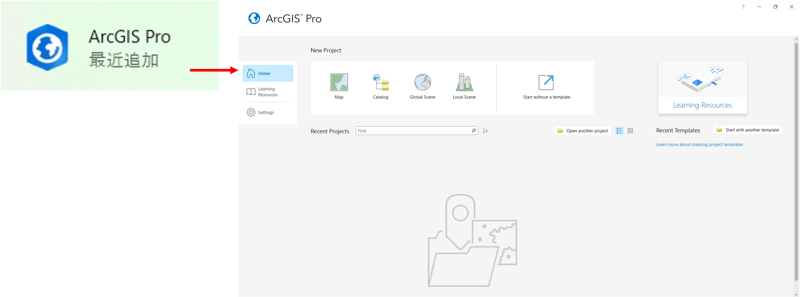
 
ログイン後に、`Map`をクリックする。Projectの名前と保存先を指定してOKをクリックする。
 
 
レイヤの設定ができるウィンドウ（緑枠）で各レイヤの見え方を調整すると、地図が表示されるウィンドウ（青枠）に反映される。
 
 
## レイヤの追加
 
### ベクタデータ：ポイントデータ
`Add Folder`を選択して、レイヤが入っているフォルダを選択する。

 
`Catalog > Folders`から、追加したレイヤを探し、必要なものをマップウィンドウにドラッグ＆ドロップする。
今回は、cvs_jgd2011_9.shpを選択する。

以下のように地図が表示される。

### ベクタデータ：ラインデータ
同じ方法で、ラインデータも追加する。今回は、`river_9kei.shp`を選択する。

### ベクタデータ：ポリゴンデータ
同じ方法で、ポリゴンデータも追加する。今回は、`tokyo_23ku_jgd2011_9kei.shp`を選択する。

### ラスタデータ
同じ方法で、ラスタデータも追加する。今回は、`tokyo_srtme.tif`を選択する。ウィンドウが表示されるが`Yes`を選択する。
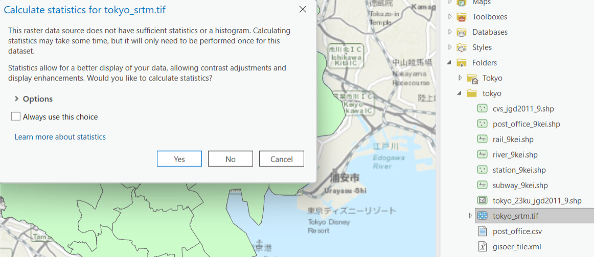

地図をクリックすると、ラスタデータの各セルの値（このデータは標高）が確認できる。
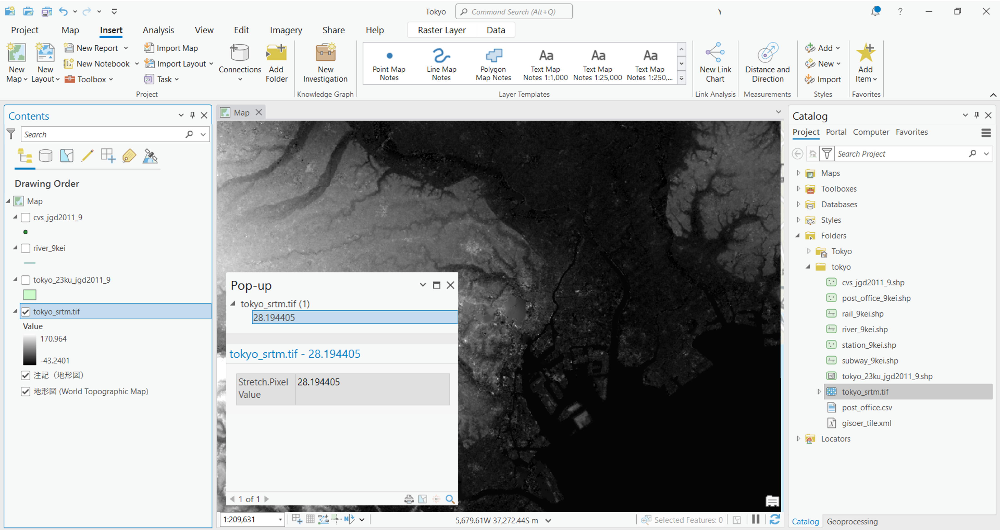

### テキストデータからポイントデータを作成
`post_ofifce.csv`を読み込むと、レイヤウィンドウに表示される。`post_ofifce.csv`の上で右クリックし、`Create Points From Table > XY Table To Point`を選択し、以下のように設定する。
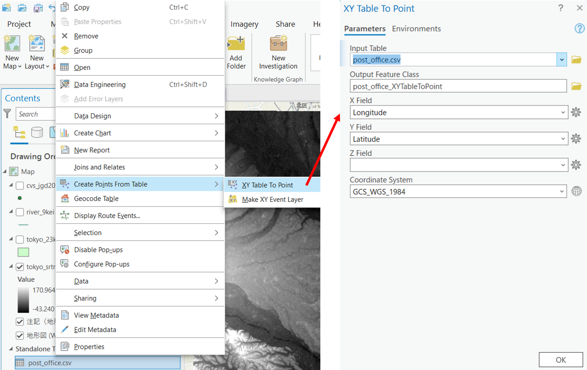

正しく設定すると、以下のように地図が表示される。
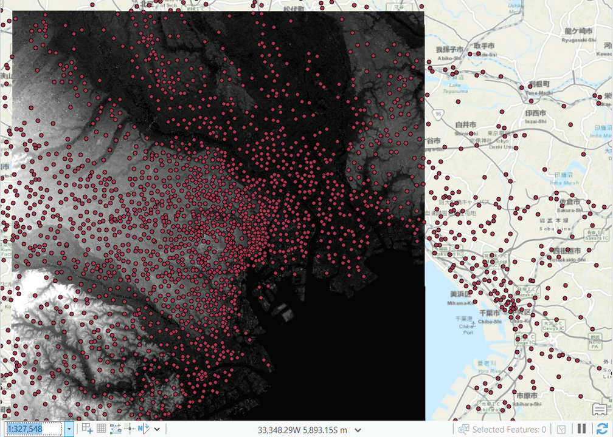

## レイヤの管理

レイヤウィンドウでは、レイヤのチェックボックスの切り替えや、上下の移動で地図表示を管理できる。

右クリック、`Remove`でレイヤを地図から削除できる。レイヤそのものを削除したい場合は、元のフォルダ内のレイヤを削除する。

## 機能
Arc GIS Proには、以下のような代表的な機能がある。タブ内に表示されていないものは、`Toolbox`などから検索できる。

1. Project
2. Map
3. Insert
4. Analysis
5. View
6. Edit
7. Imagery
8. Share
9. Help

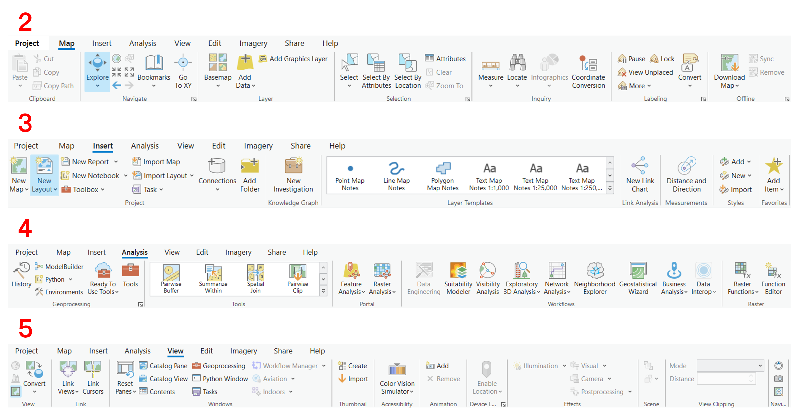

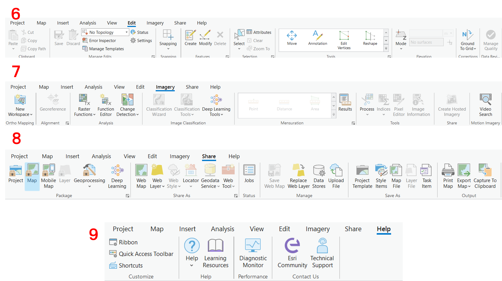

## 属性テーブルと選択機能
GISでは、属性情報と地図情報を連携して管理したり、地図表示したりできる。ArcGIS Proでは、レイヤウィンドウで、対応するレイヤの上で右クリックし、`Attribute Table`を開く。属性テーブル上で選択したものは、地図上でも選択される。

`Select`使うと、地図からでも検索できる。選択表示を終了したい場合は`Clear`をクリックする。

属性テーブルでは、選択したもののみを表示できたり、選択を反転したりできる。

## プロパティ
プロパティでは、データの空間座標系などを確認できる。
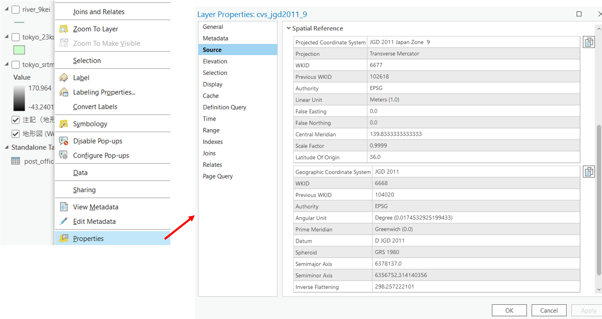

## シンボルの変更
ArcGIS Proでは、GISデータのスタイルを変更できる。ここでは、一括で同じシンボルにする場合と、属性情報に基づいて可視化する場合を紹介する。

`Properties > Symbology`を選択し、ポイントデータの表現を以下のように変更する。`Gallery tab`でスタイルを決め、`Properties`タブでサイズや色を調整できる。
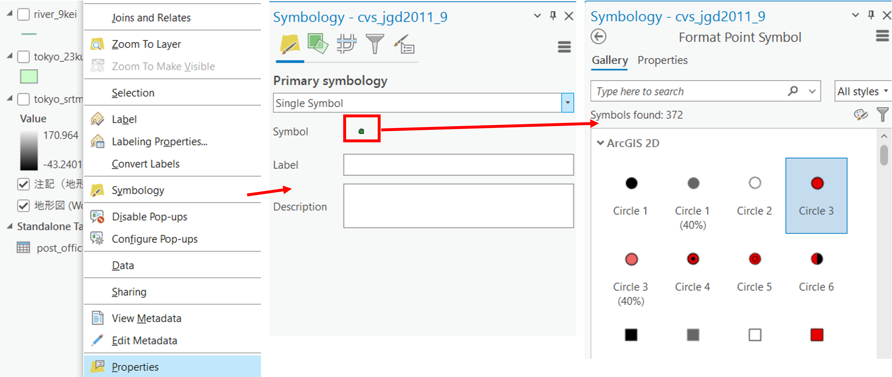

### 属性情報に基づく可視化
右上の三本線から、`Vary symbology by attribute`を選択する。`Unique Values`のアイコンをクリックする。
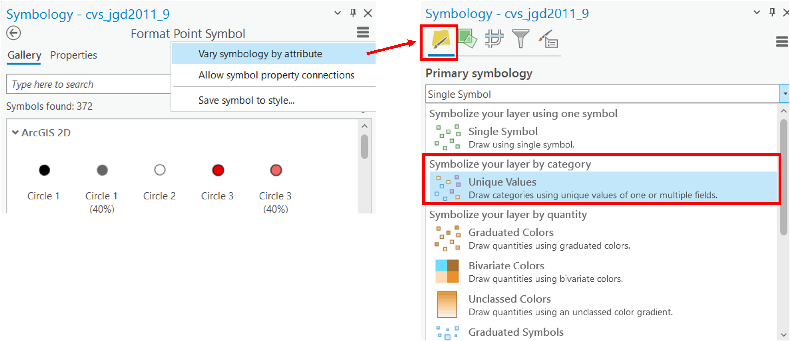

対応する属性テーブルのヘッダーを指定（今回はen_name）すると、以下のようにシンボルが分類される。

## ラベルの追加
属性情報を用いると、以下のようにデータにラベルを追加できる。

## 背景地図の追加（地理院タイル）
https://esrijapan.github.io/gsi-wmts/layers0.xml　をWMTSレイヤとして設定する。

写真を選択すると国土地理院の空中写真が表示できる。
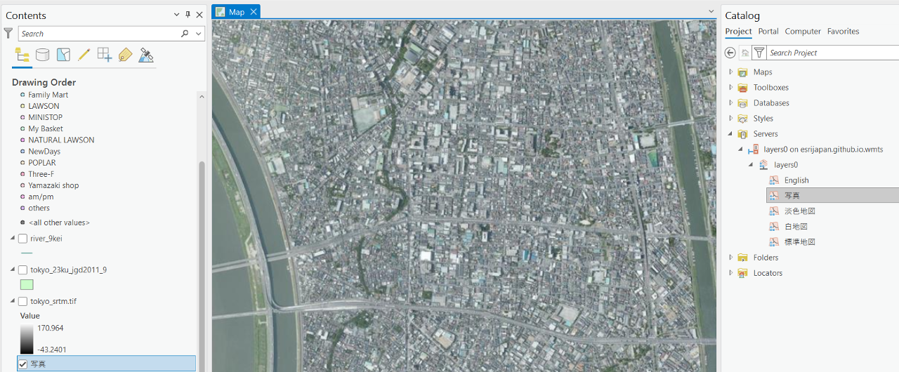

## 地図のレイアウト
最初に示した完成例のように、地図をレイアウトするために、`Insert > New Map Layout`を選択する。

### 地図の設定

用紙内に地図を追加する
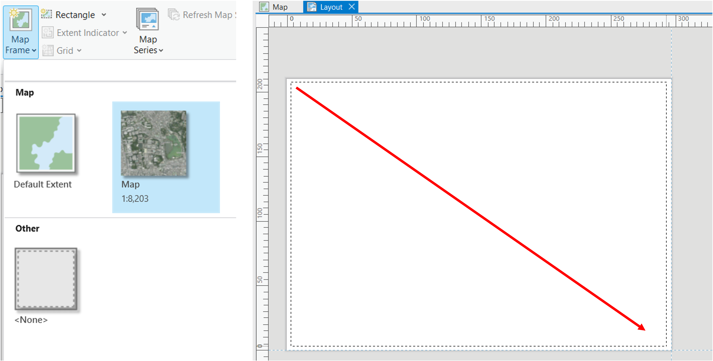

`Layout > Activate`をクリックして、地図の表示範囲を調整する。

最後に、`Layout > Close Activation`を選択して、地図の範囲を確定する。

### 方位
次に方位を追加する。

### 縮尺
次に縮尺を追加する。
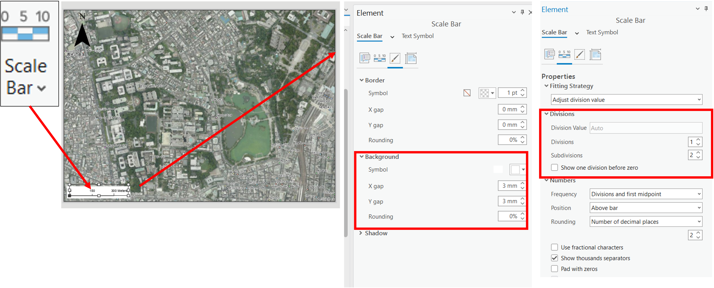

### 凡例
次に凡例を追加する。

### タイトル
次にタイトルを追加する。

### 地図の書き出し
`Share > Export Layout`から地図を書き出す。

### プロジェクトの保存
`Project > Save Project`を実行する。

## 課題
[課題用データ](https://raw.githubusercontent.com/gis-oer/datasets/master/vector/fkuchiyama_sample.zip)
を用いて、以下の地図を作成してください。

 
 
 
 
 
 
 
 