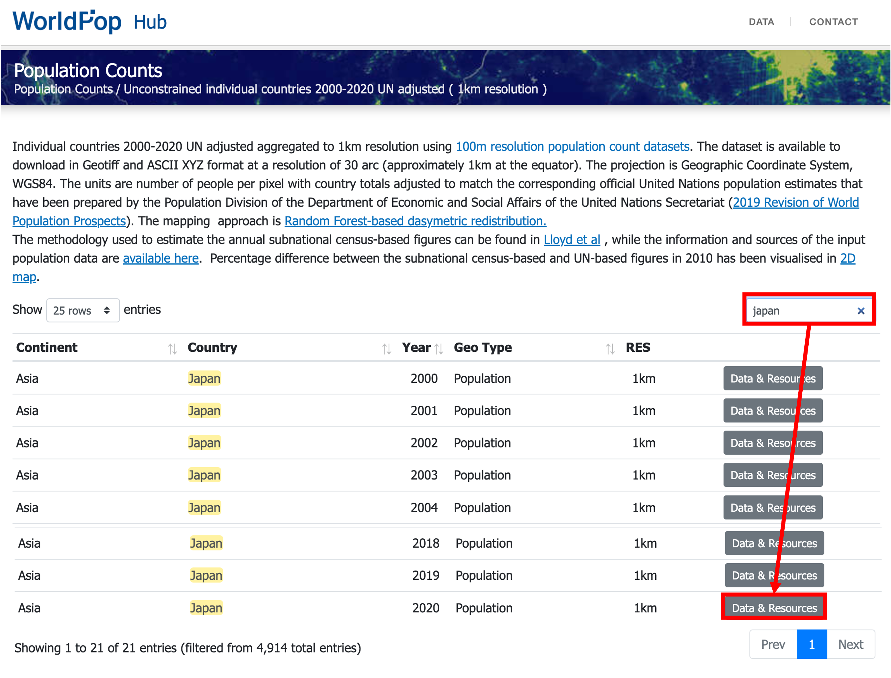
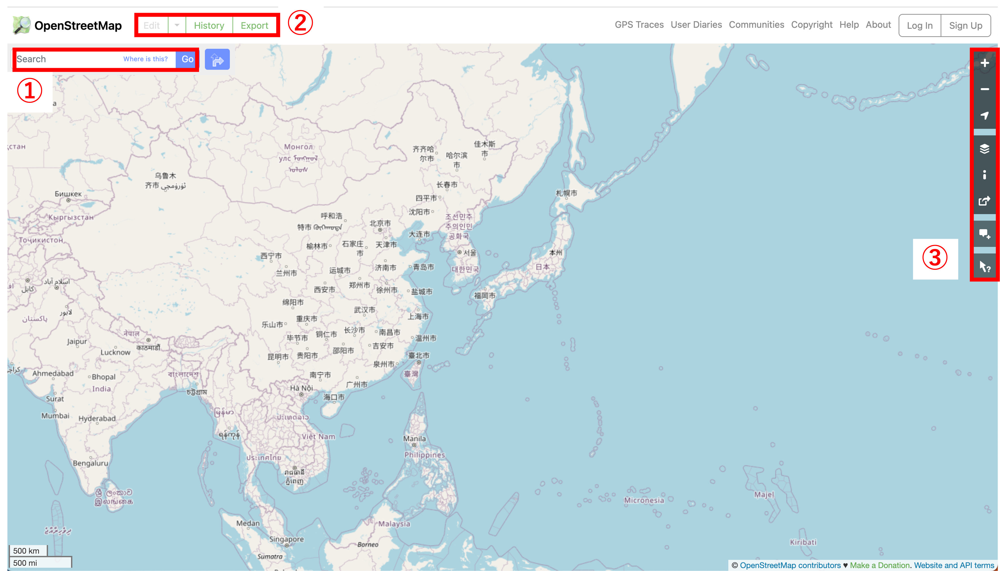
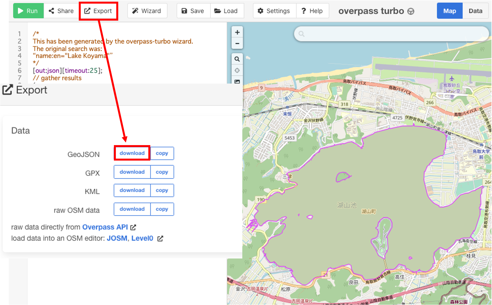
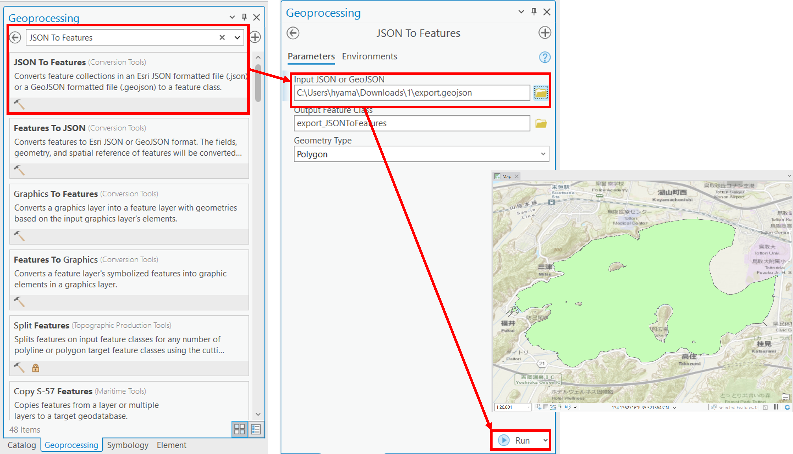

# GISデータの取得
このページでは、様々な機関のWebサイトで公開されているGISデータを取得する手法を解説します。国内の機関のデータの入手方法は、[GIS実習オープン教材](https://gis-oer.github.io/gitbook/book/materials/07/07.html)で解説されています。この実習では、以下の3機関から、ダウンロードしたそれれぞのデータを用いて、GISで3枚の地図（方位、凡例、縮尺をつけること）を作成した後、課題を作成してください。

**Menu**
-----
- 国土数値情報
- World population
- OpenStreetMap
- Option: EarthExplorer

----------

## 国土交通省の国土数値情報
　国土数値情報は、国土交通省が整備しているGISデータであり、国土計画の策定や推進のために提供されている。以下では、国土数値情報のサイトから、データをダウンロードする手法について解説する。以下では、`3.地域＞学校（ポイント）`から、東京都の学校のデータをダウンロードする方法を紹介する。

1. [国土数値情報](https://nlftp.mlit.go.jp/ksj/)のサイトにアクセスする。`国土数値情報をダウンロード`をクリックする。

2. 右側の画面を下にスクロールし、`3.地域`の`学校（ポイント）`をクリックする。次に表示される画面のデータの解説を読みすすめ、下にすすむ。都道府県の一覧が表示されているため、今回は東京都のデータをダウンロードする。ダウンロードしたファイルは、.zipを解答した後、利用できます。

[▲ Back to Menu]

## World population
[WorldPop](https://www.worldpop.org/)にアクセスする。`Data`を選択する。

`Population Counts > Unconstrained individual countries 2000-2020 UN adjusted (1km resolution)` の順で選択していく。

今回は、日本のデータを入手するため、`Japan`をsearch boxから検索する。次に、2020年の`Data & Resources` を選択する。

`jpn_ppp_2020_1km_Aggregated_UNadj.tif`をダウンロードする。

ダウンロードしたデータArcGIS Proに読み込み、シンボルを整える。

[▲ Back to Menu]

## OpenStreetMap
[OpenStreetMap(OSM)]は、無償で閲覧できるオンライン地図である。地理情報はユーザーが登録でき、データはCommons Open Database License (ODbL) by the OpenStreetMap Foundation (OSMF)として利用できる。OSMを利用する場合, クレジットを表記する必要がある。詳細は参照先に記載されている。

> https://wiki.openstreetmap.org/wiki/About_OpenStreetMap
> https://www.openstreetmap.org/copyright

### OpenStreetMapでのデータ閲覧
[OpenStreetMap]には、①住所検索、 ②地理情報のエクスポート機能、③背景地図を追加や地物の詳細を確認する機能などがある。

今回は、鳥取県の湖山池のポリゴンをエクスポートする。[Koyama Lake (by clicking here)](https://www.openstreetmap.org/#map=14/35.5086/134.1515)を表示する。`Query features`を選択し、地図上の湖山池をクリックする。ここでは、`name:en="Lake Koyama"`のタグを使用する。

[http://overpass-turbo.eu/](http://overpass-turbo.eu/)にアクセスし、右側の地図を湖山池に移動する。 `Wizard`をクリックし、`name:en="Lake Koyama"`を入力する。`build and run query`を実行する。

`Export`を選択し、GeoJSON formatから、データをダウンロードする。

ArcGIS Proを立ち上げ、`View > Geoprocessing > JSON to Features`を選択し、ダウンドードしたデータを指定して`Run`をクリックする。

Note: This Lake Koyama polygon is necessary for the next section.

[▲ Back to Menu]

### 時間のある人：EarthExplorer
[EarthExplorer]は、衛星画像やDEM(Digital Elevation Model)が、入手できます。 このサイトは, USGS（United States Geological Survey）が運用しています。

[EarthExplorer] にアクセスして、`Login`から アカウントを作成する。アカウントを作成しないとデータがダウンロードできないが、その直前までは体験できる。

今回は東京周辺の標高データ（DEM）を対象とするため、地図を東京に移動する。

`Search Criteria` のタブを選択し、 `Use Map`をクリックする。

`Data Sets`タブで`SRTM`を検索し、`SRTM 1 Arc-Second Global`を選択する。

青枠のボタンをクリックするとデータの範囲が地図上で表示される。必要なデータの範囲を確認後、GeoTIFFを赤枠のボタンからダウンロードする。

[▲ Back to Menu]

## 課題

### Downloading GIS data
2機関以上のGISデータを用いて、下記のような地図を作成して提出してください。

### 完成例

[▲ Back to Menu]:./2.md#Menu
[OpenStreetMap(OSM)]:https://www.openstreetmap.org/
[EarthExplorer]:https://earthexplorer.usgs.gov/
