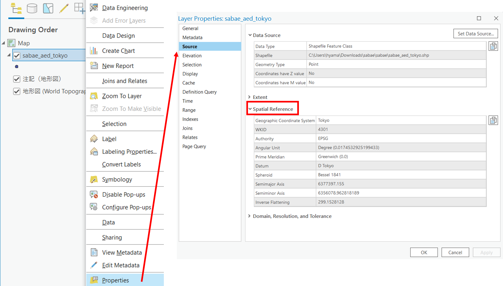
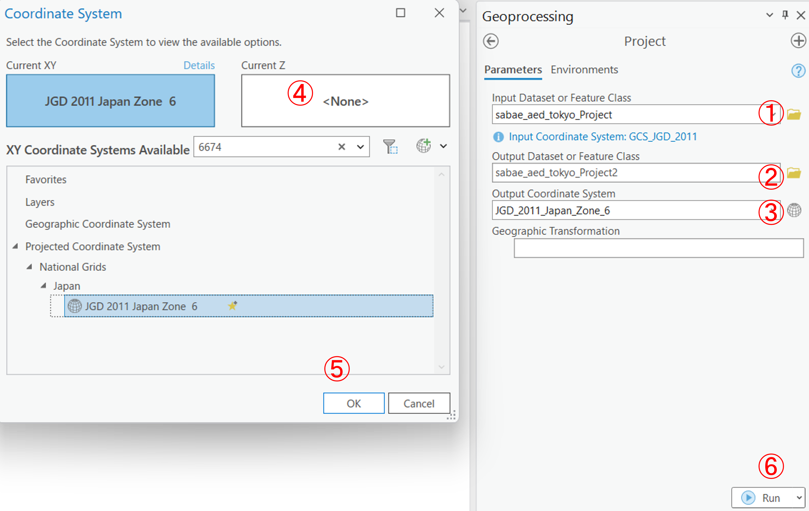
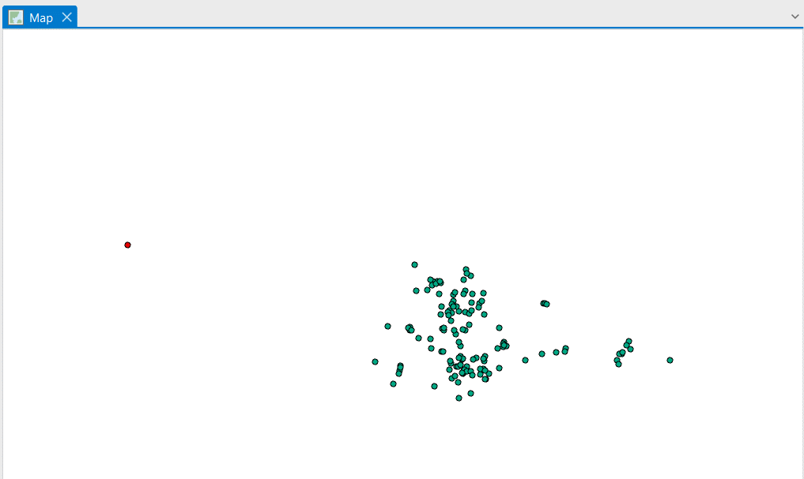

# 空間データの座標変換
本教材は、「空間データ」の実習用教材です。ArcGIS Proを用いた空間データの座標変換について解説しています。地理空間情報（GISで扱うことのできるデータ）は、測地系と座標系に基づいた位置情報を保持しています。測地系や座標系は様々なものがあります。そのため、複数のデータを処理する場合は、各データの座標系を統一する必要があります。ラスタデータの座標変換は別の実習で行います。

**Menu**
-----
- 測地座標系の変換
- 投影座標系の変換

----------

### 実習用データ

[Sabae](https://github.com/gis-oer/datasets/raw/master/sabae.zip)をダウンロードしてください。

## 測地座標系の変換
`sabae_aed_tokyo`（Tokyo）とsabae_aed_jgd2000（JGD 2000）のシェープファイルを読み込む。GISで空間座標の変換をする場合は、データそのものの変換のみでなく、地図の表示ウィンドウも変換後のデータの座標系にあわせて再設定する必要がある。地図の表示ウィンドウは、一番最初に読み込んだデータの座標系に合わせて設定される（データを読み込む前は、WGS 1984 Web Mercator (auxiliary sphere)がデフォルトとして設定されている）。

まず、データの空間座標を`Properties > Source > Spatial Reference`から確認する。このデータは、Tokyo（4301）ということがわかる。

今回はこの座標系をJGD2011（6668）に変換する。`Analysis > Tools`から`Project`を検索し以下の手順を実行する。

1. 変換するデータを指定する
2. 地球のアイコンをクリックし、変換先の座標系を設定する
3. `6668`を検索して、`JGD2011`をクリックする
4. `OK`を選択
5. `Run`実行する

結果が新しいデータとして出力されるが、ArcGIS Proには異なる座標系のデータを最初に読み込んだデータの座標系に合わせて見かけ上変換して表示する機能があるため、その機能をオフにして、変換結果を確認する。`Map`の上で右クリックし、`Properies > Coordinate Systems`から`Unknown`を選択し、`OK`をクリックする

レイヤの上で右クリックし、`Zoom to Layer`をクリックすると、２つのデータの分布がずれて表示されていることを確認できる。この際、ポイントの色を変更したり、`地形図 (World Topographic Map)`をオフにしたりすると、結果をわかりやすく表示できる。

[▲ Back to Menu]

## 投影座標系の変換
今回は書き出した緯度経度のデータを平面直角座標系の`JGD2011 Japan zone 6`に変換する。`Analysis > Tools`の`Project`から以下の手順を実行する。

1. 変換するデータを指定する
2. データ名に重複しないように名前を変える
3. 地球のアイコンをクリックし、変換先の座標系を設定する
4. `6674`を検索して、`JGD2011 Japan zone 6`をクリックする
5. `OK`を選択
6. `Run`実行する

レイヤの上で右クリックし、`Zoom to Layer`をクリックすると、1つのデータしか表示されていないことが確認できる。

ズームアウトすると、別の場所に変換前のデータがあることがわかる。それぞれ、データの空間座標系が異なるため、別の位置に表示される。

`Map`の上で右クリックし、`Properies > Coordinate Systems`から`Layers > JGD2011 Japan zone 6`を選択し、`OK`をクリックして地図の表示ウィンドウの設定をデータの座標系に合わせておく。

[▲ Back to Menu]

## 課題

### 課題1
東京23区コンビニのデータをJGD2011の平面直角座標系へ投影変換し、地図をレイアウトしてください。

#### 課題用データ

[東京23区コンビニ](https://github.com/gis-oer/datasets/raw/master/tasks/tokyo23ku-cvs_task.zip)をダウンロードしてください。

#### 課題1の完成例

### 課題2
地理座標系と投影座標系の違いについて、200~300字程度でまとめてください。

### 課題3
前回ダウンロードしたベクタデータのうち、JGD2011の平面直角座標系でなかったものを回答してください。

[▲ Back to Menu]

[▲ Back to Menu]:./3.md#Menu

