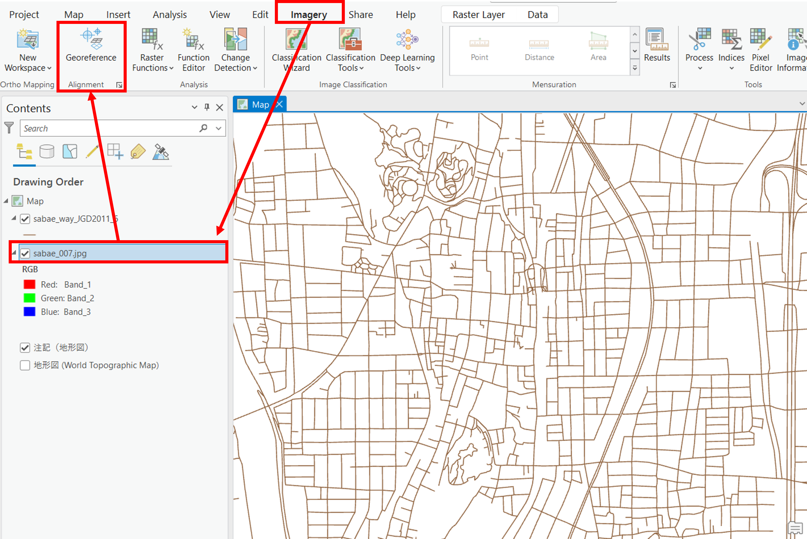

# ジオリファレンスとジオコーディング
以下では、電子化した紙地図（地図画像）をジオリファレンスする手法と、ジオコーディングによって住所情報から位置情報を取得する手法を解説しています。

**Menu**
-------
- [ジオリファレンス](#ジオリファレンス)
- [ジオコーディング](#ジオコーディング)

**実習用データ**

実習をはじめる前に、[Sabae]をダウンロードしてください。

## ジオリファレンス

### 事前作業
1. これまでの教材を参考に、sabaeフォルダを接続し、`sabae_way.shp`をマップに追加
2. `sabae_way.shp`をJGD2011の平面直角座標系の6系に投影変換
3. 背景地図もJGD2011の平面直角座標系の6系に設定

### 地図画像の読み込み
Contentsのウィンドウに、`sabae_007.jpg`を読み込む。ウィンドウがでるが、Yesを選択する。

### ジオリファレンスの処理
`Imagery`をクリックし、地図画像を選択する。次に、`Georeference`をクリックする。

以下のような範囲に地図画面をズームし、次の順でボタンを選択する。

1. `Fit to Display`で地図画像を表示
2.  `Control Points Table`をクリック
3.  `Add Control Points`を選択し、地図画像を道路データに合わせていく

地図画像→GISデータの順で、合致する交差点などを複数箇所指定する。点は地図画像の全体を網羅するように作成する。点を追加すると自動で、画像が補正されていく。この例では、20点ほどコントロールポイントを追加した。コントロールポイントは、画像を網羅するように配置する（`Auto Apply`を停止したほうが、わかりやすい場合もある。その場合は適宜`Apply`を実行する）。

この例では、`1st Order Polynominal (Affine) / 一次多項式（アフィン）`となっているが、ゆがみ補正に適した`2nd Order Polynominal / 二次多項式`も試し、双方の結果を確認する。Residual（残差）が大きいものを消すことで、ジオリファレンスの精度があがる場合もある。変換方法や残差をチェックしながら、**ある程度**地図が重なるまで、処理を繰り返す。※ゆがみのある地図画像をGISデータと完全に一致させることは難しい

> ArcGIS Proでのジオリファレンスの詳細は、ESRI社の[ジオリファレンスの概要](https://pro.arcgis.com/ja/pro-app/latest/help/data/imagery/overview-of-georeferencing.htm)、[ジオリファレンス ツール](https://pro.arcgis.com/ja/pro-app/latest/help/data/imagery/georeferencing-tools.htm)などのページを参照。変換方法については、
ESRIジャパン株式会社 公式ブログ・[ArcGIS Pro の画像処理機能紹介 その 1 ～ジオリファレンス～](https://blog.esrij.com/2017/08/08/post-27513/)で簡潔に紹介されている。
次の手順でジオリファレンスの処理を完了し、結果を地図としてレイアウトする。

1. `Save as New`から、書き出しの座標系を設定した後、tiff画像として結果をエクスポート
2. `Export Control Points`からコントロールポイントを保存
3. `Save`をクリック
4. `Close Georeference`を選択

作成したデータを地図として、レイアウトする。レイアウトの方法は、ArcGIS Proビギナーズマニュアルを参考にする。

[▲ Back to Menu]

## ジオコーディング
　ジオコーディングは、住所や緯度経度などの情報から、GISで扱えるデータ等を作成する手法です。以下では、鯖江市内の店舗のデータ(sabae_store.csv)を用いて、住所と経緯度の情報からジオコーディングする手法として、CSVアドレスマッチングサービスについて解説しています。

## CSVアドレスマッチングサービスを利用する
東京大学空間情報科学研究センターが提供する[CSVアドレスマッチングサービス]を利用して、住所から緯度経度を求めることができる。以下では、その手法について解説する。

sabae_store.csvの住所情報をもとに以下の手順で、ジオコーディングを実行する。

1. 全国街区レベル（緯経度・世界測地系）を選択する。
2. 住所を含むカラムに`3`を入力（エクセルでみたときの住所が入っている箇所に相当する）する。
3. シフトJISコード（SJIS）を選択する。
4. 避難所をまとめたCSVを選択する。
5. 送信をクリックする。その後、保存のウインドウが表示されるため、データを保存する。
6. ダウンロードしたデータをエクセルなどで開き、住所と位置情報の特定精度を確認する。

### ArcGISで緯度経度つきのCSVデータを表示する
ArcGIS Proビギナーズマニュアルを参考に、CSVデータを読み込み、空間データの座標変換（JGD2011 平面直角の6系）し、地図をレイアウトする。

## 課題
以下の課題のうち**いずれか**を実施し、それぞれの地図を作成してください。

### 実習用データ
以下から、実習用データを入手する。

- 課題1 [鯖江市_古地図006]
- 課題2 [裾野市_AED設置施設]

## 課題1 ジオリファレンス
最初の演習で使用した地理院タイルをもとsabae_way.shpを基準に、地図画像をジオリファレンスする。

### 完成例

## 課題2 ジオコーディング
[裾野市_AED設置施設]を用いて、ジオコーディング（アドレスマッチング)を行い地図を作成して下さい。ジオコーディングでは、全国街区レベル（緯経度・旧測地系）を選択してください。旧測地系はTokyo（4301）です。

### 完成例

[▲ Back to Menu]

[Sabae]:https://github.com/gis-oer/datasets/raw/master/sabae.zip
[CSVアドレスマッチングサービス]:http://newspat.csis.u-tokyo.ac.jp/geocode-cgi/geocode.cgi?action=start
[鯖江市_古地図006]:https://github.com/gis-oer/datasets/raw/master/tasks/sabae_task.zip
[裾野市_AED設置施設]:https://github.com/gis-oer/datasets/raw/master/tasks/susono_task.zip

[▲ Back to Menu]:./4.md#Menu