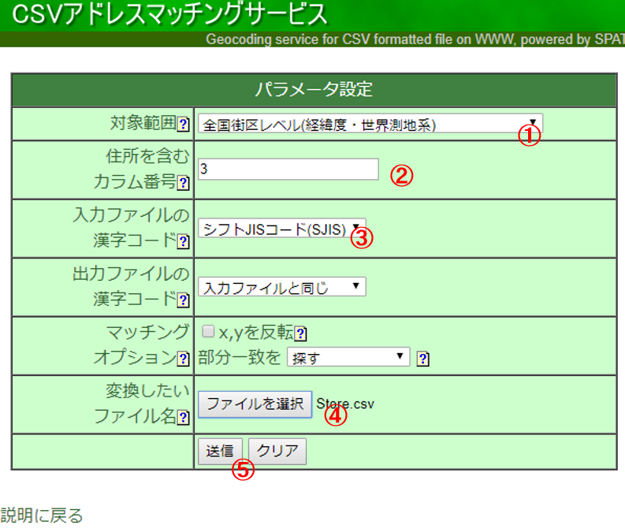
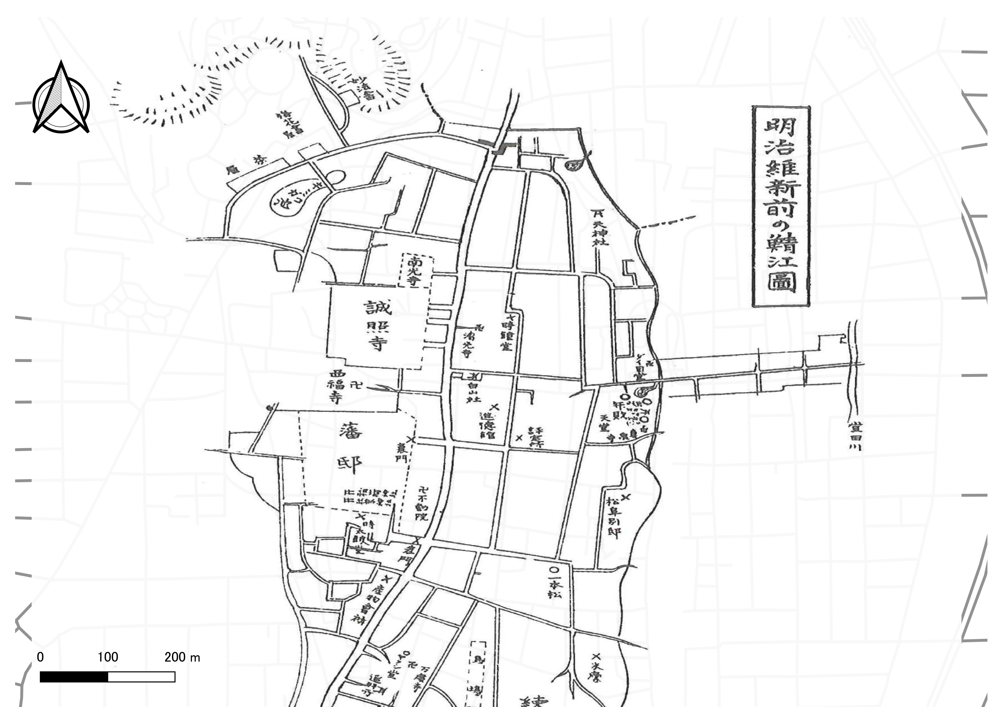

# ジオリファレンスとジオコーディング
以下では、電子化した紙地図をジオリファレンスする手法と、ジオコーディングによって住所情報から位置情報を取得する手法を解説しています。

**Menu**
-------
- [ジオリファレンス](#ジオリファレンス)
- [ジオコーディング](#ジオコーディング)

**実習用データ**

実習をはじめる前に、[Sabae]をダウンロードしてください。

## ジオリファレンス

### 事前作業
1. これまでの教材を参考に、sabaeフォルダを接続し、`sabae_way.shp`をマップに追加
2. `sabae_way.shp`をJGD2011の平面直角座標系の6系に投影変換
3. 背景地図もJGD2011の平面直角座標系の6系に設定

### 地図画像の読み込み
Contentsのウィンドウに、`sabae_007.jpg`を読み込む。ウィンドウがでるが、Yesを選択する。

## ジオコーディング
　ジオコーディングは、住所や緯度経度などの情報から、GISで扱えるデータ等を作成する手法です。以下では、鯖江市内の店舗のデータ(sabae_store.csv)を用いて、住所と経緯度の情報からジオコーディングする手法について、2つのWEBサイトを利用して解説しています。

## CSVアドレスマッチングサービスを利用する
東京大学空間情報科学研究センターが提供する[CSVアドレスマッチングサービス]を利用して、住所から緯度経度を求めることができる。以下では、その手法について解説する。

sabae_store.csvの住所情報をもとに以下の手順で、ジオコーディングを実行する。

1. 全国街区レベル（緯経度・世界測地系）を選択する。
2. 住所を含むカラムに`3`を入力（エクセルでみたときの住所が入っている箇所に相当する）する。
3. シフトJISコード（SJIS）を選択する。
4. 避難所をまとめたCSVを選択する。
5. 送信をクリックする。その後、保存のウインドウが表示されるため、データを保存する。

### ArcGISで緯度経度つきのCSVデータを表示する
ArcGIS Proビギナーズマニュアルを参考に、地図を表示する。

本実習をはじめる前に、以下のデータをダウンロードしてください。

## 課題
以下の２つの課題を実施し、それぞれの地図を作成する。

### 実習用データ
以下から、実習用データを入手する。

- 課題1 [鯖江市_古地図006]
- 課題2 [裾野市_AED設置施設]

## 課題1 ジオリファレンス
[鯖江市_古地図006]と、地理院タイルをもとにGCPを取得し、完成例のようにジオリファレンスした図を作成してください。まず、way.shpを読み込み、地図を表示する位置の基準としてください。

### 完成例

## 課題2 ジオコーディング
[裾野市_AED設置施設]を用いて、ジオコーディング（アドレスマッチング)を行い地図を作成して下さい。

### 完成例

[▲ Back to Menu]

[Sabae]:https://github.com/gis-oer/datasets/raw/master/sabae.zip
[CSVアドレスマッチングサービス]:http://newspat.csis.u-tokyo.ac.jp/geocode-cgi/geocode.cgi?action=start
[鯖江市_古地図006]:https://github.com/gis-oer/datasets/raw/master/tasks/sabae_task.zip
[裾野市_AED設置施設]:https://github.com/gis-oer/datasets/raw/master/tasks/susono_task.zip

[▲ Back to Menu]:./4.md#Menu