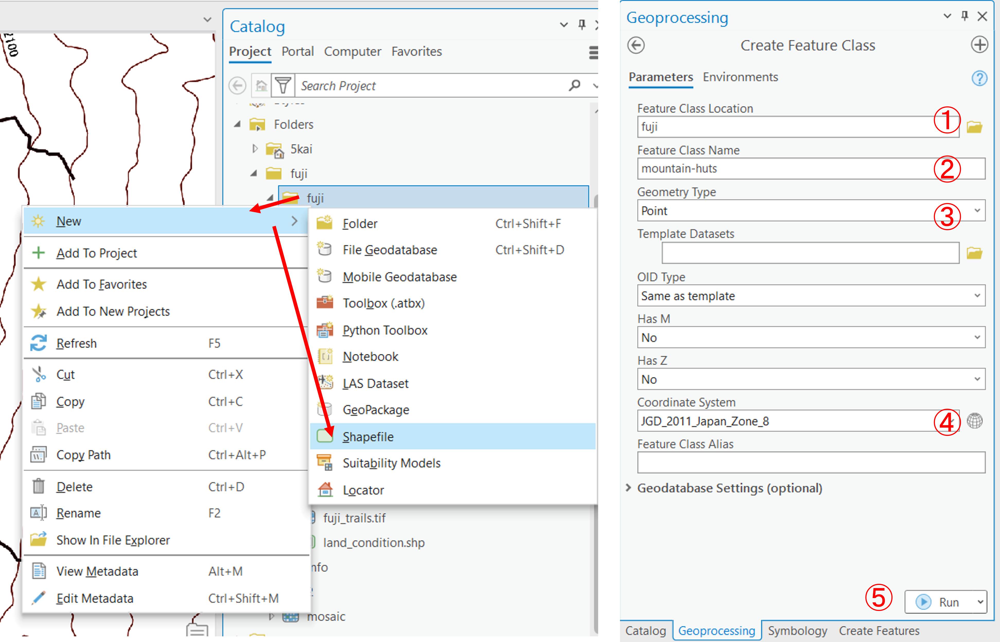
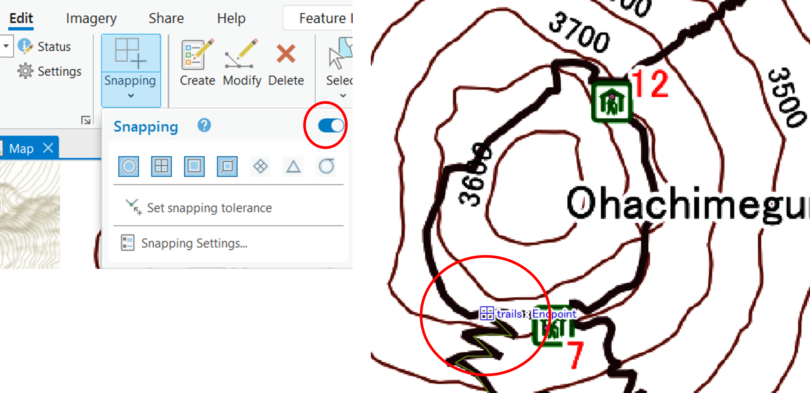

# 空間データの作成
　GISで用いられるラスタデータの統合と、ベクタデータの作成手法について解説しています。

**Menu**
---------
* [ラスタのモザイクとクリップ](#ラスタのモザイクとクリップ)
* [等高線の抽出](#等高線の抽出)
* [ラスタをベクタへ](#ラスタをベクタへ)
* [新規ベクターレイヤの作成](#新規ベクタの作成)

**実習用データ**

実習をはじめる前に、[fuji]をダウンロードしてください。

[fuji]:https://github.com/gis-oer/datasets/raw/master/fuji.zip

## ラスタのモザイクとクリップ
　以下では、ラスタデータ(ここでは、DEMを使用)の結合と任意範囲での切り抜きの解説する。DEMは、Digital Elevation Modelの略であり、各セルごとに標高値を保持しているデータです。以下に従って、ダウンロードしたデータから任意の地域のデータを結合し、切り出していく。次に、ラスタのセル値を用いて、等高線を抽出する。

### ラスタのモザイク
ArcGIS Proに`fuji_trails.tif`以外のtifファイルを読み込む。

`Analysis > Tools > Mosaic To New Raster`を選択する。

以下の手順で複数のファイルを一つのラスタデータにする。

1. `Input Rasters`の横の（＞）のマークをクリックし、fuji_1.tif~fuji_12.tifを選択する。
2. データを書き出すフォルダを指定する
3. データ名を指定する
4. `Number of Bands`を`1`とする
5. `Run`を実行すると、結果が出力される

### ラスタの座標変換
`Analysis > Tools > Project Raster`を選択し、マージしたラスタデータを地理座標系から、平面直角座標系(JGD2011 zone 8)に変換する。

1. ラスタを指定する
2. 出力ファイル名を指定する
3. 地球儀マークを選択する
4. `JGD 2011 Japan Zone 8`
5. `Bilinear Interpolation`(共1次内挿法)を選択する
6. `Run`を実行する
7. マップウィンドウの地図の座標も`JGD 2011 Japan Zone 8`にする

### ラスタのクリップ
`Analysis > Tools > Clip Raster`を選択し、必要な範囲のデータを抽出する。

1. ラスタを指定する
2. 鉛筆マークをクリックし、`Polygon`を選択する
3. を選択して、地図上で範囲を指定する
4. `NoData Value`を`0`とする
5. `Run`を実行する

### ラスタの配色(値の分類)
以下では、抽出したデータの配色について解説する。DEMは、ラスタのセルごとに標高値を保持しているため、標高値による色分けができる。色分けは、以下の手順で行う。

1. 色を選択する
2. Stretch typeを`Minimum Maximum`(最小値ー最大値)を選択する
3. `Advanced Labeling`を選択し、今回はIntervalを`４`にする
4. インターバルの値を調整する
5. `Apply`を実行する

※　Edit min/max values にチェックをつけると、最大値と最小値を調整できる。

この分類では、以下のような地図になる。

## 等高線の抽出
　作成したラスタデータは、各セルごとに標高値を保持している。そのため、セルの値を補間、等高線を作成することができる。`Analysis > Tools > Contour`を選択する。

1. ラスタデータを指定
2. 出力ファイルを指定
3. 今回は、50 mの間隔で等高線を作成する
4. `Run`を実行すると等高線が出力される

**ここまでの内容を地図としてレイアウトし、画像を出力する。**

[▲ Back to Menu]

## 新規ベクターレイヤの追加
　GISでは、データを自作をすることができる。以下では、富士山の山小屋（ポイント）、登山道（ライン）、火口（ポリゴン）のデータの作成を通じて、新規にベクトルデータを作成する手法を解説する。以下をはじめる前に、富士山登山同図（fuji_trails.tif）をGISで読み込む。

### ポイントデータの作成と保存
以下では、富士山の山小屋のポイントを作成していく。背景図が読み込みが完了したら、カタログを開き、フォルダー内で右クリックし、`New > Shapefile`を選択する。

1. 出力先フォルダを指定
2. レイヤ名を指定
3. Geometry Typeを`Point`にする（ポイントデータを作成するため）
4. 座標系を指定する
5. `Run`を実行するとContentsウィンドウに空のポイントデータが出力される

作成したベクタデータをContentsウィンドウで選択し、`Edit > Create`をクリックする。

Create Featuresから編集するレイヤを選択し、ポイントを追加するアイコンをクリックする。次に、背景地図を参考に山小屋のポイントを地図上に作成する。

追加が完了したら、Finishアイコンをクリックし、`Save`をクリックする。作成したポイントを修正したいときは、`Modify`のアイコンをクリックし、作業する。ポイントを削除するときは、ポイントをSelectツールで選択して、`Delete`を実行する。

### ラインデータの作成
ポイントデータを作成する要領で、ラインデータを作成する。Polylineを選択し、空のレイヤを作成した後、登山道を何度もクリックしてなぞるようにラインデータを作成する。最後の点で右クリックをするとダイアログが表示されるため、`Finish`をクリックする。

２本目の線からは、`Snapping`をオンにして線の頂点が重ならうようにする。すべての登山道が作成できたら、`Save`をクリックする。

### ポリゴンデータの作成
ラインデータを作成する要領で、火口のふちを何度もクリックしてなぞるようにポリゴンデータを作成する。Polygonを選択し、空のレイヤを作成する。最後の点で右クリックをするとダイアログが表示されるため、`Finish`をクリックする。

**ここまでの内容を地図としてレイアウトし、画像を出力する。**

[▲ Back to Menu]

## 課題
　この実習では、ラスタデータのクリップと新規ベクトルデータの作成を行います。完成例のような地図を作成してください。ポイントデータは完成例、不忍池のポリゴンやルートのラインは、地理院タイルの空中写真をトレースして作成してください。※完成例にある地名、標高点などデータのラベルは不要です。等高線の間隔は5mまたは10mとする。

### 実習用データ
本実習を始める前に、[tokyo]をダウンロードしてください。本実習では、tokyo_srtm.tiffのみを使用します。

[tokyo]:https://github.com/gis-oer/datasets/raw/master/s/tokyo_s.zip

### 完成例

[▲ Back to Menu]

[▲ Back to Menu]:./5.md#Menu