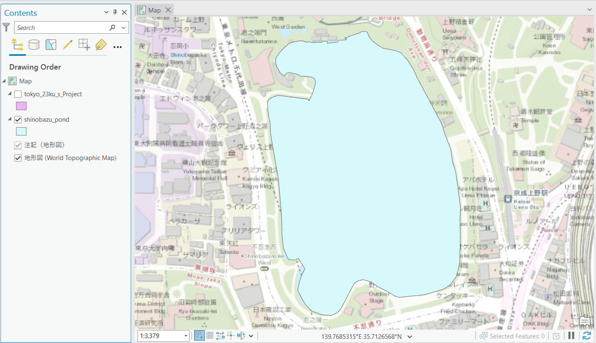
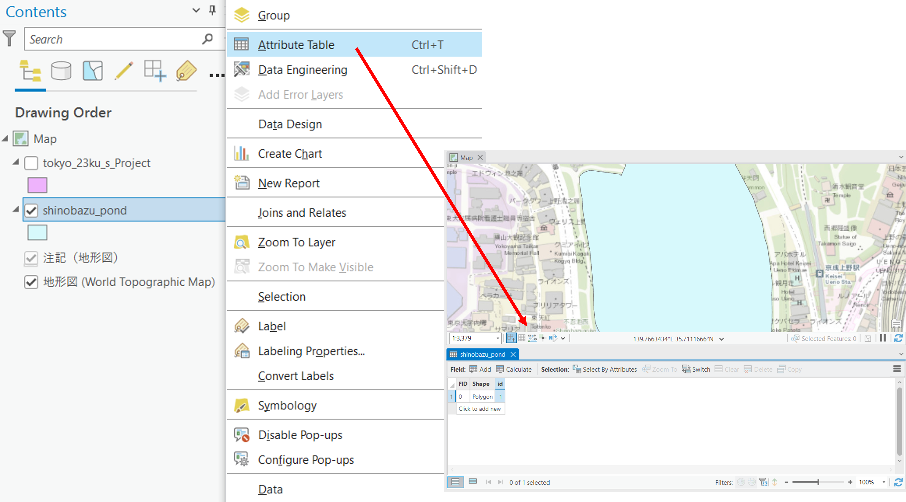
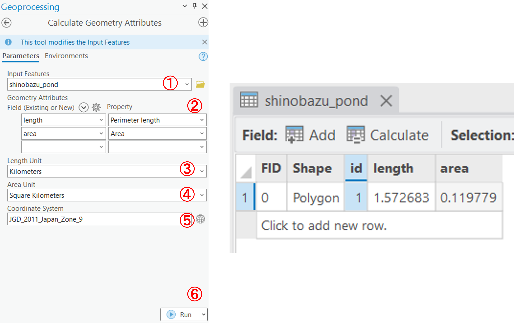
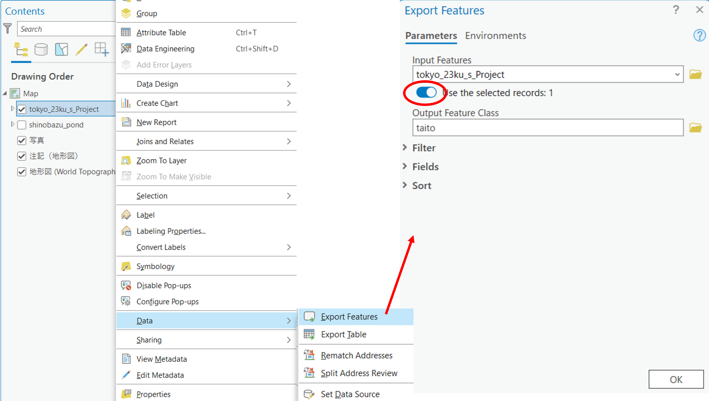
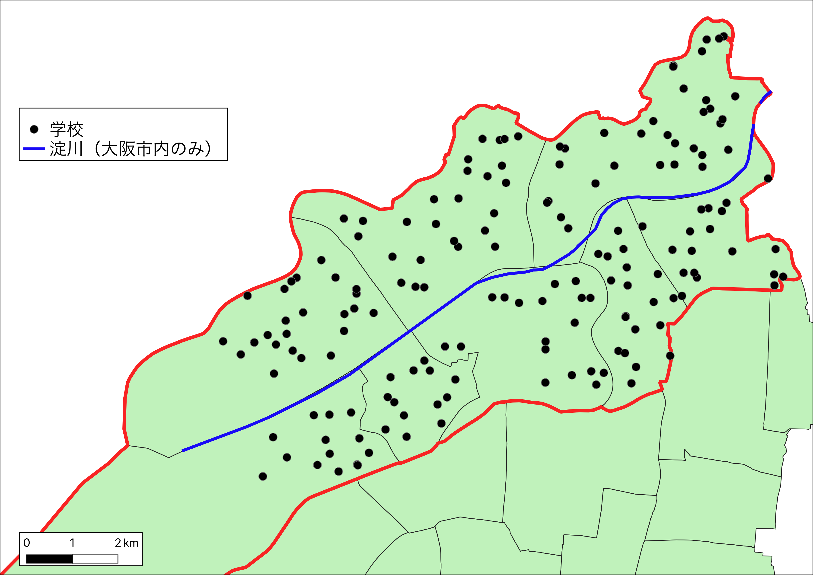

# 基本的な空間解析
　本教材は、「基本的な空間解析」の実習用教材です。GISソフトウェア（ArcGIS Pro）を用いた、地物の計測、ディゾルブ、クリップなどの空間解析手法について解説しています。

**Menu**
------
* [基本量の測定](#基本量の測定)
* [選択と地物の保存](#選択と地物の保存)
* [その他の空間データの操作](#その他の空間データの操作)

**実習用データ**

実習をはじめる前に、[tokyo]と[shinobazu]をダウンロードしてください。今回は東京23区のポリゴンと不忍池のポリゴンを使用します。

[tokyo]:https://github.com/gis-oer/datasets/raw/master/s/tokyo_s.zip
[shinobazu]:https://github.com/gis-oer/datasets/raw/master/shinobazu.zip

## 基本量の測定
　GISでは、データの形状や属性情報を用いて、地物の長さや面積を計測することができます。ここでは、不忍池の周長と面積の計測を行います。

まず、東京都23区と不忍池のポリゴンデータを読み込みます。東京23区のデータは、投影座標系への変換が必要なため、適切な処理を行った後、`Map`の座標系もあわせる。

次に属性テーブルを開く。

`Analysis > Tools > Calculate  Geometry Attributes`を選択し、以下の手順で池の周長と面積を算出し、結果を属性テーブルに追加する。

1. `shinobazu_pond`を指定
2. 新規に出力するフィールドとして、`length`と`area`を入力し、`length`に`Perimeter length(周長)`をareaに`area(面積)`を指定
3. `length`の単位を`㎞`とする
4. `area`の単位を`㎢`とする
5. 座標系を指定
6. `Run`を実行

[▲Menu]

## 選択と地物の保存
以下では、空間オブジェクトの選択の手法について解説しています。まずは、東京23区のポリゴンから台東区のみを抽出する。

東京23区のポリゴンの上で右クリックし、`Attribute Table (属性テーブル)`を開く。属性テーブル上で`taito`を選択すると地図ビューにも反映されることを確認する。青枠の`Select`ツールを使用すれば、地図上の選択が属性テーブルに反映される。選択状態（水色表示）を解除するには、`Clear`をクリックする。

東京23区のポリゴンの上で右クリックし、`Data > Export Features`を選択し、出力先を指定する。次に`Use the selected records`にチェックがついていることを確認し、出力データ名を入力した後、OKをクリックする。最後に、出力結果を確認する。

同じ手順で墨田区のポリゴンを出力する。墨田区のポリゴンは以下で使用する。

※　複数選択したいときは、shiftキーを押しながら選択する。選択したいレイヤのみ、チェックをつけて表示しておくなどすると、地図上のオブジェクトが選択しやすい。

[▲Menu]

## その他の空間データの操作
　GISでは、データの位置、形状、属性を用いて新たにデータを作成することができます。以下では、マージ（複数のデータを1つに結合）、ディゾルブ（属性を用いてデータを融合する）、クリップ（重なっているデータを指定し、特定の範囲を切り取る）について解説します。この内容をはじめる前に、`cvs_jgd2011_s.shp`を読み込み、投影座標系に変換してください。

### マージ(Merge)
`Analysis > Tools > Merge`を選択する。

墨田区と台東区のポリゴンを指定し、`Run`を実行すると結果が出力される。

### デイゾルブ(Dissolve)
`Analysis > Tools > Dissolve`を選択する。

ディゾルブには、属性が統一されている行を用いる。次の手順でデイゾルブを実行すると、以下のような区の境界のないポリゴンが出力される。

1. 入力レイヤを選択する。
2. 出力レイヤを指定する。
3. ディゾルブフィールドとして、`region`を選択する。
4. `Run`をクリックする。

### クリップ(Clip)
この処理をする前に`cvs_jgd2011_s.shp`を読み込み、座標系をディゾルブしたポリゴンデータとあわせる。次に、`Analysis > Tools > Clip`を選択する。

次の手順でクリップを実行すると、以下のように、ポリゴンデータと重なる範囲のポイントデータが出力される。

1. 入力レイヤをポイントデータにする。
2. `Clip Features`をディゾルブしたポリゴンデータにする。
3. 出力レイヤを指定する。
4. `Run`をクリックする。　

[▲Menu]

## 課題
　GISでは、ベクトルデータの保持する形状、位置、属性等の情報を用いることで特定の条件にあった新規レイヤを抽出することができます。淀川、淀川に隣接する区と、その範囲内の学校分布を示す地図を作成してください。作成する地図は、淀川に隣接する区と他の区がわかるように前者を完成例のように赤枠で示してください。

### 課題用データ
[osaka]をダウンロードしてください。この課題では、`river_s.shp`、`osaka_s.shp`、`school.shp`を使用します。

[osaka]:https://github.com/gis-oer/datasets/raw/master/s/osaka_s.zip

### 完成例

### 参考手順

1. データと地図ウィンドウの座標系を統一する。
2. 河川のデータをディゾルブした後、選択機能で淀川を抽出する。
3. 淀川が流れるエリアを選択して、出力する。
4. 3.で出力したポリゴンをデイゾルブし、ポリゴンのシンボルをアウトラインのみ表示する。
5. ディゾルブしたポリゴンを用いて、淀川をクリップする。
6. ディゾルブしたポリゴンを用いて、区内の学校をクリップする。
7. 出力したデータを用いて地図をレイアウトする。

[▲Menu]

[▲Menu]:./6.md#Menu
