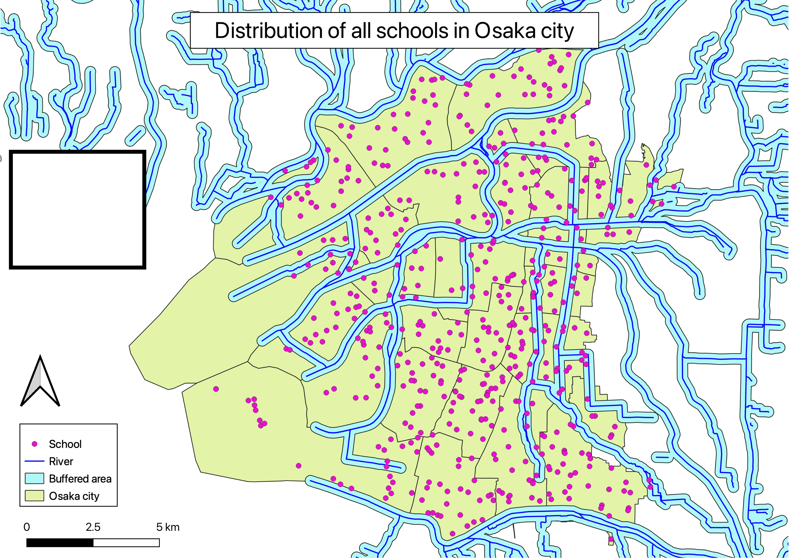

# 領域分析と検索
GISソフトウェア（ArcGIS Pro）を用いた、領域分析(バッファ)と空間検索の実習用教材です。

**Menu**
------
* [バッファ](#バッファ)
* [空間検索](#空間検索)
* [属性検索](#属性検索)

**実習用データ**

実習をはじめる前に、[tokyo]をダウンロードしてください。今回は、`cvs_jgd2011_s`と`post_office_s`を使用するため、事前に平面直角座標系に変換する。

[tokyo]:https://github.com/gis-oer/datasets/raw/master/s/tokyo_s.zip

## バッファ
　バッファは、地物からの距離に応じて一定の領域を作成する手法です。以下では、ArcGIS Proと実習用データを利用し、ポイントデータからバッファを作成する手法や、一定の距離に区切った多重リングバッファを作成する手法について解説します。

### 点バッファの作成
東京都のコンビニデータを読み込む。次に、バッファを作成するために、`Analysis > Tools > Buffer`を選択する。

以下の手順を実行すると、コンビニから500mのバッファが作成できる。

1. 入力レイヤを指定
2. 出力レイヤを指定
3. `Linear Unit`を選択
4. `Meters`を選択
5. `500`とする
6. `Method`を`Planar`にする
7. `Dissolve Type`を`No Dissolve`を選択　※「なし」を選択
8. `Run`を実行

同じ手順で、`Dissolve Type`を`Dissolve all output features into a single feature`にすると、境界が融合されたポリゴンが作成できる。

### 線バッファと面バッファ
ラインやポリゴンを入力レイヤとして、点バッファの作成と同じ手順でバッファの作成を実行すると、以下のようなバッファが作成できる。

### 多重リングバッファ
多重リングバッファでは、一定間隔ごとにバッファを作成できる。`Analysis > Tools > Multiple Buffer`を選択する。

以下の手順で、500mの範囲のバッファを100ｍごとに分割して作成する。

1. 入力レイヤを指定
2. 出力レイヤを指定
3. `Distances`を100～500mまでを100mごとに入力する
4. `Distance Unit`を`Meters`とする
5. `Buffer Distance Field Name`を`distance`とする
6. `Dissolve Option`を`Non-overapping (rings)`とする
7. `Method`を`Planar`とする

[▲Menu]

## 空間検索
　以下では、バッファで作成した領域を用いた空間検索の手法を解説します。空間検索は、データのジオメトリーの情報を利用してデータを検索する手法です。ここからは、上記で作成したコンビニから500mのポリゴン（`Dissolve Type`を`No Dissolve`としたもの）を用いて、その中に含まれる郵便局のデータを特定していきます。

`Map > Select By Location`をクリックし、次の手順を実行すると各コンビニから500ｍの範囲にある郵便局に該当するレイヤが選択できる。

1. 入力レイヤを指定
2. `Relationship`を`Intersect`にする
3. `Selecting Features`を各コンビニから算出した500mバッファにする
4. `New Selection`になっていることを確認する 
5. `Apply`を実行する

> ここでは、2で`Intersect`を指定したが、他のパラメータについては[空間条件で選択: 図の例](https://pro.arcgis.com/ja/pro-app/latest/tool-reference/data-management/select-by-location-graphical-examples.htm)が詳しい。

郵便局のレイヤの属性テーブルを表示し、結果を確認する。以下のように、赤枠のボタンをクリックすると選択した情報のみが表示される。ここでは、選択しているポイントの数が、青枠内に記載されていることを確認しておく。

[▲Menu]

## 属性検索
GISでは、空間検索の他に属性情報からデータを検索する手法があります。以下では、属性検索の手法について解説します。

属性検索をする前に、各コンビニから算出した500mのポリゴンに含まれる郵便局の数を算出する。`Analysis > Tools > Summarize Within`を選択する。※ 解析ツールの方を使う

以下の手順を実行すると、属性テーブルに結果が算出される。

1. `Input Polygons`を各コンビニから算出した500mのポリゴンにする
2. `Input Summary Features`を郵便局のポイントデータにする
3. 出力レイヤを指定する
4. `Run`を実行し、属性テーブルに結果が算出されていることを確認する（列で右クリックし、`Sort Descending`をクリックすると降順に表示できる）

`Map > Select By Attributes`をクリックし、属性検索を実行する。

ここでは以下のように、500ｍの範囲に、5つ以上の郵便局をもつコンビニ（バッファ）を特定する。

1. 属性検索するレイヤ（郵便局数を算出したポリゴン）を選択する
2. `Selection Type`を`New Selection`とする
3. Count of Points : 郵便局数が格納された列名を指定
4. `is greater than or equal to`を選択
5. 今回は`5`とする
6. `Apply`し結果を確認し、`OK`をクリックすると結果が確認できる。

属性検索は、属性情報を検索する機能であるため、地名や施設名などのテキストも検索できる。以下の右図のように、SQLでも属性検索ができる。

[▲Menu]

## 課題
　この実習は、ポイントデータから領域を作成する手法として、バッファの作成と空間検索を行うものです。大阪市およびその周辺の河川（`river_s.shp`）と学校（`school_s.shp`）を用いて、河川(`river_s.shp`)から200m圏内に含まれる学校の件数を算出してください。その後、完成例のような地図を作成し、パワポなどで地図の中に算出したポイント数を記載してください。

### 実習用データ
実習をはじめる前に、[osaka]をダウンロードしてください。

[osaka]:https://github.com/gis-oer/datasets/raw/master/s/osaka_s.zip

### 完成例

[▲Menu]

[▲Menu]:./7.md#Menu
