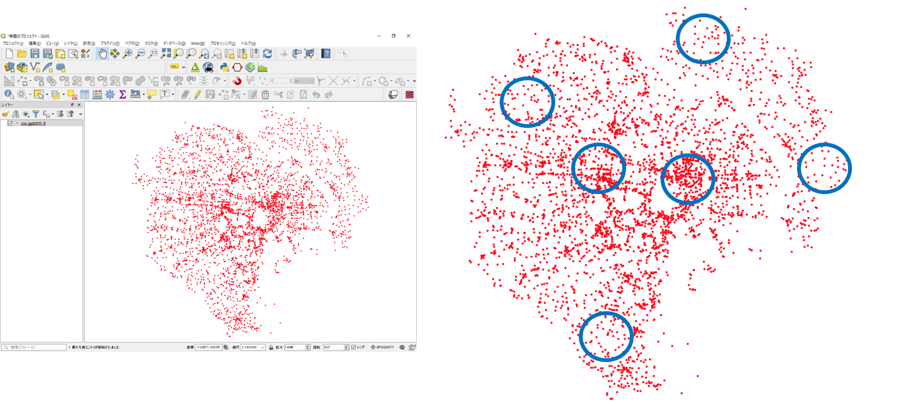
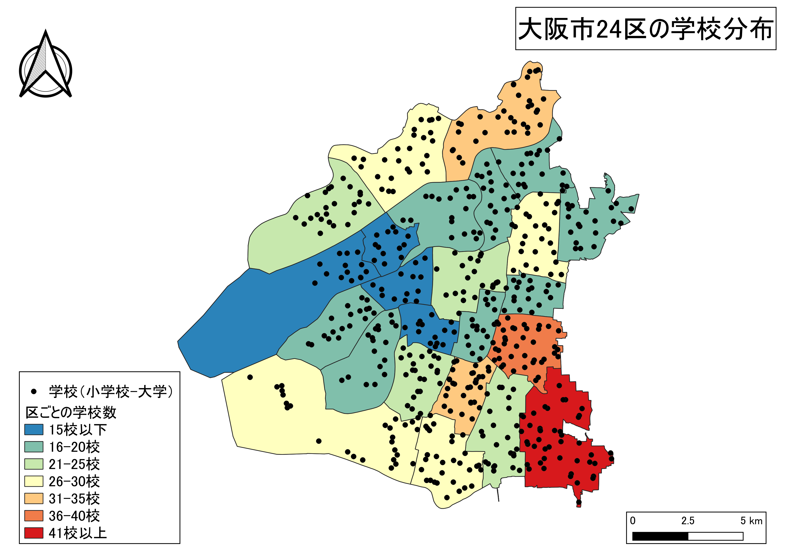

# ポイントデータの集計とテーブル結合
　本教材は、「ポイントデータの集計とテーブル結合」の実習用教材です。ArcGIS Proを用いて、点データの密度を可視化し視覚的に分析する手法とテーブル結合によってデータを作成する手法を解説しています。前提として、点データの集計では、メッシュや行政区画などの空間集計に用いるオブジェクトの大きさに影響されることを注意する必要があります。

**Menu**
------
* [点の分布密度](#点の分布密度)
* [メッシュによる点密度の表示](#メッシュによる点密度の表示)
* [行政区内の点密度](#行政区内の点密度)
* [カーネル密度推計](#カーネル密度推計)
* [テーブル結合](#テーブル結合)

**実習用データ**

実習をはじめる前に、[tokyo]と[tokyotogikai]をダウンロードしてください。今回は、`togikai_23ku_202310.xlsx`、`tokyo_23ku_s.shp`、`cvs_jgd2011_s.shp`を使用します。実習前に、後2者のデータを平面直角座標系に変換してください。

[tokyo]:https://github.com/gis-oer/datasets/raw/master/s/tokyo_s.zip

[tokyotogikai]:https://github.com/yamauchi-inochu/learning/raw/main/data/tokyotogikai.zip

-------

## 点の分布密度
　下の図は、GISで東京都のコンビニエンスストアの分布を示したものです。この図を見ると点が密集している地域とそうでない地域があることはわかります。しかし、地域ごとの密度の違いはよくわかりません。そこで、以下ではArcGIS Proでメッシュ（方形区）や行政区画ごとに密度を可視化する手法を解説します。

## メッシュによる点密度の表示
`Analysis > Tools > Grid Index Features`から以下の手順で、メッシュを作成する。ここでは、500m×500mのメッシュを作成する。

1. 入力レイヤ（今回は点データ）を選択
2. 出力レイヤ（今回は点データ）を指定
3. `Generate Polygon Grid that...`のチェックを外す。
4. `500`とし、`Meter`を指定
5. `500`とし、`Meter`を指定
6. `Run`を実行

### 空間結合機能でメッシュ内のポイント数を計算する
`Analysis > Tools > Spatial Join`を選択する。

以下の手順で、メッシュ内のポイント数を計算する。

1. Target Featuresを指定（今回はメッシュのポリゴンデータ）
2. Join Featuresを指定（今回は点データ）
3. 出力レイヤを指定
4. `Join one to one`を指定
5. `Keep All Target Features`にチェック
6. `Add Fields > Add Empty Field`を選択
7. `NewField`を選択
8. `Edit`を選択
9. `NewField`を選択
10. `Type`を`Big Integer(64 bit integer)`とする
11. 点データを選択
12. `OBJECTID`を指定
13. `OK`をクリック
14. `Run`を実行すると、属性テーブルにJoin_Countのフィールドが作成される。ソートすれば、降順に並び替えられる

### メッシュ内のポイント数で色分け
レイヤの上で右クリックし、`Symbology > Graduated Colors` を選択する。

次の手順で、各メッシュ内のポイント数をもとに色分けを行う。

1. `Join_Count`を指定
2. `Manual Interval`を指定
3. 色を選択　※一般的に値が高いほど、赤色を設定することが多い
4. 値の閾値を指定
5. 凡例を設定

[▲Menu]

## 行政区内の点密度
　同じ手法で、行政区画のポリゴンを利用し、行政区ごとの点密度を計算することもできる。

シンボルも示したい情報に合わせて設定できる。

※　行政区域のように面積が異なる場合は、数ではなく、属性テーブルで算出した割合の値を使うこともある。

[▲Menu]

## カーネル密度推計
　カーネル密度分析は犯罪発生マップなどに用いられる手法で、カーネル関数を用いてポイントの分布密度を連続的な密度局面としてモデル化する手法です。`Analysis > Tools > Karnel Density`を選択し、以下のように実行する。

1. 入力レイヤを指定
2. 出力レイヤを指定
3. セルサイズを`30`に設定
4. `Run`を実行

[▲Menu]

## テーブル結合
　ここでは、[tokyotogikai]のエクセルファイルを、23区のポリゴンデータに結合する手法を解説する。まず、ダウンロードしたエクセルファイルと、23区のポリゴンデータで完全一致するフィールドを確認する（今回は、前者のDistrictと後者のnameが一致）`Analysis > Tools > Add Join`を選択し、以下のように実行する。

1. コンビニのデータを指定
2. 結合するフィールドを選択（今回は`name`）
3. エクセルファイルとシート名を選択
4. 結合するフィールドを選択（今回は`District`）
5. `Run`を実行すると結果が確認できる

以下のようにシンボルを変えることもできる。

[▲Menu]

**ここまで実施した内容から二つ選びスタイルを整えた地図画像を一枚作成する(方位、スケール、凡例)**

[▲Menu]

# 課題
　GISで点データの密度を可視化する場合、分析に用いる空間オブジェクトの形状や大きさを考慮する必要があります。この実習では、メッシュによる集計法を用いて、点データを視覚的に分析します。

### 実習用データ
実習をはじめる前に、[osaka]をダウンロードしてください。

[osaka]:https://github.com/gis-oer/datasets/raw/master/s/osaka_s.zip

## メッシュによる点の集計
　均一な大きさのメッシュポリゴン（1kmメッシュ）を作成し、メッシュ内に含まれる学校の数を集計し、配色を調整した地図を作成してください。

### 完成例

※メッシュの範囲は完成例と一致していなくても良い

## 行政区域を用いた点の集計
大阪市の各区に含まれる学校の数を集計し、スタイルを整えた地図を作成してください。

### 完成例

※ 完成例のように区ごとを塗り分ける方式も可とするが、より適した可視化法を検討し、地図を作成しても良い。

[▲Menu]

[▲Menu]:./8.md#Menu
