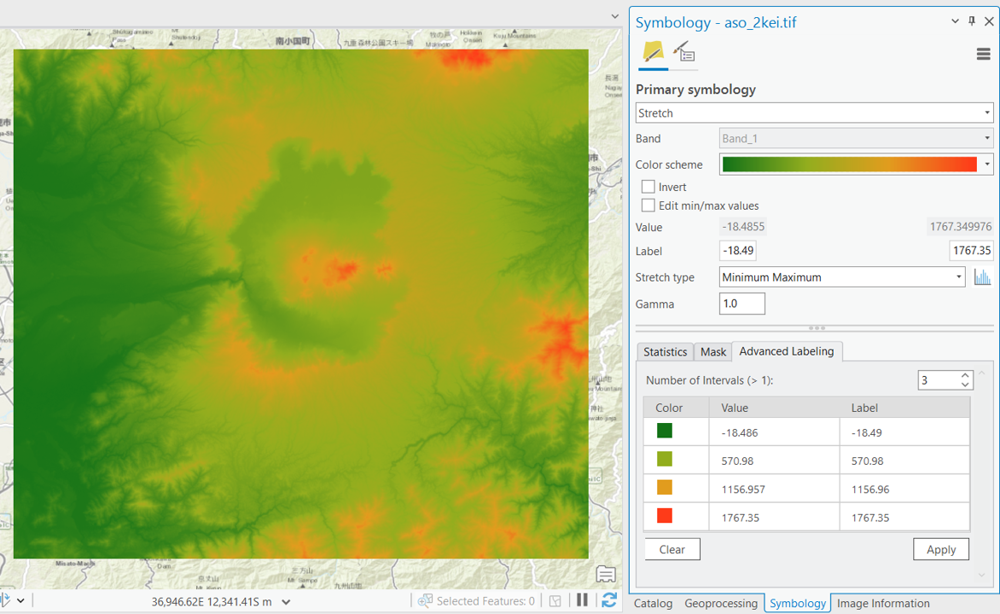

# 標高データの可視化と分析
　本教材は、「ラスタデータの分析」の実習用教材です。各セルに標高値を保持しているラスタデータを用いて、地形解析の手法について解説しています。本教材では、数値標高モデル(DEM)として整備されたデータを用います。DEMは、Digital Elevation Modelの略であり、地形解析等に用いられるデータです。

**Menu**
------
* [基本統計量の確認](#基本統計量の確認)
* [数値標高モデルの視覚的分析](#数値標高モデルの視覚的分析)

**実習用データ**

実習をはじめる前に、[aso]をダウンロードしてください。

[aso]:https://github.com/gis-oer/datasets/raw/master/aso.zip

## 基本統計量の確認
分析をはじめる前に、ラスタデータが保持する情報を確認する。まずは、ラスタデータをArcGIS Proに読み込む。この際、以下のウィンドウが出る場合は、`Yes`を選択する。

### セル値
ラスタデータは、各セルに値を持っている。今回使用しているのはDEMであるため、標高値となる。`Imagery > Image Information`を選択する。次に、ポイントのアイコンをクリックし、セル値をしりたい場所を地図で選択すると、緑枠内に標高値が表示される。×アイコンをクリックすると、点表示をオフにできる。

### 統計量
`Properties > Source > Statistics`を選択すると、最小値、最大値、平均値、標準偏差が確認できる。

### ヒストグラム
`Properties > Create Chart > Histogram`を選択し、NumberでBand 1を指定すると、ヒストグラムが作成できる。

以下のようにすると、csvファイルや画像を出力できる。

[▲Menu]

## 数値標高モデルの視覚的分析
　標高値を保持しているラスタデータを用いることで、傾斜区分図、斜面方位図、陰影図、3D地図、断面図を作成することができます。以下では、その手法について解説しています。

### 標高段彩図の作成
`空間データの作成`の教材を参考にすると、以下のように標高値に応じた色分けができる。

### 傾斜区分図の作成
`Analysis > Tools > Slope`を選択する（3D Analyst Toolの方を選択）。

1. 入力ラスタを選択
2. 出力ラスタを選択
3. `Output measurement`を`Degree`とする
4. `Run`を実行

### 斜面方位図の作成
`Analysis > Tools > Aspect`を選択する（3D Analyst Toolの方を選択）。

1. 入力ラスタを選択
2. 出力ラスタを選択
3. `Run`を実行

以下のようにすると、配色を調整できる（0（北）ー360（北）。

### 陰影図
`Analysis > Tools > Hillshade`を選択する（3D Analyst Toolの方を選択）。

1. 入力ラスタを選択
2. 出力ラスタを選択
3. `Run`を実行

以下のように陰影図の上に、透過した標高段彩図のレイヤを重ねると、凹凸と標高が対応した地図表現ができる。レイヤの順を緑枠のように調整し、`Raster Layer > Transparency`を選択する。今回は、標高段彩図の透過度を`25.0%`とする。

### 地形断面図の作成
`Analysis > Tools > Profile`を選択する。

1. 入力フィーチャーを`Lines`に設定
2. 断面をとる線を作成
3. 線の作成後、`Finish`(チェックマーク)アイコンを２回クリック
4. `Run`を実行

`Properties > Create Chart > Profile Graph`を選択すると地形の断面図が作成される。**縦軸と横軸が1：1でない断面図は、地形が変形するため、傾斜などの解釈に注意が必要となる。**

### 鳥瞰図
`New Map > New Local Scene`を選択し、`Catalog`からデータをドラッグアンドドロップで追加する。

ArcGIS Proでは、デフォルトで標高タイルによる3D表示が可能だが、ここではレイヤの標高値を用いた鳥観図作成を行う。ラスタレイヤの`Properties > Elevation`を選択し、`On custom elevation surface`を指定する。

左クリックで移動、右クリックでズームイン・アウト、マウスホイールを押しながら上下にすると角度のように視点
が調整できる。

値の配色を調整して、視認性を高めることもできる。

**ここまで作成した図を一枚のパワポにまとめる**

[▲Menu]

## 課題
　、富士山のDEMデータを用いて、標高区分図、傾斜区分図、傾斜方位図、陰影図、3D地図を作成し、レイアウトしてください。

### 実習用データ
本実習をはじめる前に、[Fuji_task]をダウンロードしてください。データは、`JGD_2011_Japan_Zone_8`に座標変換してから使用してください。座標変換の方法は、`空間データの作成`の教材を参照してください。変換したデータのデフォルトの保存先は、`Catalog > Databases`の各gdbの直下になる。

[Fuji_task]:https://github.com/gis-oer/datasets/raw/master/s/fuji_task_s.zip

### 完成例

※　上段：左から、標高区分図（段彩図）、傾斜区分図、傾斜方位図、陰影図　下段：3D地図、断面図

※　色の配色や凡例は、各自で工夫して作成すること

[▲Menu]

[▲Menu]:./9.md#Menu