# Downloading spatial data and converting spatial data coordinate
Various organizations provide spatial data either commercially or free of charge. This chapter explains the methods for downloading such data from online. Due to GIS data provided in various formats, it's important for GIS users to understand the characteristics of each data format. Additionally, knowledge of spatial coordinates is necessary because GIS data is imported into software based on the concept of a spatial coordinate system. Please note that when data from different coordinate systems are displayed in a GIS, the data cannot be overlaid even for the same area because these have different XY axis definitions.

**Menu**
-----
- Collection of various spatial data
	- World data from Natural Earth
	- Terrain data from EarthExplorer
	- Population data from World population
	- City data from OpenStreetMap
- Spatial coordinate conversion

----------

## Collection of various spatial data
### World data from Natural Earth
In this section, try to collect and to extract spatial data (Vector data; point, line and polygon type) with QGIS following procedures.

Access to [Natural Earth](https://www.naturalearthdata.com/), a website that provides global spatial data under a public domain license. To acquire the spatial data, simply click on the `Download` tab on the website.

Click on `Cultual`.

For practice, download three types of data as follows; 
`Admin 0 - Countries`(Click on `Download countries`)
`Populated Places`(Click on `Download populated places`)
`Railroads` (Click on `Download railroads`)
After downloading in local these three datasets as zip files, unzip each file as shown in the images below.
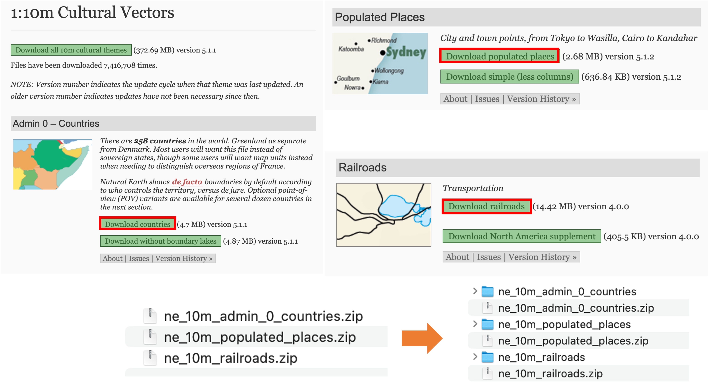

Import downloaded data to QGIS.

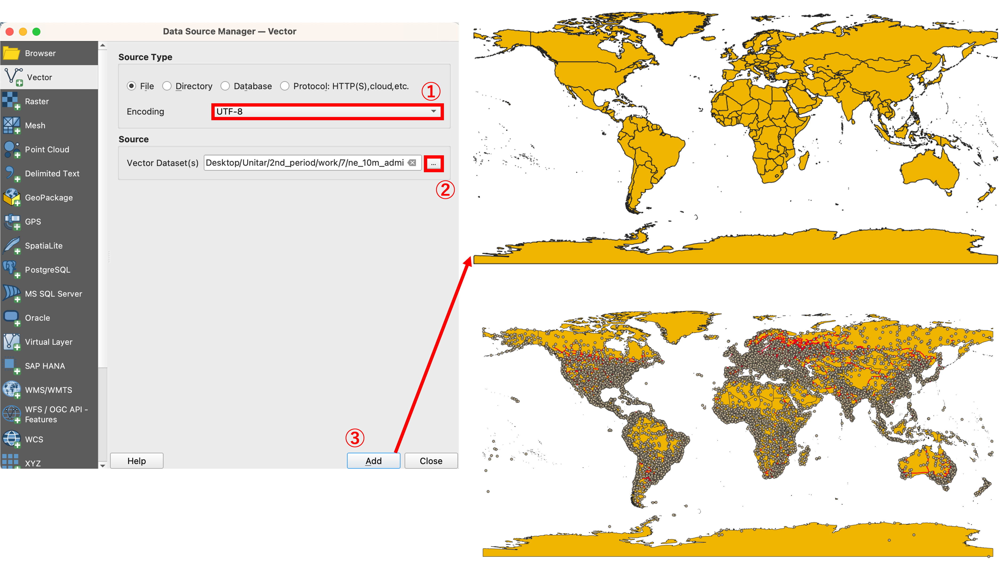

1. Click on `Data Source Manager > Vector`.
2. Set `Encoding to utf-8` and location of inputting data.
3. Click on `Add`.
4. Importing other layers with the same procedures as mentioned above.

Click on the right mouse button on the layer name in the Layer window. Attribute table appears by selecting `Open Attribute Table`.
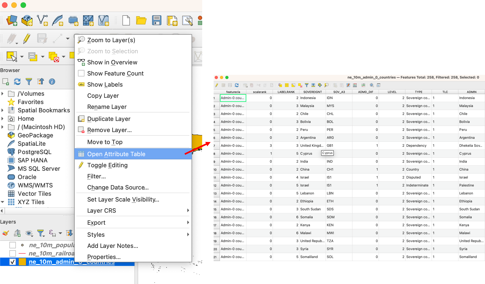

### Extracting spatial data
In this section, practice data extracting methods using selecting functions.

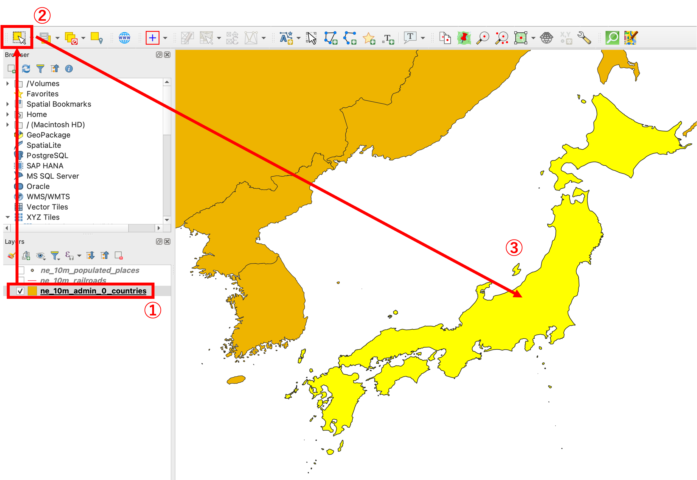

1. Click on the layer name in the Layer window.
2. Click on  `select features` icon.
3. Click on Japan boundary in map window.

To create an independent layer, export a selected file from `Export > Save Selected Features As...`. And set parameters as follows.

Parameters:
1. Format: ESRI Shapefile
2. File name and exporting location
3. CRS: Set as default  
    * Generally, this setting is very important but this section uses default.
4. Encording: UTF-8
5. Click on OK
*The other parameters can be left as default settings.

The data is exported as the following image.
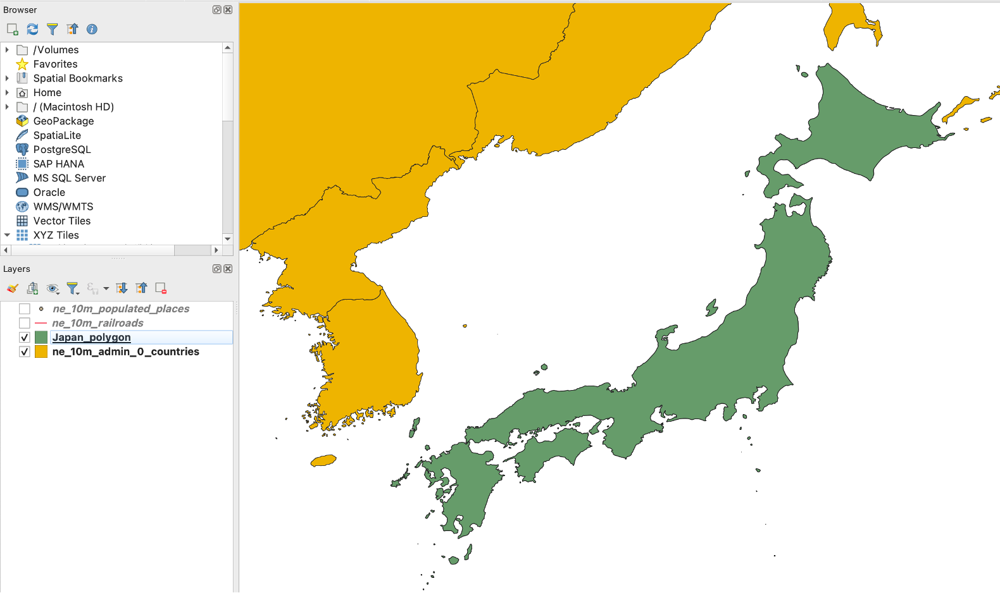

The users can deselect selecting mode using `Deselect layers from all layers`

#### Selecting function
By using the selecting function, the users can select part of spatial data while dragging on the map window.

The users can also select part of spatial data from the attribute table with expression. For using an expression function, open the attribute table and Select 'Show Select Features' from the list. Enter `"SOV0NAME" = 'Japan'` to Expression window.

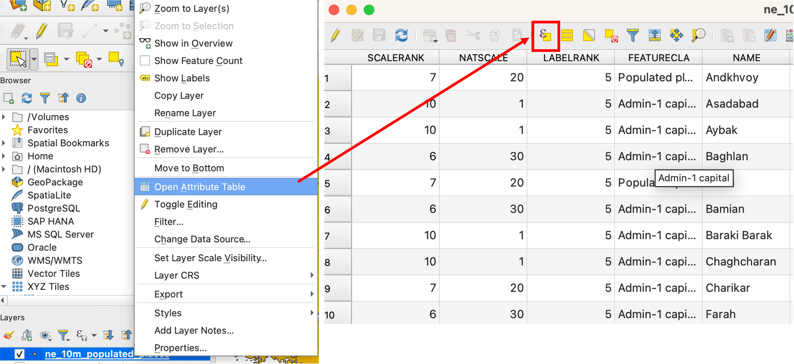

[▲ Back to Menu]

### Terrain data from EarthExplorer
Try to collect elevation data via [EarthExplorer]. In this site, USGS have been providing various spatial data related to the natural environment.

[EarthExplorer]:https://earthexplorer.usgs.gov/

Access [EarthExplorer] using your web browser. Account registration is required by clicking on the 'login' button, however, users can experience the data downloading procedures with Earth Explorer without login.

To collect data, please change the map view to the Tokyo metropolitan area in Japan.

To specify the data region, click on the "Search Criteria" tab and select the "Use Map."

To search for the SRTM 1 Arc-Second Global dataset, click on the `Data Set` tab and type `SRTM` for searching.
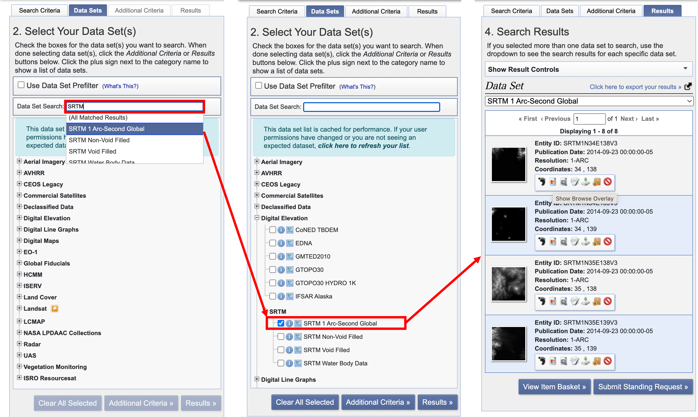

Logged-in users can download GeoTIFF files by clicking on the red box button. Additionally, if users click on the blue box button, the data image will be overlaid on a map.

Downloaded SRTM 1 Arc-Second Global dataset, can be managed as a data source in QGIS by using `Data Source Manager`. It also can be used by simply dragging and dropping from a directory.  As an example, areas with a lighter shade represent highly elevated regions and darker’s vice versa.
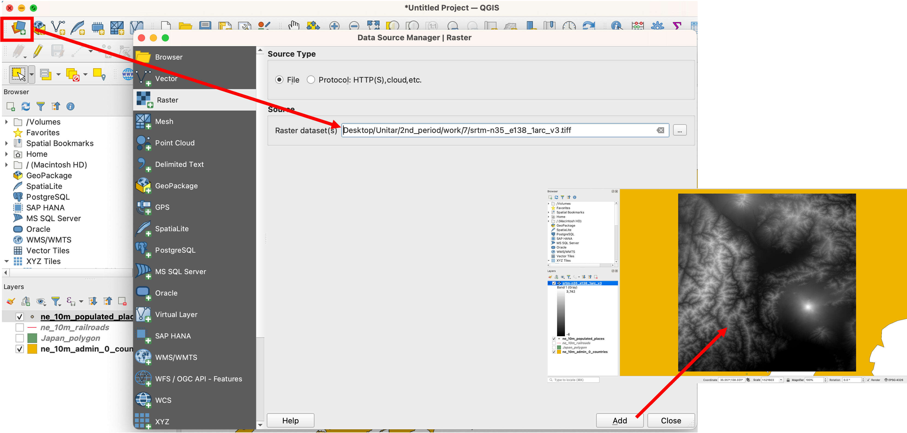

[▲ Back to Menu]

### Population data from World population
Access [WorldPop](https://www.worldpop.org/), a website that provides population information for each country, and click on the `Data` section.

Click on the `Population Counts`, and open to `Unconstrained individual countries 2000-2020 UN adjusted (1km resolution)` page.
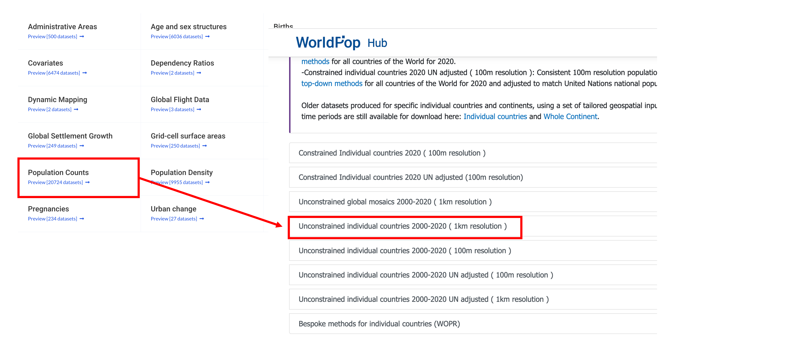

To download population data of Japan, enter `Japan` in the search box. Then, click on the  `Data & Resources` button of the latest version(2020) .

Download `jpn_ppp_2020_1km_Aggregated_UNadj.tif`.
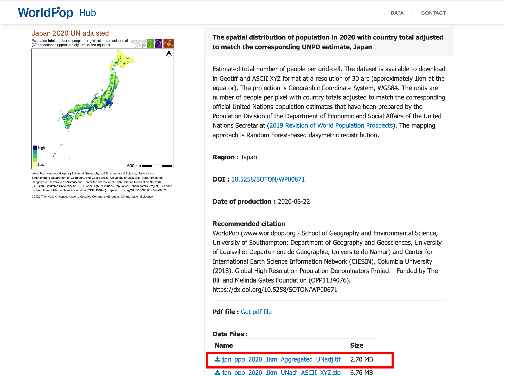

Downloaded data can be managed in QGIS by using the `Data Source Manager` or it also can be used by simply dragging and dropping from directory.  Areas with a lighter shade represent highly populated regions, such as Tokyo, Osaka, and Nagoya.

[▲ Back to Menu]

### City data from OpenStreetMap
[OpenStreetMap]is a free, editable map of the whole world that is being built by volunteers largely from scratch and released with an open-content license. OpenStreetMap (OSM) is open data, licensed under the Open Data Commons Open Database License (ODbL) by the OpenStreetMap Foundation (OSMF). When you use OSM data, you need to provide credit to OpenStreetMap by displaying a copyright notice. Additionally, users must make it clear that the data is available under the Open Database License. In this section, the users can learn how to operate OSM and the method for downloading spatial data from OSM.

> https://wiki.openstreetmap.org/wiki/About_OpenStreetMap
> https://www.openstreetmap.org/copyright

#### Basic operation of OpenStreetMap(OSM)
　OpenStreetMap can be viewed on the [OpenStreetMap] website, it has 3 specific functions as follows; 
Searching address and place name on the map
Creating and exporting spatial data
Map operation and displaying details of the data
 While OSM users who are interested in creating spatial data need to be logged in, however, this section does not cover the login process or spatial data creation methods. This section is focusing on users to be able to learn how to download spatial data from OSM instead.

Move to [Koyama Lake (by clicking here)](https://www.openstreetmap.org/#map=14/35.5086/134.1515), and confirm Lake Koyama information by using the `Query features` function. Click on Lake Koyama area on the map, and show the details of Lake Koyama information in the following images. The OSM users can download spatial data using tag information such as natural = water.

#### How to download OSM data (displayed area)
Zoom to map as the following image, click on `Export`. The users can download `.osm`file.
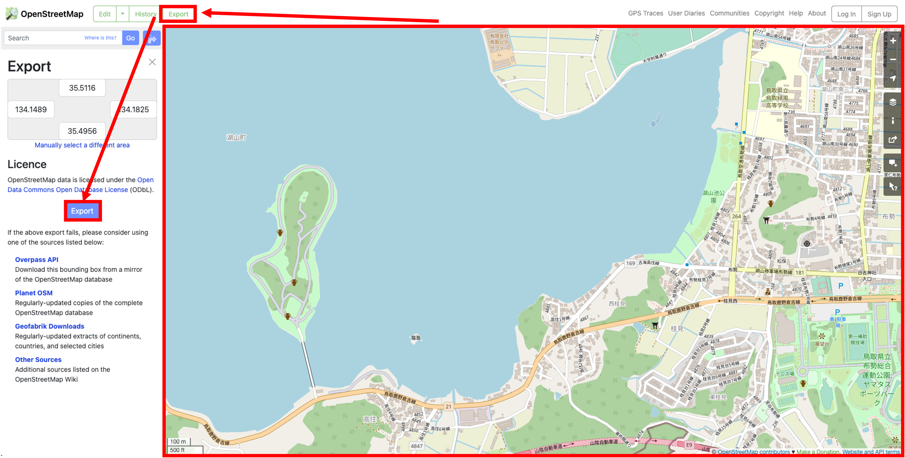

Open to QGIS, drag & drop to `.osm` data to QGIS. Then, select data such as line and click `Add Layers`. The users can confirm the data on a QGIS map window.
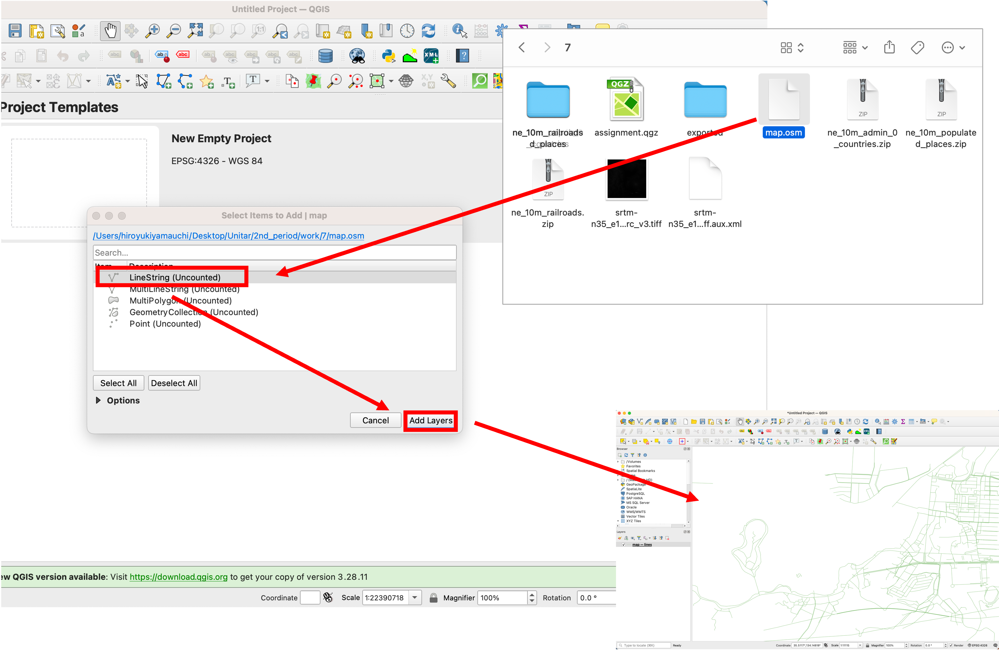

#### Exporting specific data using tag information
Access to [http://overpass-turbo.eu/](http://overpass-turbo.eu/), moving and zooming to Lake Koyama. Click on `Wizard`, enter `name:en="Lake Koyama"`in Query Wizard window. Click on `build and run query`.

Click on `Export` to get data as GeoJSON format.

Open to QGIS, drag & drop `.geojson` data to QGIS. Then, select data such as line and click `OK`. The users can confirm the data on a QGIS map window.
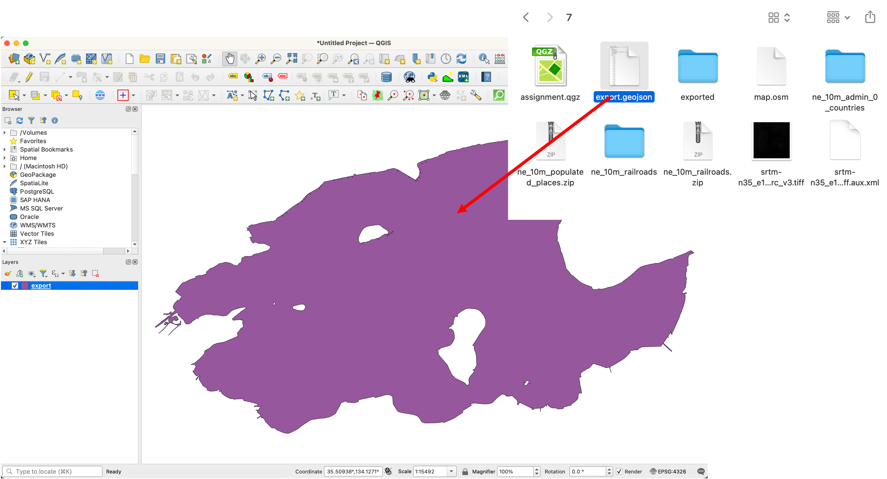

Note: This Lake Koyama polygon is necessary for the next section.

[▲ Back to Menu]

## Spatial coordinate conversion
 Coordinate information is one of the important ideas for Geospatial data and there are various geodetic and coordinate systems on the market. When users handle multiple geospatial datasets, it is necessary to confirm the coordinate system of each dataset. If users import different coordinate data into QGIS, a coordinate conversion process is required. The following section explains the methods for conversion of data coordinates using QGIS. If you want to learn more about fundamental knowledge of spatial coordinates, details are explained on ESRI's site[ESRI' site](https://pro.arcgis.com/en/pro-app/latest/help/mapping/properties/coordinate-systems-and-projections.htm) .

### Conversion of geographic coordinate
Import the `Koyama Lake` data downloaded in the previous section into QGIS. Then, confirm the coordinate information by accessing the `Properties`. This data coordinate is WGS84 (EPSG:4326). In this section, you can practice converting it to a different geographic coordinate system.

Note: Do not change data coordinate information in `Properties`.

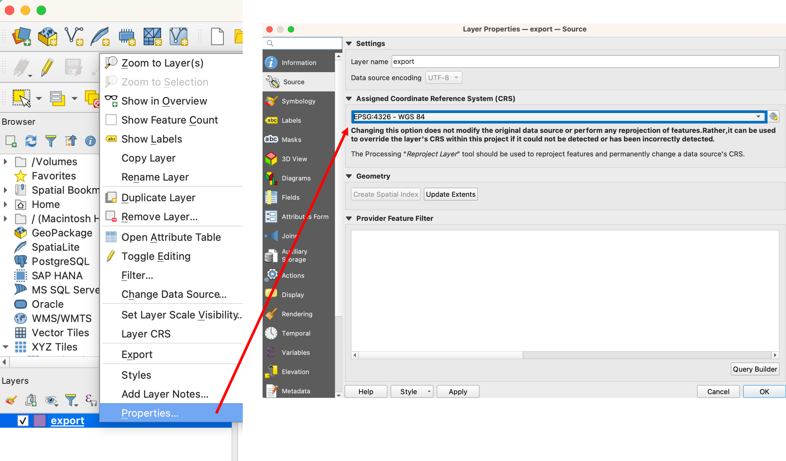

Click on the right mouse button on the Lake Koyama layer in the layer window. Open the `Export > Save Features As...` function. Execute following procedures.
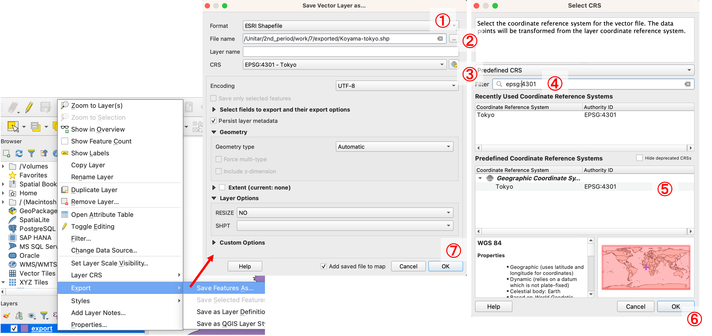

1. ESRI Shapefile
2. Set output directory and data fundamental
3. Click on CRS icon
4. Enter `epsg:4301` in `Filter`
5. Click on `epsg:4301`
6. Click on `OK`
7. Click on `OK`

To confirm the result, users need to disable the CRS function. QGIS has a feature that allows layers with the same location to be overlaid even with different data coordinates. By disabling this function, QGIS will display the actual data location based on coordinate information.

1. Click on EPSG button
2. Check on `No CRS`
3. Click on `OK`

Then, the layer will appear with its original coordinates, and users can confirm that the data coordinates are different. After converting spatial data, users need to set the appropriate EPSG code for the map window.
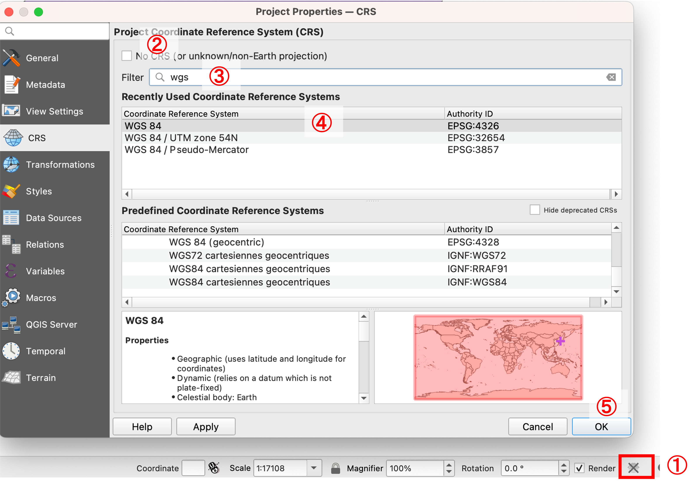

### Conversion of projected coordinate
In this section, you can practice converting Lake Koyama data (WGS84) to a different projected coordinate system.

Click on the right mouse button on the Lake Koyama layer in the layer window. Open the `Export > Save Features As...` function.

1. ESRI Shapefile
2. Set output directory and data fundamental
3. Click on CRS icon
4. Enter `epsg:32663` in `Filter`
5. Click on `epsg:32663`
6. Click on `OK`
7. Click on `OK`

After converting spatial data, users need to set the appropriate EPSG code for the map window. In this case, users should set it to `EPSG:32663` as shown in the following image.

[▲ Back to Menu]

## Week 2 Assignment

### Downloading GIS data
Please create a map such as below, which implemented in some dataset provided by two or more institutions. The map should include a title, a legend, and a compass. 

Note: It is not need to color raster data due to change style of raster data will be explained in fifth week. Shapefiles consist of multiple files (e.g., .shp, .shx, .dbf). If moving only the .shp file, the importing error is occurred.

### Completed example

## Converting spatial data coordinate.
Please convert the data of [CVS in Tokyo] to WGS 84 / UTM zone 54 N and layout the map.
　
[CVS in Tokyo]:https://github.com/gis-oer/datasets/raw/master/tasks/tokyo23ku-cvs_task.zip

### Completed example

[▲ Back to Menu]:./b.md#Menu
[Correspondence table of the plane rectangular coordinate system]:http://www.gsi.go.jp/LAW/heimencho.html
[OpenStreetMap]:https://www.openstreetmap.org/
