# Integrating and Modifying Spatial Data
This course is a practical training material for "Integration and Modification of Spatial Data", which explains data editing methods such as integration, modification, and conversion of raster data used in GIS.

**Menu**
---------
* [Mosaic and Clip of Raster](#Mosaic and Clip of Raster)
* [Extract Contour Lines](#Extract Contour Lines)
* [Creating and editing a new vector layer](#Create new vector)

**Practice Data**

Please download [fuji] before starting the training.

[fuji]:https://github.com/gis-oer/datasets/raw/master/fuji.zip

------

## Mosaicking and clipping raster data
Below is an explanation of merging raster data (in this case, using DEM) and clipping in an arbitrary range; DEM stands for Digital Elevation Model and is data that holds elevation values for each cell. Follow the instructions below to join and cut out any region of data from the downloaded data ([fuji]).

Click the `Raster` in `Data Source Manager` to load all the rasters of [fuji] excepted fuji_trails.tif.

### Mosaic of raster data
Multiple `.tif` files loaded are combined into one by selecting `Raster > Miscellaneous > Merge` and following the steps below. Usually, values with no data are specified as 0, -9999, etc. as needed. In this case, we use default.
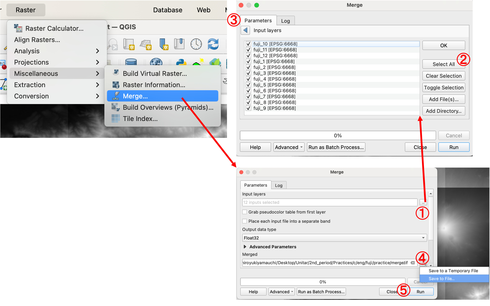

1. Select an input file.
2. Click on `Select All`
3. Click on ◀︎　button.
4.  Enter the output directly and file name.
5. Click `Run`.

These raster data can be merged as follows.
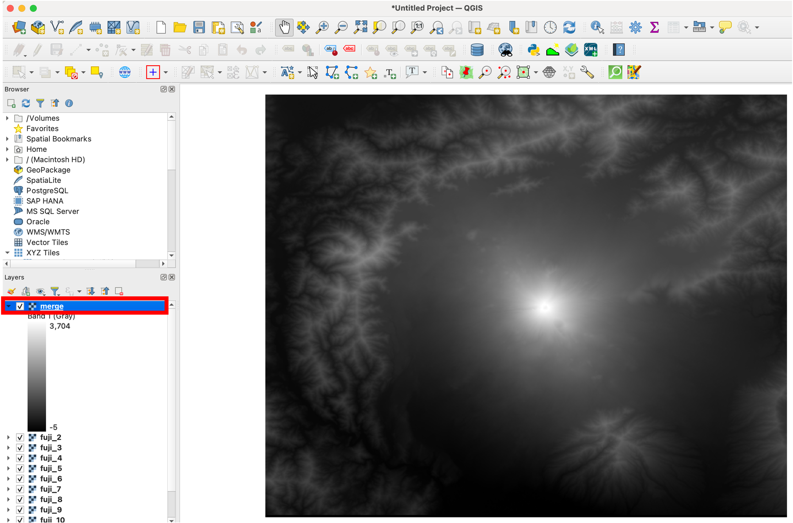

### Coordinate transformation of raster data
The coordinate transformation of the raster is performed from `Raster > Projection > Warp (Reprojection)`. Here, the transformation is performed from the geographic coordinate system to the plane rectangular coordinate system, which is performed in the following steps.
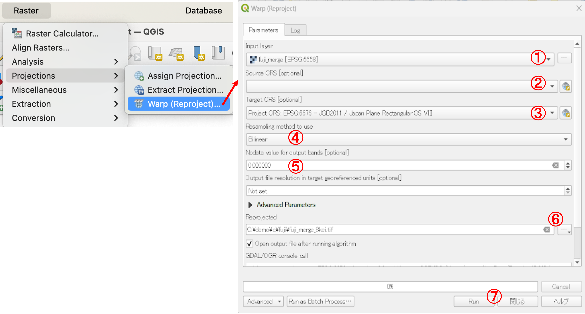

1. Select a combined raster as an input layer.
2. None select (or set the source coordinate system to `EPSG:6668`). 
3. Set the destination coordinate system to `EPSG:6676`. 
4. Set resampling to `bilinear`. 
5. Set Nodata value to `No set`. 
6. Specify the destination and file name. 
7. Click `Run`.
8. Change map window coordinate to `EPSG:6676` from right bottom EPSG button.

### Clip Raster
Click `Raster > Extract > Clip Raster by Extent` to extract the range of data needed for analysis. From the following, it is recommended to delete layers other than the merged and re-projected raster.
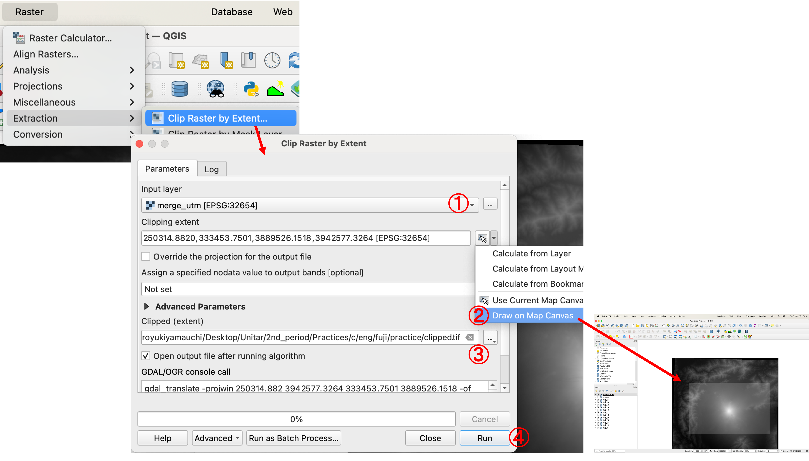

1. Set the re-projected raster as an input layer.
2. Click `Draw on Map Camvas` and drag the map to specify the area. 
3. Specify the output destination and file name.
4. Click `Run`.

The raster can be clipped as follows. Before, practice next section, repeatedly confirm whether map window coordinate is `EPSG:6676` in right bottom EPSG menu.
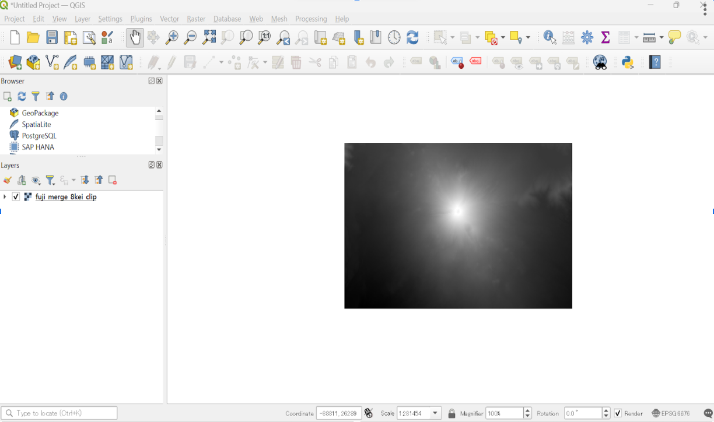

### Color scheme of raster (value classification)
The color scheme of the extracted data is explained below: Since DEM holds the elevation value for each raster cell, color classification by elevation value is possible. The color coding is performed by the following procedure. Open `Properties > Symbology`.
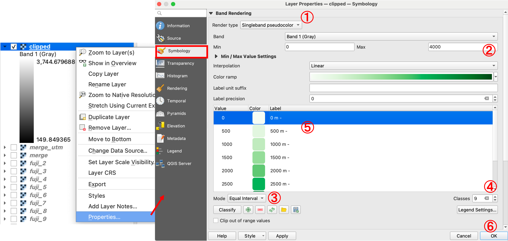

1. Set `Singleband puseudcolor`.
2. Set the minimum to 0 and the maximum to 4000.
3. Change the mode to `Equal Interval`.
4. Set the class to 9. 
5. Click each value label and rewrite the displayed value by double clicking on each label. 
6. Click `OK`.

The following color coding can be done for each elevation value.
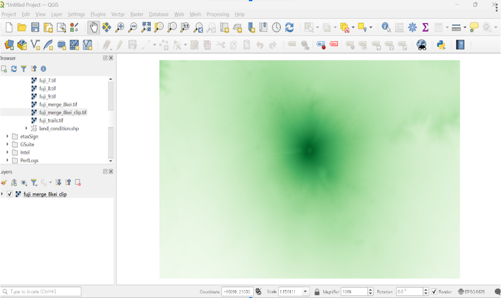

[▲ Back to menu]

## Extracting contours
This raster data contains elevation value for each cell. Therefore, the users can create contour lines using cell values. In the following, to create contour lines, select `Raster > Extract > Contour Lines` and follow the steps below.
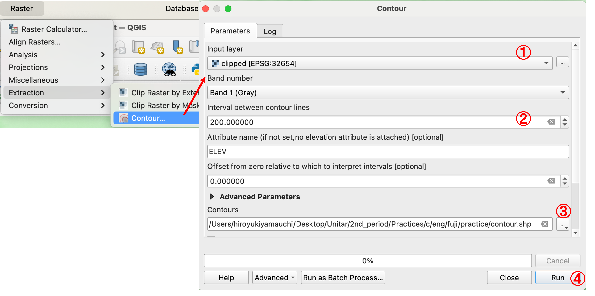

1. Select the clipped raster data. 
2. Enter the contour interval (in this case, 200m). 
3. Enter the output destination and file (save as `ESRI Shapefile`). 
4. Click `Run`.

The 200m contour lines will be output as shown below. It is also good to check that the elevation values are created in the attribute table.
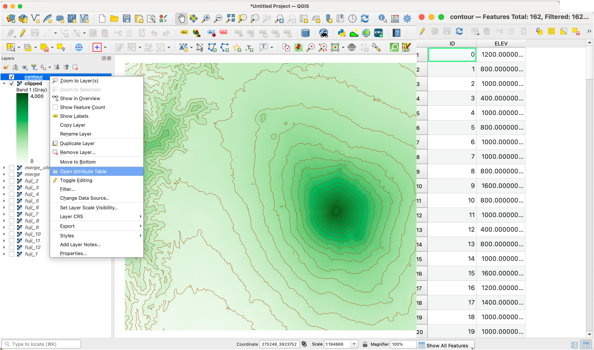

[▲ Back to menu]

## Creating and editing a new vector layer
GIS allows you to create your original data. The following explains how to create new vector data. Before starting the following, load the Mt. Fuji climbing map (fuji_trails.tif) as background map into QGIS. 

After the background map has been loaded, select `Layer > Create Layer > New Shapefile Layer` and follow the steps below to create a layer.
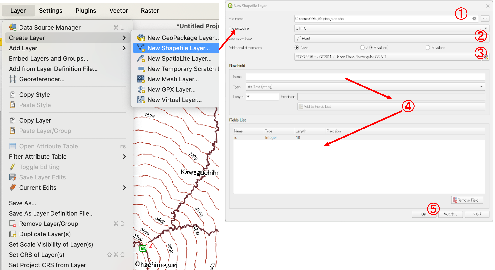

1. Specify the destination and file name.
2. Select `point` in Geometry type.
3. Set the coordinate system (in this case, EPSG:6676) 
4. Create field by editing on `New Field`.`Name` is the column name, `Type` is the data type. `Length` and `Precision` are decided depend on the data type. Data Type is Integer means the value is an integer, Real means containing decimals, String means value is text. This time, the learners add `name` in Name, next click on `Add to Field List` button.
5. Click `OK`.

* When adding a new vector layer, points, lines, and polygons cannot be created at the same time. A new layer must be created by each layer to be created.

### Creating and saving point data
In the following, we will create a point for a mountain lodge by tracing a trail map of Mt. Fuji Refer to the table for the ID and name of the point to be added.
Select a layer and click `Toggle Edit` icon.
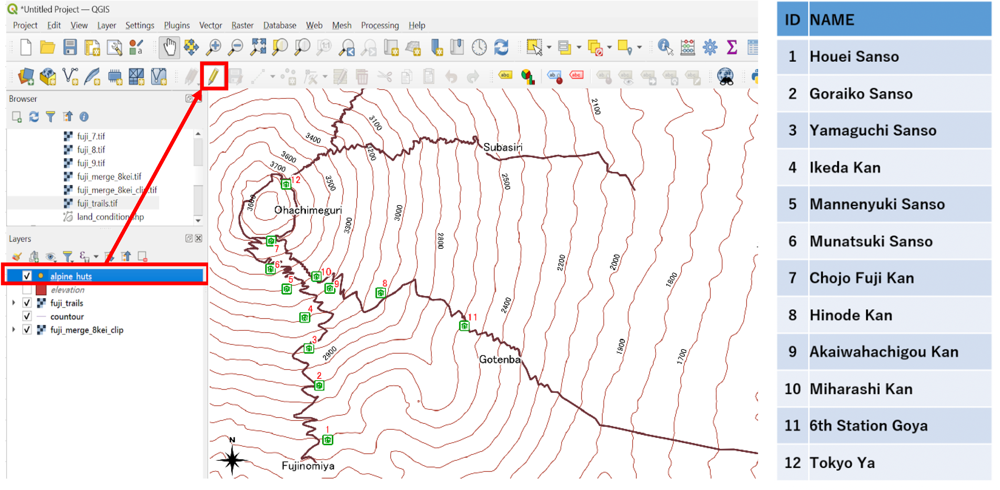

Click on `Add Point Feature` icon, click on the location of mountain lodge 1, and enter its id and name on the map. Do this until id 12.
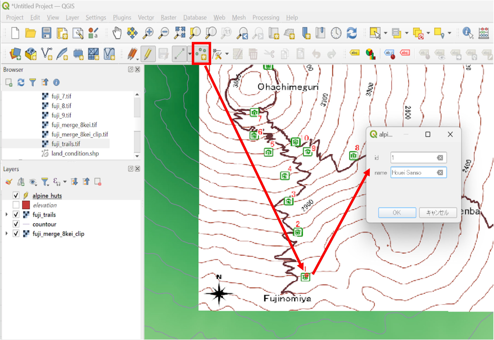

When you have added all points, click `Save Layer Edits` icon, next click on `Toggle Edit` icon to save the data.
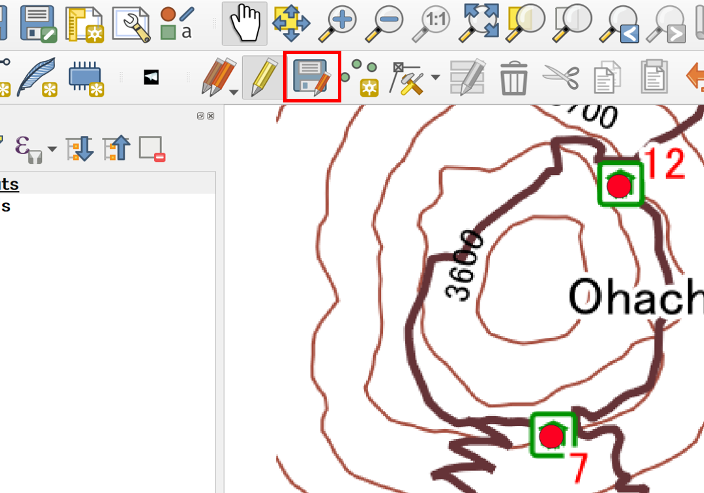

### Deleting Points
The following describes a technique for editing point data. To delete a point, in edit mode, use `Select Features` to choice the layer to be deleted on the map, and click `Delete Selection` icon.
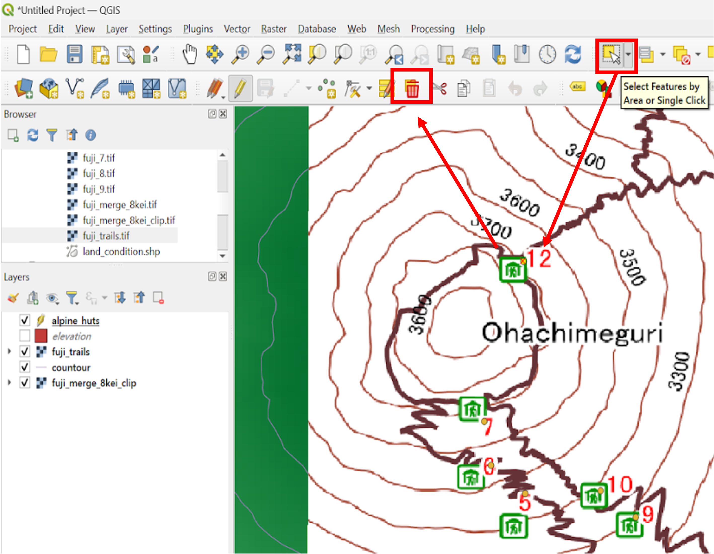

#### Moving Points
To move a point, click the `Vertex tool`. On the map, click the layer you want to move, and move it to any location.
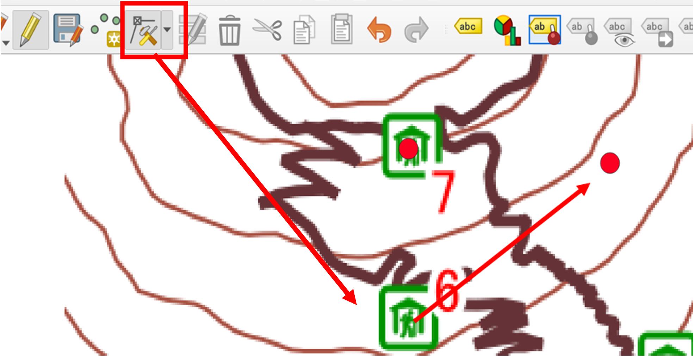

#### Editing Attribute Information
Open the attribute table as shown below, click on the attribute information, and enter the information you want to edit.
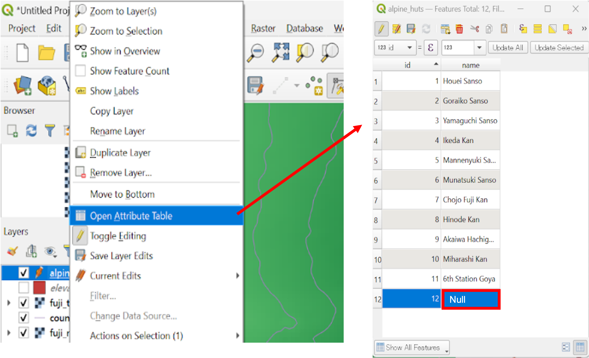

### Creating Line Data
From `Layer > Create Layer > New Shapefile Layer`, create line data using the same method as for point layers. 
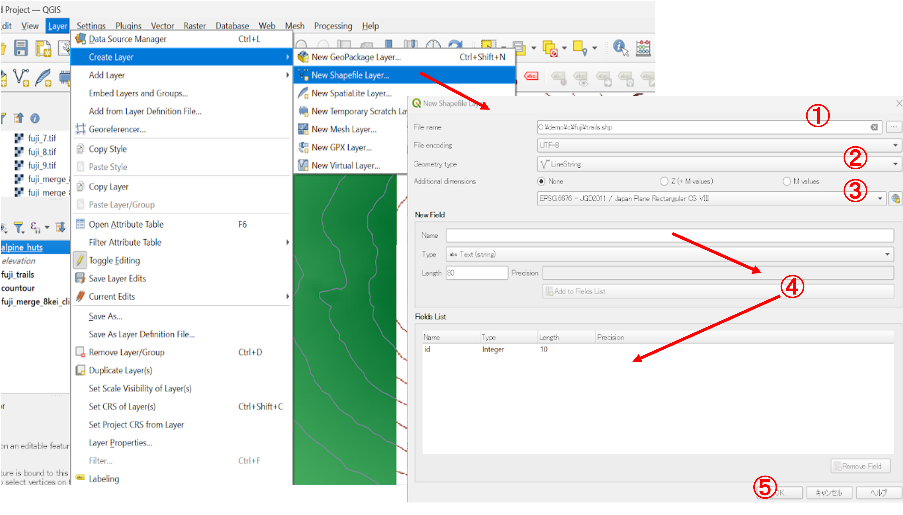

1. Specify the destination and file name.
2. Select `LineString` in Geometry type.
3. Set the coordinate system (in this case, EPSG:6676) 
4. Create field by editing on `New Field`.
5. Click `OK`.

In the following, check `Enable snapping by default` from `Settings > Options > Digitizing` to make the vertices connected.
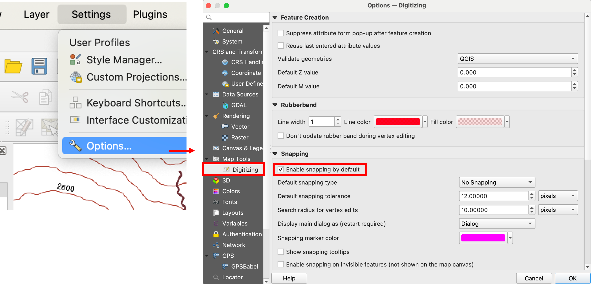

In the same way as creating point data, create line data by clicking and tracing the trails repeatedly. Right-click at the last node of the created line to display a dialog box, and enter the attribute information.
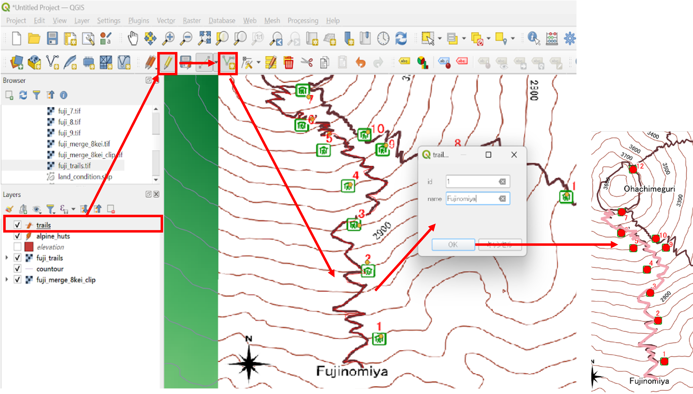

When creating the some trails, it is necessary connecting each road by overlaping each line node. If you hover the cursor over the final point, the cursor will turn pink, then the user can connect multiple lines.
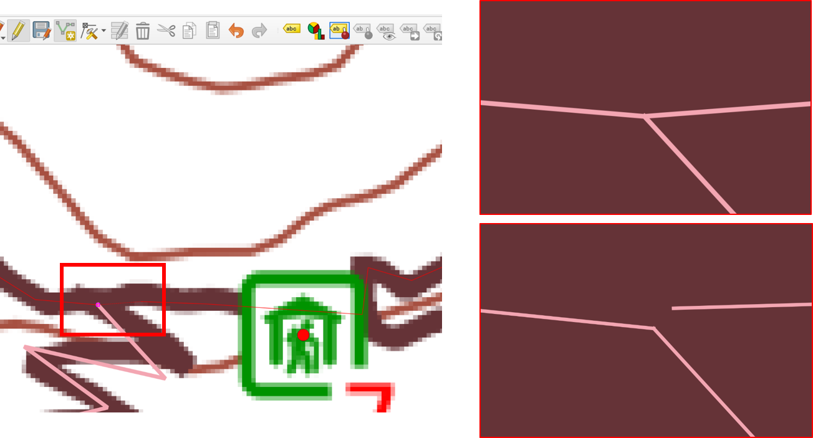

#### Creating Polygon Data
In the following, a new polygon of the crater is created to explain the creation of polygon data. Display the `browser panel` according to the week 1 material and read in the Geospatial Information Authority tiles (`e_`Aerial photographs) .
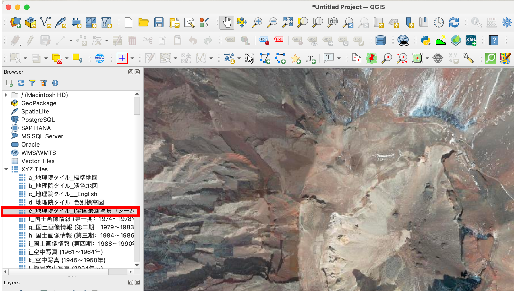

Create polygon data from `Layer > Create Layer > New Shapefile Layer` in the same way as the point layer.
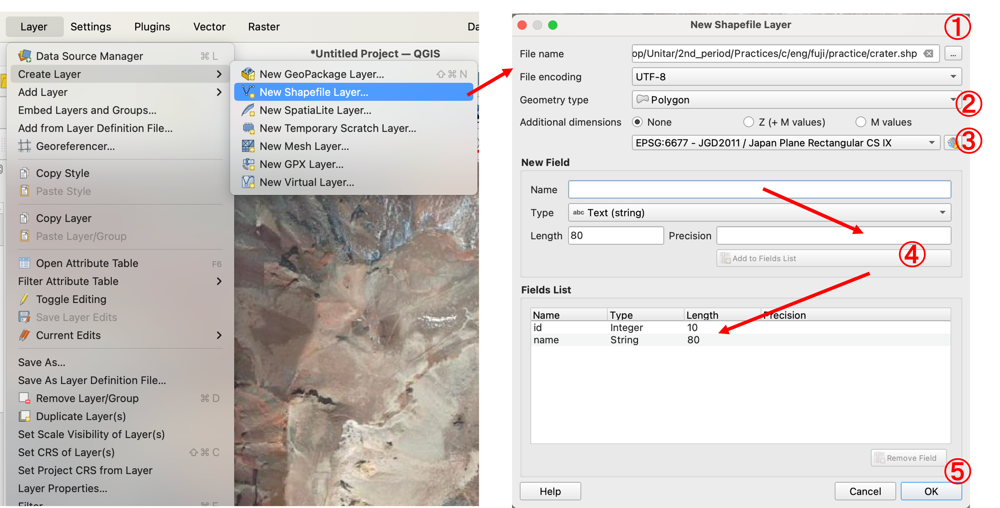

1. Specify the destination and file name.
2. Select `Polygon` in Geometry type.
3. Set the coordinate system (in this case, EPSG:6676) 
4. Create field by editing on `New Field`.
5. Click `OK`.

Multiple click along with the edge of the crater to create a polygon data. End of creating the last node, the users can completed data creation with right click.  Then a dialog box is displayed, enter the information of this polygon.

[▲ Back to menu]

## Week 3 Assignment
This exercise involves creating new raster data by merging existing raster data and creating new vector data by tracing background maps. 
　
### Practice Data
Before starting this exercise, please download [tokyo]. Only tokyo_srtm.tiff will be used in this exercise.

[tokyo]:https://github.com/gis-oer/datasets/raw/master/tokyo.zip

### Completed example
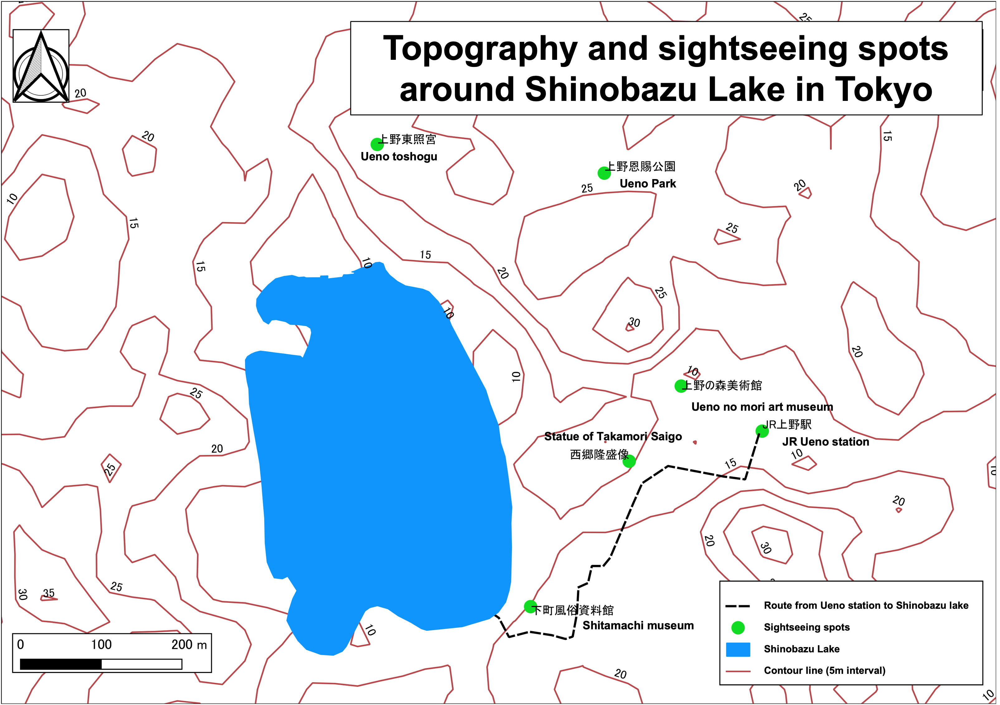

- The map shows route of [Shinobazu Pond to JR Ueno Station and sightseeing spots](https://www.openstreetmap.org/#map=16/35.7120/139.7726).
- Shinobazu Pond polygon should be created using GSI aerial photo, its used in week 1 section.
- Contour lines interval is 5m
- The points should create  with this setting; id (Integer, width 2), NAME (String, width 25), and fill in Id (serial number) and NAME (sightseeing spots).

[▲ Back to menu]:. /c.md#Menu

