# Vector data analysis (Point Distribution Density and Buffering analysis)
In this section, we will explain how to calculate and visualize the distribution of point data, as well as buffer analysis. When conducting point visual analysis using a mesh or administrative boundary, it's important to note that the result is influenced by the size of the polygon used for counting point data. A buffer is a method of creating an area at a certain distance from target vector data.

**Menu**
------
* Point Distribution Density
	* Visualizing point density using mesh
	* Visualizing point density using boundary
	* Kernel density estimation
* Buffer

**Practice Data**

Please download [tokyo] before starting the training.

[tokyo]:https://github.com/gis-oer/datasets/raw/master/tokyo.zip

-------

# Point Distribution Density
Below figure shows the distribution of convenience stores in Tokyo. By looking at this map, you can see that there are areas with dense points and areas with sparse points. However, it's not easy to determine the differences in density by region. Therefore, in the following sections, we will explain methods to visualize point density based on mesh (rectangular cells) and administrative boundaries using QGIS. 
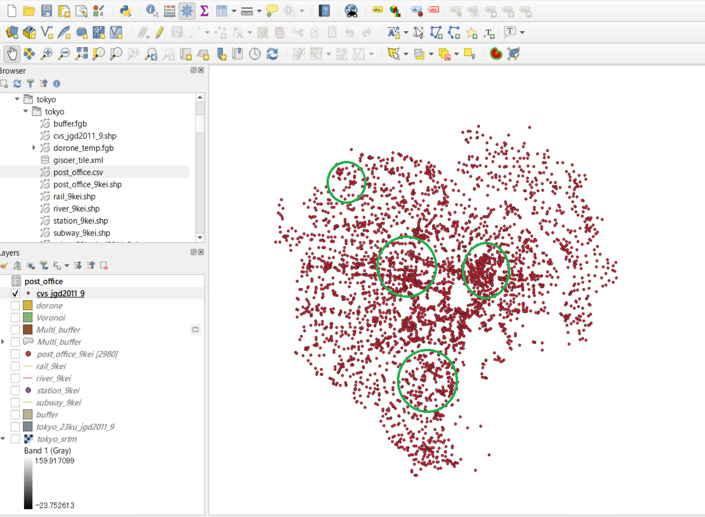

## Visuallizing point density using mesh
To create a mesh for visualizing point density, follow these steps using QGIS from `Processing > Toolbox > Vector creation > Create grid`. In this example, we will create a 500m × 500m mesh. 

1. Choose `Rectangles (Polygons)` as the mesh type.
2. Select the `Calculate from layer > cvs_jgd2011_9`.
3. Set the horizontal and vertical spacing to 500m each.
4. Specify the output directory and filename.
5. Click `Run` to create the mesh.

As a result, you will have a mesh made up of 500m × 500m cells, as shown in the image below.
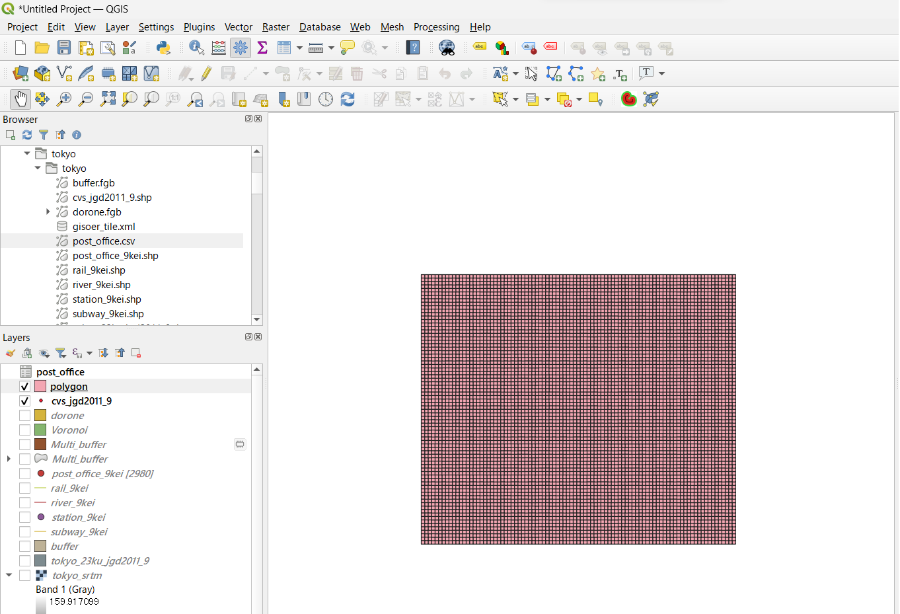

### Calculating the number of points each grid
To calculate the number of points within each mesh, use the following steps in QGIS by going to `Vector > Analysis Tools > Count Points` in Polygon. 
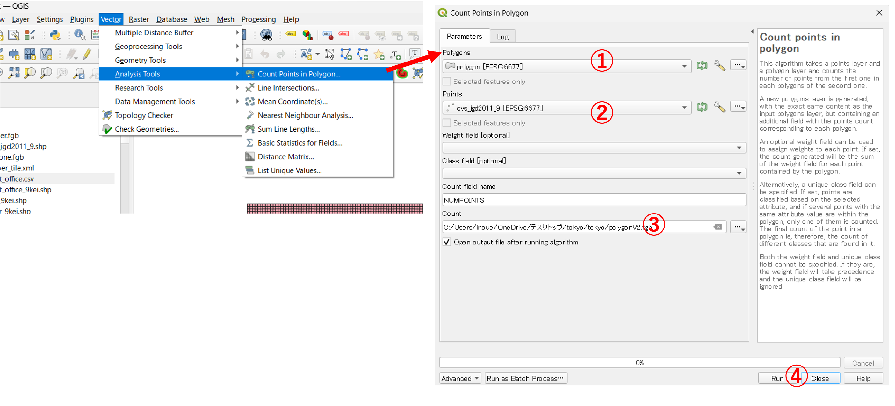

1. Set mesh polygon.
2. Set points.
3. Specify the output directory and filename.
4. Click `Run` to create the mesh.

As a result, a new polygon layer is created, and each polygon have an attribute information representing the count of points each grid, as shown in the image below. 
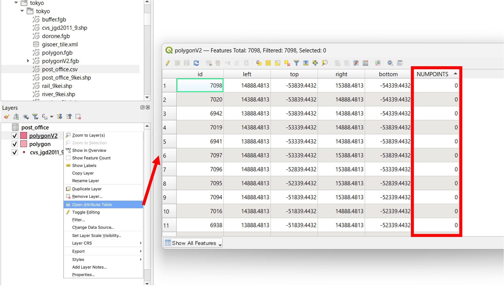

You can open the attribute table and sort the data in the column to see the calculated results.

### Coloring mesh based on number of points each grid
To color the mesh cells based on the number of points within each cell, follow these steps: Go to `Properties > Symbology`.
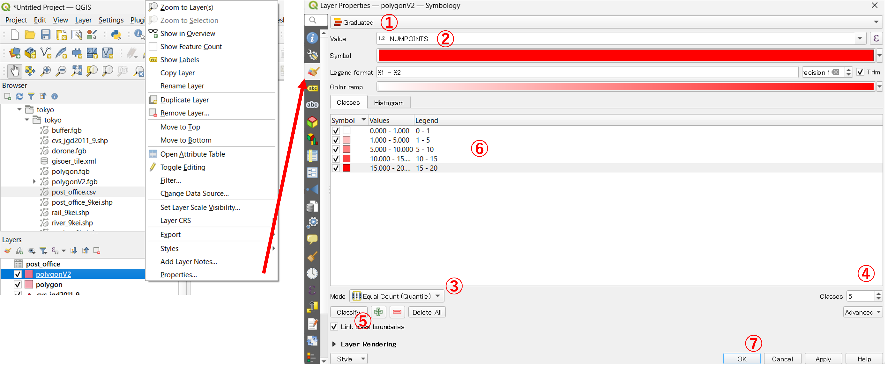

1. Select `Graduated`.
2. Set `NUMPOINTS`.
3. Set `Equal Count(Quantile)`.
4. Enter 5 in Classes window.
5. Click `Classify`.
6. Define threshold values and color.
7. Click `Run` .

Note: If your attribute values are in text format, you can not categorize and colorize the polygons based on point counts. To address this, you'll need to convert the attribute to  numeric type following procedure. 
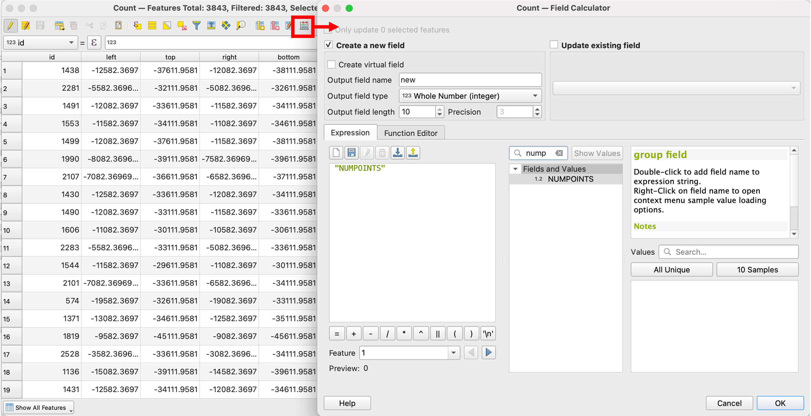

1. Open the attribute table of the mesh layer.
2. Click on the `Field Calculator` icon to create a new field. 
3. Select an appropriate name for the new field, set the output field type to `integer` and choose the field that represents the point count. 
4. Click `OK` to create the new field.
5. Save the edits by clicking the `Edit` mode (pencil icon).

Then, you can use the newly created numeric field to categorize and color the polygons based on the point count, and you'll have a visualization of convenience store density within each grid, as shown in the image below. 
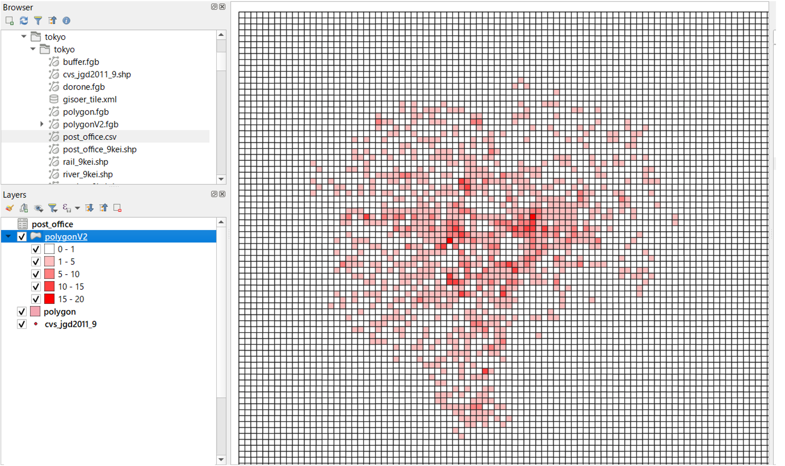

[▲ Back to Menu]

## Visuallizing point density using boundary
In the following, we will explain a method for calculating point density within administrative boundaries using administrative polygon data. Start by loading the tokyo23ku_jgd2011_9.shp file, and then follow these steps in the `Analysis Tools > Count Points in Polygons` menu to calculate the number of convenience stores in each administrative area.
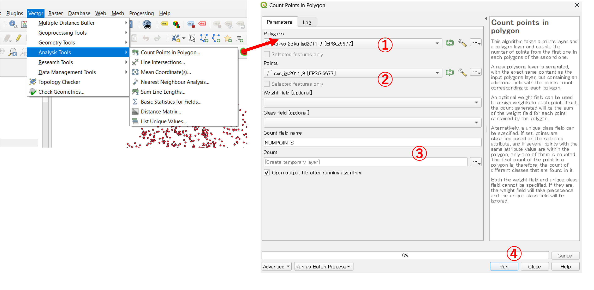

Set the style for the calculation results from the Properties menu. Using `Properties > Symbology`, you can adjust the representation of polygons based on attribute values as shown in the following image: 
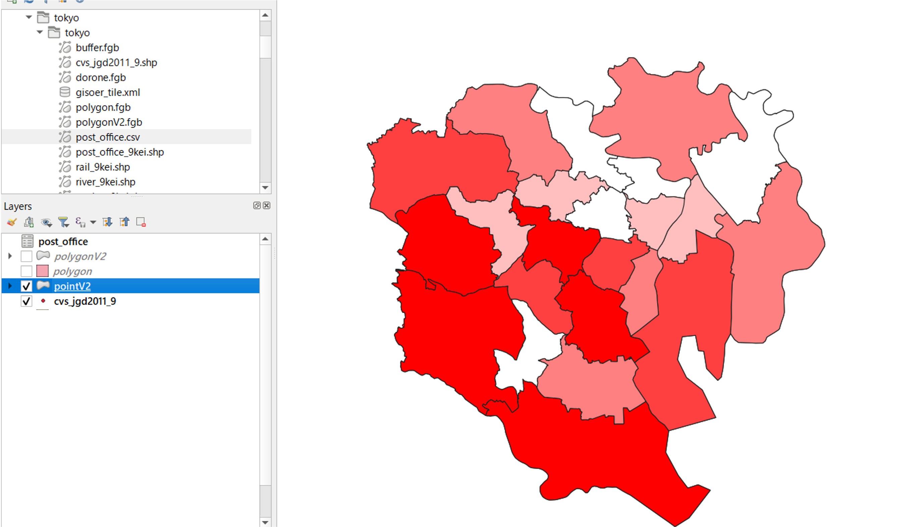

[▲ Back to Menu]

## Kernel Density Estimation
Kernel density estimation is a method used for creating maps showing event frequencies , such as crime incidents. It models the distribution density of points as a continuous density surface using a kernel function. In QGIS, you can process kernel density estimation by selecting `Processing > Toolbox > Interpolation > Heatmap (Kernel Density Estimation)` and following the steps below:
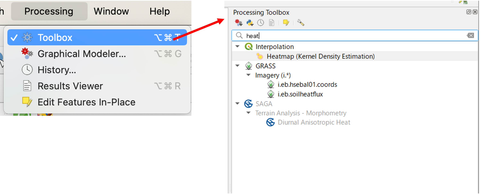

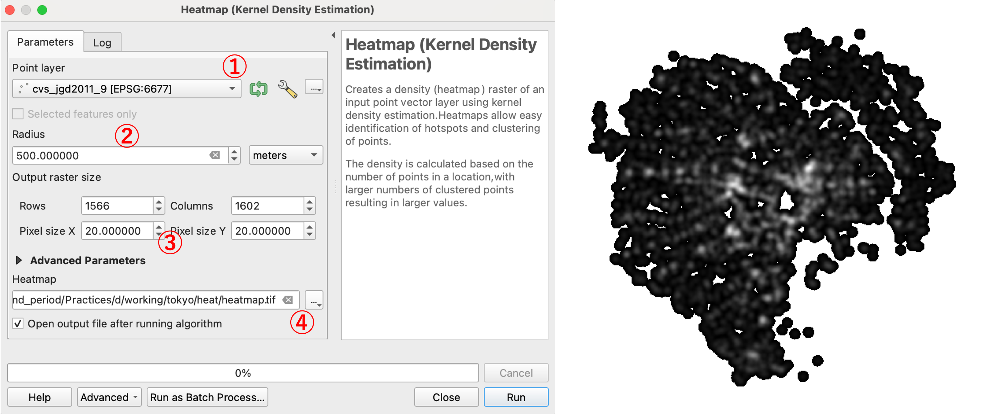

1. Select the convenience store data as the input point layer.
2. Set the radius to 500 meters.
3. Set the pixel size to 20 for both dimensions. ※ Note that choosing a very small pixel size may significantly increase processing time, so be cautious.
4. Define the output raster and click `Run`.

You can configure the color scheme for the resulting raster from `Properties > Symbology` as shown in the image below.
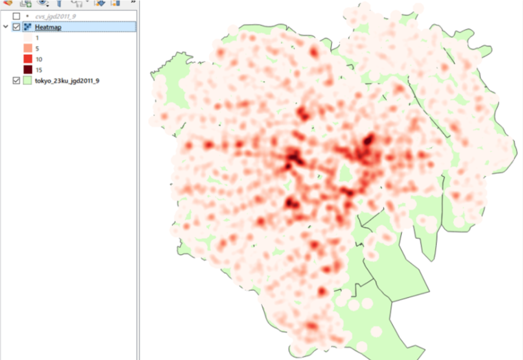

It's a good practice to try different radius (bandwidth) values and observe how the results change when classified with the same threshold. A wider bandwidth is useful for capturing broader spatial trends but may have difficulty representing localized values. Therefore, careful consideration is needed when setting the bandwidth.
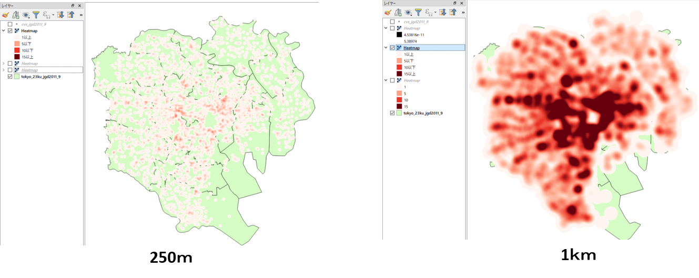

[▲ Back to Menu]

## Buffer
Buffering analysis is a method to create a polygon at a certain distance from a target feature, and it is employed for overlay analysis with multiple layers. In the following, the material explain methods for creating buffers from point data and generating multiple ring buffers segmented at various distances using QGIS. Additionally, select layers by location method using buffer polygons is explained.

### Point buffer creation
The material explains how to create 500m buffers from convenience store (CVS) data and calculate the number of post offices that overlap with the 500m buffer polygon. First, to create the buffer, select `Vector > Geoprocessing Tools > Buffer` and execute the following steps.
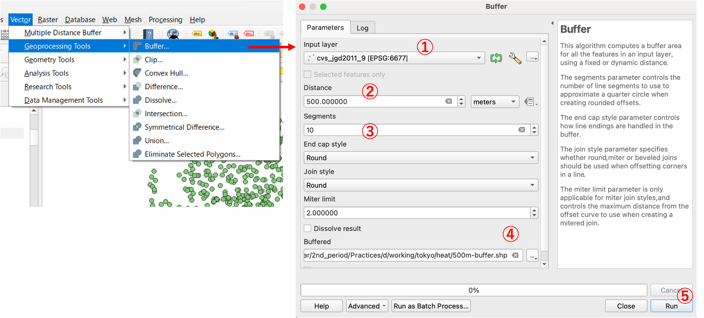

1. Set CVS data. Note: You need check that CVS data is projected coordinate.
2. Enter `500` in Distance box.
3. Enter `10` in Segments Note: A larger value indicates a more favorable shape for the circle.
4. Specify the output directory and file name.
5. Click `OK`

After executing the above procedure, you can obtain the result as shown in the left image below. If you select `Dissolve result` option when creating the buffer, the result will be displayed as shown in the right image below.

### Line buffer and polygon buffer
QGIS can create line buffer and polygon buffer with similar procedure of point buffer.
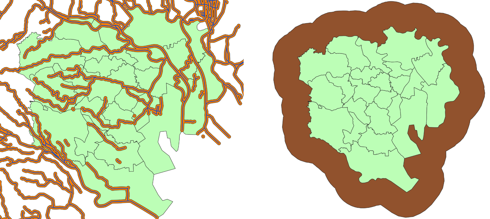

### Select layers by location
The following section explains the method to select features overaped buffer polygon on the map using select layer by location.

`Vector > Check Geometries > Select by Location`をクリックする。
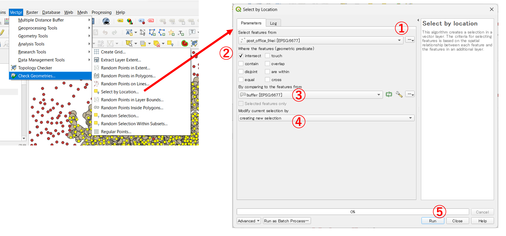

1. Set post office layer as sourece layer.
2. Check `intersect`.
3. Set buffer layer.
4. Set `creating new selection`.
5. Click `Run`.

As shown in the image below, post offices within 500 meters of the convenience store are selected.
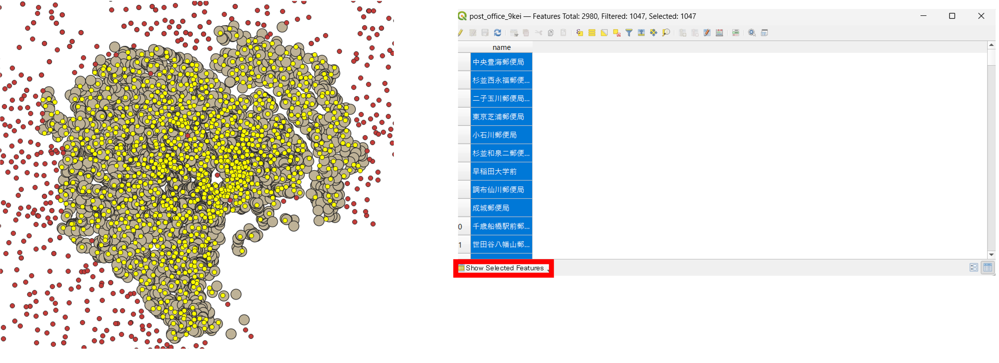

You can export the selected data using the following steps.
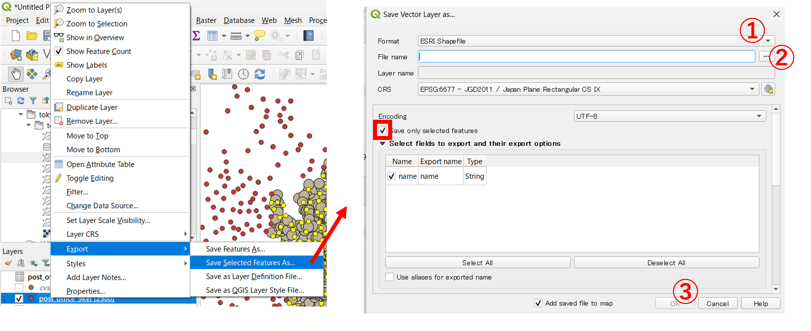

### Multi rings buffer
To create multi rings buffer, install a plugin with following procedure; `Plugins > Manage and Install Plugins > Multi-distance buffer`.

Click on `Install`.
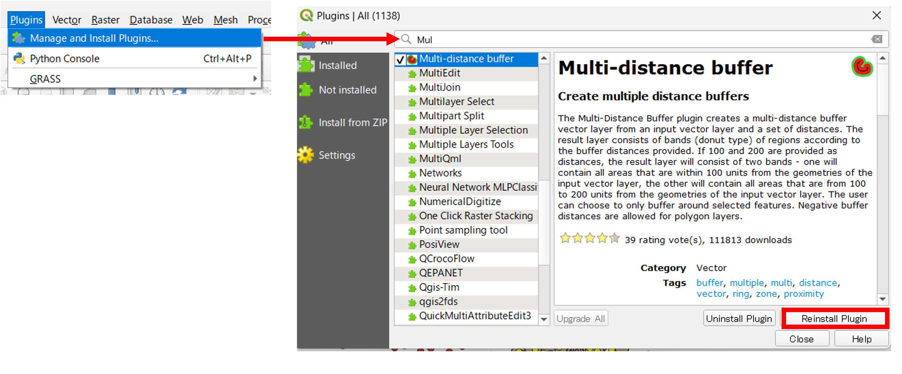

You can create multi rings buffer with following procedure;`Vector > Multi-distance buffer > Multi-distance buffer`
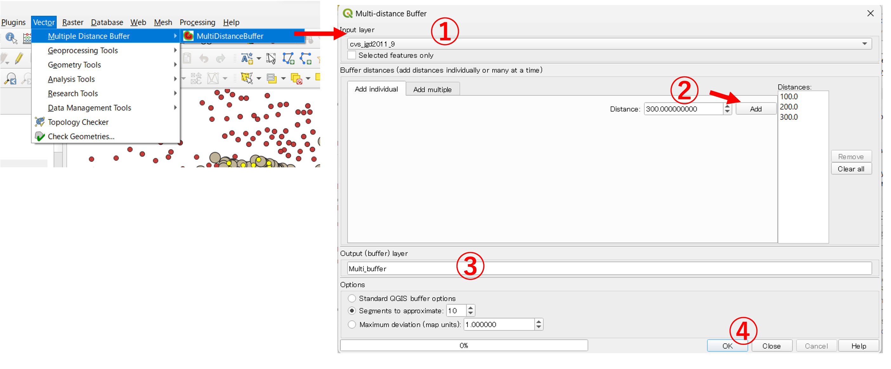

1. Set CVS data.
2. Use the "Add" button to specify values in increments of 100 meters, up to 500 meters.
3. Enter the output layer name.
4. Click on `OK`

As shown in the image below, a multi-ring buffer with intervals of 100 meters is created.
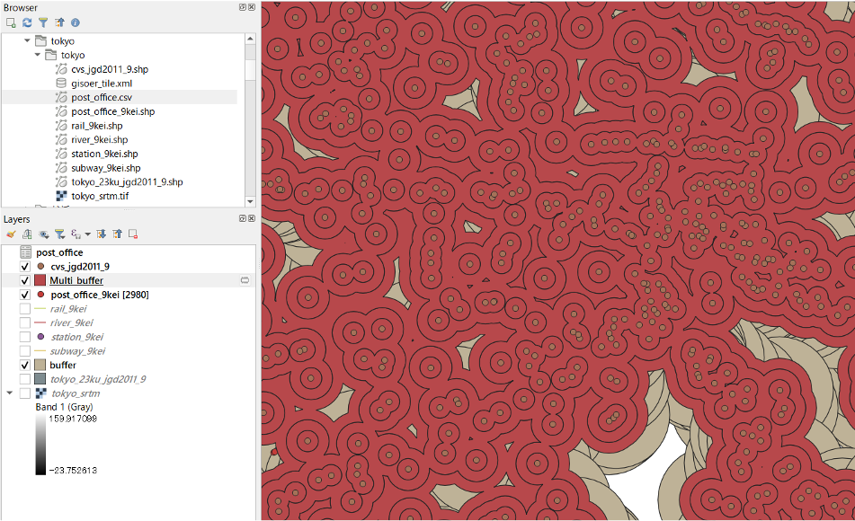

You can assign colors corresponding to each 100 meters for classification.
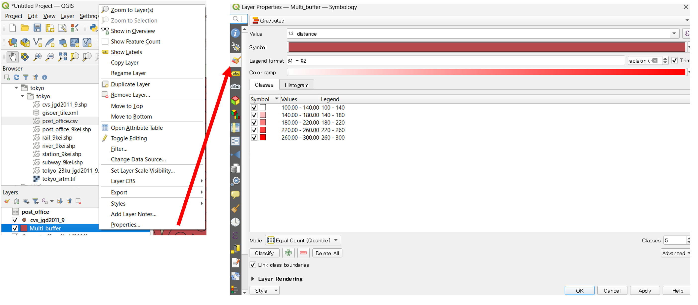

As shown in the image below, the colors are assigned to the data at intervals of 100 meters.  
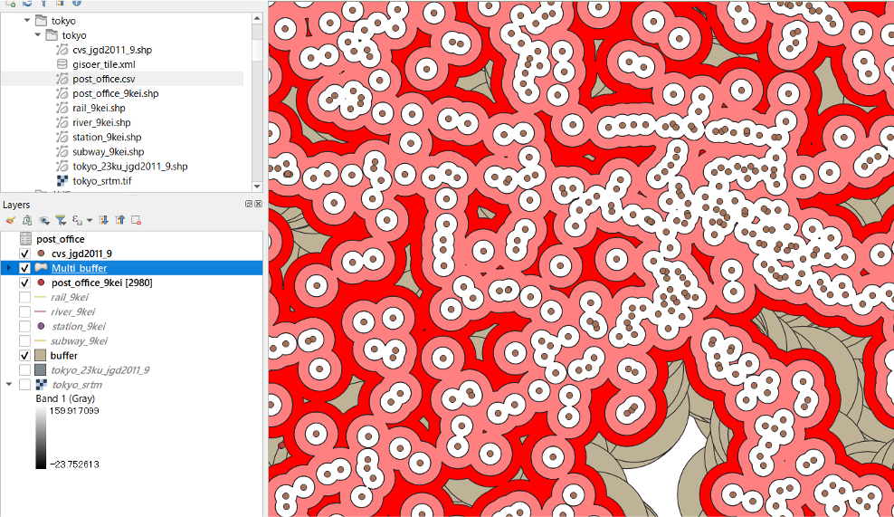

[▲ Back to Menu]

## Week 4 Assignment
In the A to C assignments, you calculate and visualize the number of points using various scale boundaries.

## Assignment A Measure points by mesh
Create a mesh polygon (1 km mesh), measure the number of schools contained within each grid, and compose a map with an adjusted color scheme as shown below.

### Practice Data
Before you start following exercise, please download [osaka].

[osaka]:https://github.com/gis-oer/datasets/raw/master/osaka.zip

### Example of completion
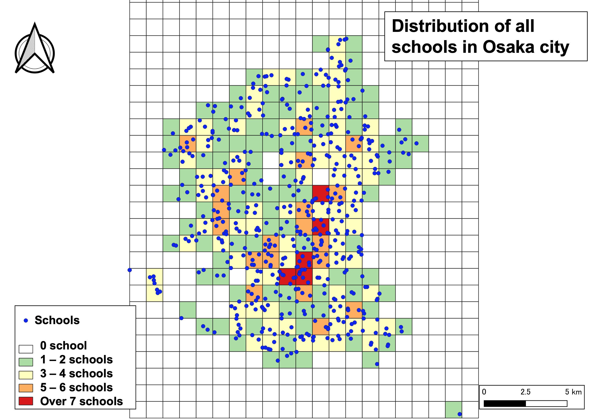

## Assignment B Measure points by administrative wards
Using the polygons of the administrative wards, calculate the number of schools each district and adjust the color accordingly. 

### Example of completion
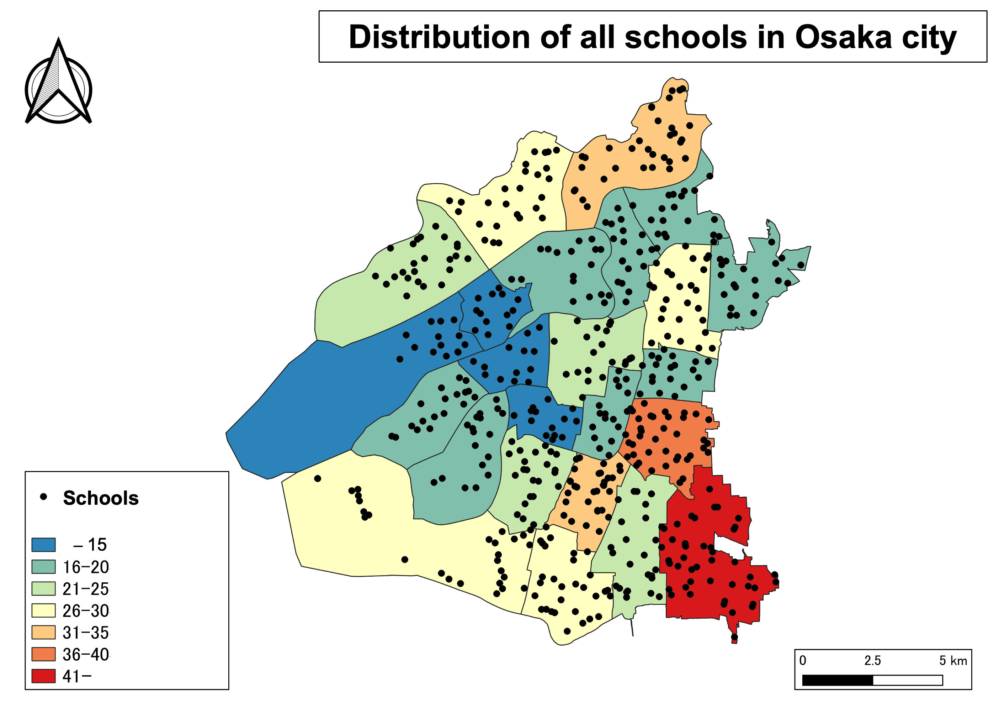

## Assignment C Creating a buffer
Using rivers (river.shp) and schools (school.shp) data in Osaka city and its surrounding areas, please survey the number of schools located within a 200 meter from the rivers. Next, create a map shown as below and add the number of schools (results of above survey) obtained within the white box.

### Example of completion

[▲ Back to Menu]:./d.md#Menu