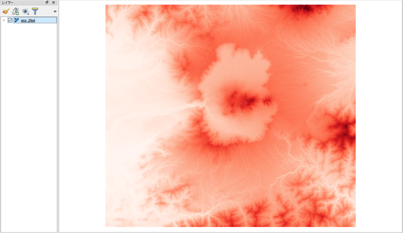
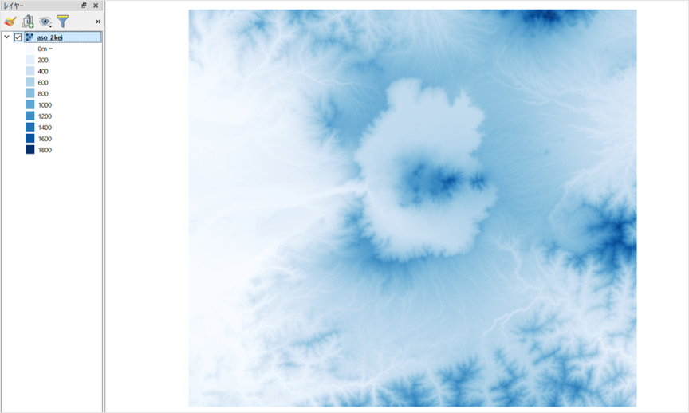
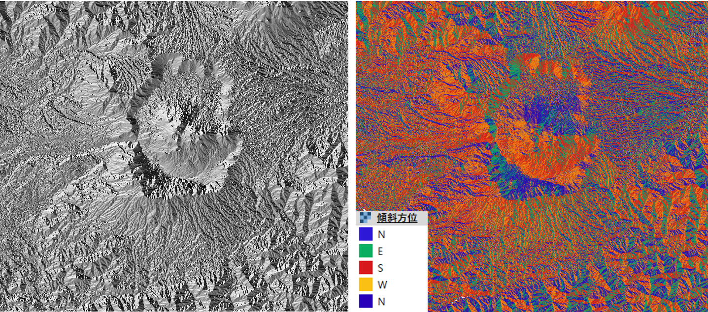
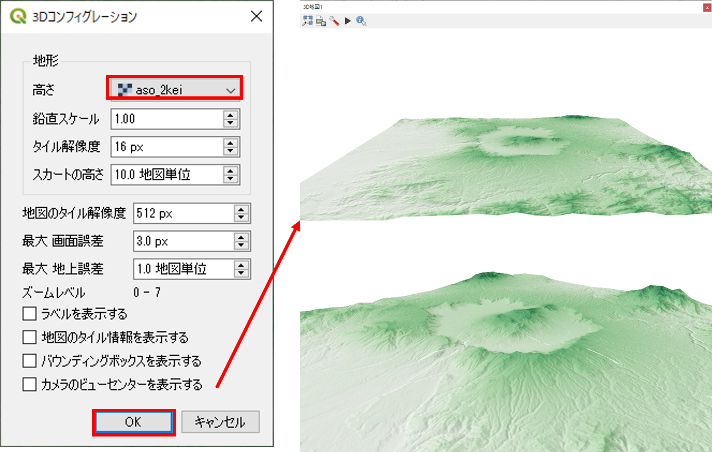
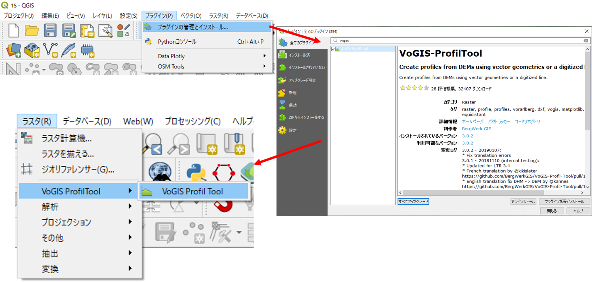
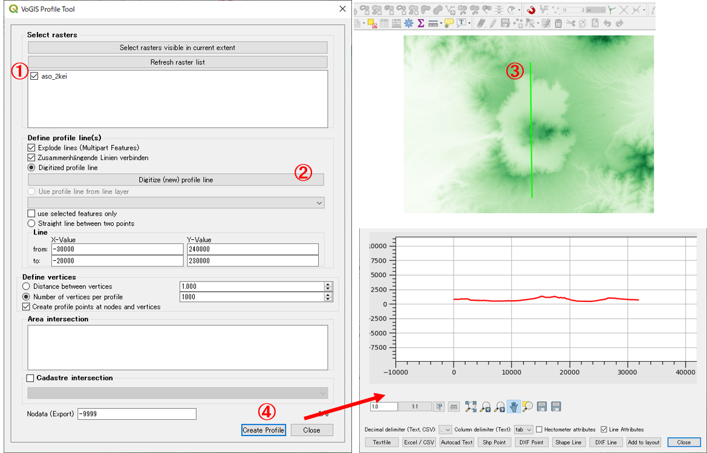
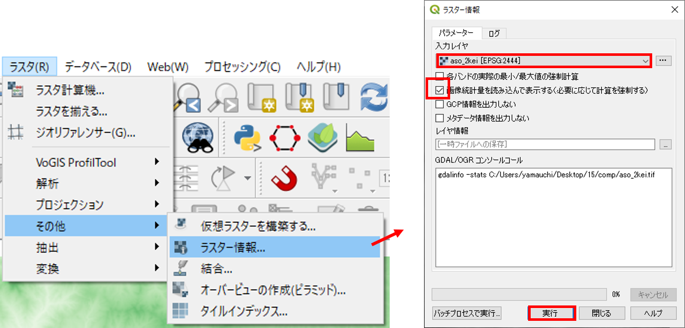
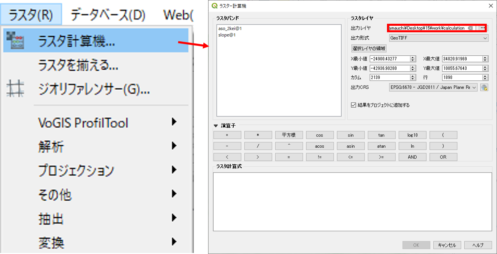
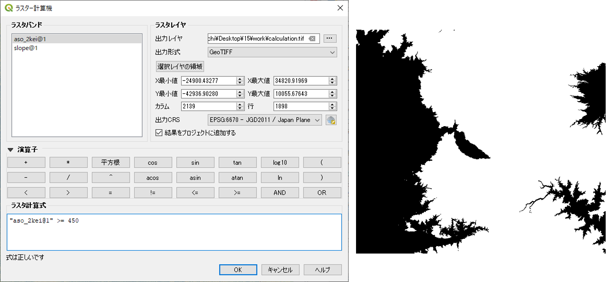

# ラスタデータの分析
　本教材は、「ラスタデータの分析」の実習用教材です。各セルに標高値を保持しているラスタデータを用いて、地形解析の手法について解説しています。本教材では、数値標高モデル(DEM)として整備されたデータを用います。DEMは、Digital Elevation Modelの略であり、地形解析等に用いられるデータです。

**Menu**
------
* [数値標高モデルの視覚的分析](#数値標高モデルの視覚的分析)
* [基本的な統計量の確認](#基本的な統計量の確認)
* [ラスタ演算](#ラスタ演算)

**実習用データ**

実習をはじめる前に、[aso]をダウンロードしてください。

[aso]:https://github.com/gis-oer/datasets/raw/master/aso.zip

## 数値標高モデルの視覚的分析
　セルごとに標高値を保持しているラスタデータを用いることで、傾斜区分図、斜面方位図、陰影図、3D地図、断面図を作成することができます。以下では、その手法について解説しています。QGISを起動し、`データソースマネージャ>ラスタ`からラスタデータを表示してください。

### 標高段彩図の作成
`プロパティ＞シンボル体系`を選択し、レンダリングタイプを`単バンド疑似カラー`を選択し`OK`をクリック押すとラスターの配色が変更できる。

下の図のように、ラスターの配色が変更された。

シンボル体系では、最小、最大値、分類モード、分類数等を指定できる。各項目を設定後、分類をクリックすると反映される。また、各値、ラベルの上で、ダブルクリックすると値、ラベルの指定ができる。

以下では、200ｍ間隔で標高値を色分けした。

### 傾斜区分図の作成
`ラスタ＞解析＞傾斜`を選択し、`実行`をクリックすると傾斜区分が計算できる。**複数QGISを起動していると、`解析`機能が表示されない場合があるため注意する。**

下の左のように傾斜が計算されるため、図の配色を整え、傾斜区分図を作成する。

### 斜面方位図の作成
`ラスタ＞地形解析＞傾斜方位`を実行すると傾斜方位が計算できる。

下の図のように、斜面方位が出力される。傾斜方位は、360°(0°-359.999°)で計算されるため角度に応じて値を分類する。

#### Macメモ: 傾斜と斜面方位
`プロセッシング＞ツールボックス`から`Slope, aspect, curvature`を選択し、データを選択し実行。※ curvatureも出力されるがここでは利用しない。

### 陰影図の作成
`ラスタ＞地形解析＞陰影図`を実行すると陰影図が計算できる。

下の図のように、陰影図が出力される。右下の図のように陰影図に標高値のラスタを重ね、`プロパティ＞透過性`から透過度を設定すると、立体的な地形表現となり、起伏が読み取りやすくなる。ここでは、陰影図の透過度や色合いを変更しないように注意する。

#### Macメモ: 陰影図
`プロセッシング＞ツールボックス`から`Analytical hillshading`を選択し、データを選択し実行。

### 鳥瞰図の作成
`ビュー＞新しい3Dマップビュー`を選択し、`3Dビューの設定`アイコンをクリックする。

高さに標高値のラスタデータを指定し、ＯＫをクリックする。ウィンドウ内で地図を動かすと3次元表示されていることが確認できる。鉛直スケールを1以上とすると、下の図のように地形を誇張して表現できる。

### 地形断面図の作成
`プラグイン＞プラグインの管理とインストール`から`VoGIS Profile tool` をインストールする。

`ラスタ>VoGIS ProfileTool > VoGIS Profile Tool`から起動する。

1. 断面図を作成するラスタにチェックを入れる。
2. `Digitize (new) profile line` をクリックする。
3. QGISの地図上でクリックしながらラインを作成する。（右クリックで終了）
4. `Create Profile`をクリックすると別ウィンドウに断面形状が表示される。

[▲メニューへもどる]

## 基本的な統計量の確認
以下では、QGISでラスタデータが保持する情報を確認する手法を解説しています。

`ラスタ＞その他＞ラスター情報`を開き、統計情報を表示するラスタを選択し、`画像統計量を読み込んで表示する`にチェックをつけ、実行をクリックする。

実行結果は、結果ビューアの`File path`をクリックし、html形式で確認する（座標系、セルサイズ、最低標高、最高標高、平均標高、標高の標準偏差等）。

ヒストグラムの表示は、`プロパティ＞ヒストグラム`を選択し、`ヒストグラムの計算`をクリックする。ヒストグラムは、左クリックすると拡大でき、右クリックで元のビューに戻る。

※外れ値は、`プロパティ＞シンボロジー`の`最小/最大値設定`から、`累積数カット`等を指定し`適用`をクリックすることで、地図表現上、除外できる。

[▲メニューへもどる]

## ラスタ演算
　セルの大きさや領域が同一のラスタデータは、演算によるデータ処理が可能です。ソフトウェアによっては、厳密にセルが重ならなくても補間した値で計算できるものもあります。この処理は、特定の条件に当てはまる地域の抽出や、2時期の地形の変化量の算出（例えば、10年前に取得された標高データと最近取得したデータを引き算する等）際などに用いられます。以下では、標高データや傾斜データを用いて、条件指定したエリアを抽出する手法について解説します。

はじめに、標高値と傾斜角のラスタを読み込む。`ラスタ＞ラスタ計算機`から計算結果を出力するための新規ラスタを作成する。

DEMから標高450ｍ以上の地域を抽出する。
ラスタ計算式に`“aso_2kei@1” >= 450`を入力後、OKをクリックすると右下の図のように表示される。

DEMから標高300m以上で傾斜が5度以下の地域を抽出する。
ラスタ計算式に`“aso_2kei@1” >= 450 AND “slope@1” <= 5`を入力後、`OK`をクリックすると右下の図のように表示される。
※"slope@"1は[斜面方位図の作成]で作成した傾斜ラスタである。

[▲メニューへもどる]

#### この教材の[課題ページ_ラスタデータの分析]へ進む

#### ライセンスに関する注意事項
本教材で利用しているキャプチャ画像の出典やクレジットについては、[その他のライセンスについて]よりご確認ください。

[▲メニューへもどる]:./15.md#Menu
[株式会社エコリスのＨＰ]:http://www.ecoris.co.jp/contents/demtool.html
[利用規約]:../../policy.md
[その他のライセンスについて]:../license.md
[よくある質問とエラー]:../questions/questions.md

[GISの基本概念]:../00/00.md
[QGISビギナーズマニュアル]:../QGIS/QGIS.md
[GRASSビギナーズマニュアル]:../GRASS/GRASS.md
[リモートセンシングとその解析]:../06/06.md
[既存データの地図データと属性データ]:../07/07.md
[空間データ]:../08/08.md
[空間データベース]:../09/09.md
[空間データの統合・修正]:../10/10.md
[基本的な空間解析]:../11/11.md
[ネットワーク分析]:../12/12.md
[領域分析]:../13/13.md
[点データの分析]:../14/14.md
[ラスタデータの分析]:../15/15.md
[傾向面分析]:../16/16.md
[空間的自己相関]:../17/17.md
[空間補間]:../18/18.md
[空間相関分析]:../19/19.md
[空間分析におけるスケール]:../20/20.md
[視覚的伝達]:../21/21.md
[参加型GISと社会貢献]:../26/26.md

[地理院地図]:https://maps.gsi.go.jp
[e-Stat]:https://www.e-stat.go.jp/
[国土数値情報]:http://nlftp.mlit.go.jp/ksj/
[基盤地図情報]:http://www.gsi.go.jp/kiban/
[地理院タイル]:http://maps.gsi.go.jp/development/ichiran.html

[スライド_GISの基本概念]:https://github.com/gis-oer/gis-oer/raw/master/materials/00/00.pptx
[スライド_QGISビギナーズマニュアル]:https://github.com/gis-oer/gis-oer/raw/master/materials/QGIS/QGIS.pptx
[スライド_GRASSビギナーズマニュアル]:https://github.com/gis-oer/gis-oer/raw/master/materials/GRASS/GRASS.pptx
[スライド_リモートセンシングとその解析]:https://github.com/gis-oer/gis-oer/raw/master/materials/06/06.pptx
[スライド_既存データの地図データと属性データ]:https://github.com/gis-oer/gis-oer/raw/master/materials/07/07.pptx
[スライド_空間データ]:https://github.com/gis-oer/gis-oer/raw/master/materials/08/08.pptx
[スライド_空間データベース]:https://github.com/gis-oer/gis-oer/raw/master/materials/09/09.pptx
[スライド_空間データの統合・修正]:https://github.com/gis-oer/gis-oer/raw/master/materials/10/10.pptx
[スライド_基本的な空間解析]:https://github.com/gis-oer/gis-oer/raw/master/materials/11/11.pptx
[スライド_ネットワーク分析]:https://github.com/gis-oer/gis-oer/raw/master/materials/12/12.pptx
[スライド_領域分析]:https://github.com/gis-oer/gis-oer/raw/master/materials/13/13.pptx
[スライド_点データの分析]:https://github.com/gis-oer/gis-oer/raw/master/materials/14/14.pptx
[スライド_ラスタデータの分析]:https://github.com/gis-oer/gis-oer/raw/master/materials/15/15.pptx
[スライド_空間補間]:https://github.com/gis-oer/gis-oer/raw/master/materials/18/18.pptx
[スライド_視覚的伝達]:https://github.com/gis-oer/gis-oer/raw/master/materials/21/21.pptx
[スライド_参加型GISと社会貢献]:https://github.com/gis-oer/gis-oer/raw/master/materials/26/26.pptx

[課題ページ_QGISビギナーズマニュアル]:./tasks/t_qgis_entry.md
[課題ページ_GRASSビギナーズマニュアル]:./tasks/t_grass_entry.md
[課題ページ_リモートセンシングとその解析]:./tasks/t_06.md
[課題ページ_既存データの地図データと属性データ]:./tasks/t_07.md
[課題ページ_空間データ]:./tasks/t_08.md
[課題ページ_空間データベース]:./tasks/t_09.md
[課題ページ_空間データの統合・修正]:./tasks/t_10.md
[課題ページ_基本的な空間解析]:./tasks/t_11.md
[課題ページ_ネットワーク分析]:./tasks/t_12.md
[課題ページ_基本的な空間解析]:./tasks/t_13.md
[課題ページ_点データの分析]:./tasks/t_14.md
[課題ページ_ラスタデータの分析]:./tasks/t_15.md
[課題ページ_空間補間]:./tasks/t_18.md
[課題ページ_視覚的伝達]:./tasks/t_21.md
[課題ページ_参加型GISと社会貢献]:./tasks/t_26.md
