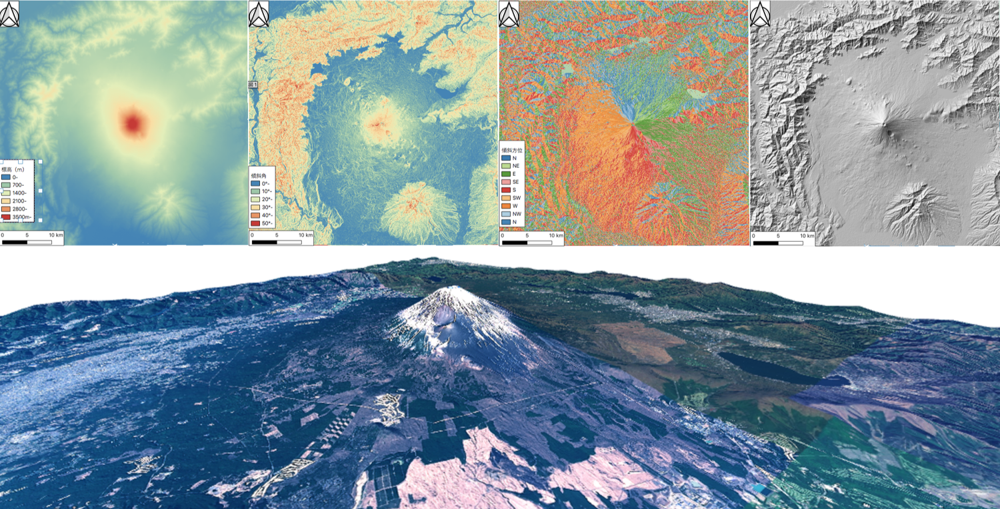

# 課題：ラスタデータの分析
　この実習では、ラスタデータを用いた地形情報の可視化や分析を行います。ラスターデータはベクトルデータと異なり、ピクセルごとに入力された値が分析に用いられます。実習で使われる用語や概念は、地理情報科学教育用スライド（GIScスライド）の4章を参照してください。手順とGISオープン教材の[ラスタデータの分析]の教材を参考に、完成例のような地図が作成できれば、完了となります。

### 実習用データ
本実習をはじめる前に、[Fuji_task]をダウンロードしてください。座標変換でエラーが出る場合は、[Fuji_task2]内のどちらかを選択して実行

[Fuji_task]:https://github.com/gis-oer/datasets/raw/master/s/fuji_task_s.zip

[Fuji_task2]:https://github.com/gis-oer/datasets/raw/master/s/fuji_task_s2.zip

## 課題②_数値標高モデルの視覚的分析
　富士山周辺のDEMデータを用いて、標高区分図、傾斜区分図、傾斜方位図、陰影図、3D地図を作成し、レイアウトしてください。また、富士山の地形の特徴を整理し、300字程度でまとめてください。

### 完成例

※　上段：左から、標高区分図（段彩図）、傾斜区分図、傾斜方位図、陰影図　下段：3D地図（背景地図として地理院タイルを使用）

### 手順
1. ダウンロードしたラスターデータをQGISで読み、[空間データの統合・修正]の教材を参考にラスタデータを結合する。
2. ラスタ＞解析から傾斜、傾斜方位、陰影図を作成する。
3. 標高値、傾斜角、斜面方位（0°-360°）など、それぞれのラスターデータの値に応じて色分けを行い、標高区分図、傾斜区分図、傾斜方位図を作成する。
4. 3D地図を作成する。
5. 作成した標高区分図、傾斜区分図、傾斜方位図、陰影図、3D地図をパワーポイントなどで完成例のようにまとめる
6. 地図を視覚的に分析し、富士山の地形の特徴をまとめる。

#### 実習用データのソース
実習用データは、無償で利用可能なデータを加工して作成したものです。データのソースは、各ファイルのREADME.mdにまとめています。

[利用規約]:../../../policy.md
[その他のライセンスについて]:../../license.md
[よくある質問とエラー]:../../questions/questions.md

[GISの基本概念]:../../00/00.md
[QGISビギナーズマニュアル]:../../QGIS/QGIS.md
[GRASSビギナーズマニュアル]:../../GRASS/GRASS.md
[リモートセンシングとその解析]:../../06/06.md
[既存データの地図データと属性データ]:../../07/07.md
[空間データ]:../../08/08.md
[空間データベース]:../../09/09.md
[空間データの統合・修正]:../../10/10.md
[基本的な空間解析]:../../11/11.md
[ネットワーク分析]:../../12/12.md
[領域分析]:../../13/13.md
[点データの分析]:../../14/14.md
[ラスタデータの分析]:../../15/15.md
[傾向面分析]:../../16/16.md
[空間的自己相関]:../../17/17.md
[空間補間]:../../18/18.md
[空間相関分析]:../../19/19.md
[空間分析におけるスケール]:../../20/20.md
[視覚的伝達]:../../21/21.md
[参加型GISと社会貢献]:../../26/26.md

[地理院地図]:https://maps.gsi.go.jp
[e-Stat]:https://www.e-stat.go.jp/
[国土数値情報]:http://nlftp.mlit.go.jp/ksj/
[基盤地図情報]:http://www.gsi.go.jp/kiban/
[地理院タイル]:http://maps.gsi.go.jp/development/ichiran.html

[課題ページ_QGISビギナーズマニュアル]:../../tasks/t_qgis_entry.md
[課題ページ_GRASSビギナーズマニュアル]:../../tasks/t_grass_entry.md
[課題ページ_リモートセンシングとその解析]:../../tasks/t_06.md
[課題ページ_既存データの地図データと属性データ]:../../tasks/t_07.md
[課題ページ_空間データ]:../../tasks/t_08.md
[課題ページ_空間データベース]:../../tasks/t_09.md
[課題ページ_空間データの統合・修正]:../../tasks/t_10.md
[課題ページ_基本的な空間解析]:../../tasks/t_11.md
[課題ページ_ネットワーク分析]:../../tasks/t_12.md
[課題ページ_基本的な空間解析]:../../tasks/t_13.md
[課題ページ_点データの分析]:../../tasks/t_14.md
[課題ページ_ラスタデータの分析]:../../tasks/t_15.md
[課題ページ_空間補間]:../../tasks/t_18.md
[課題ページ_視覚的伝達]:../../tasks/t_21.md
[課題ページ_参加型GISと社会貢献]:../../tasks/t_26.md
