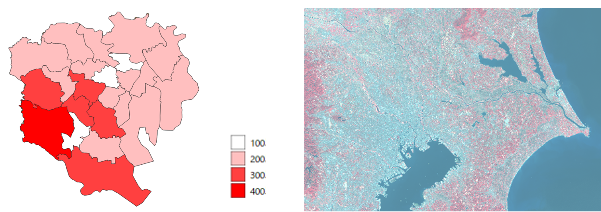
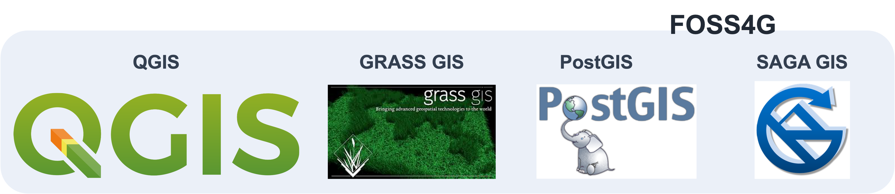
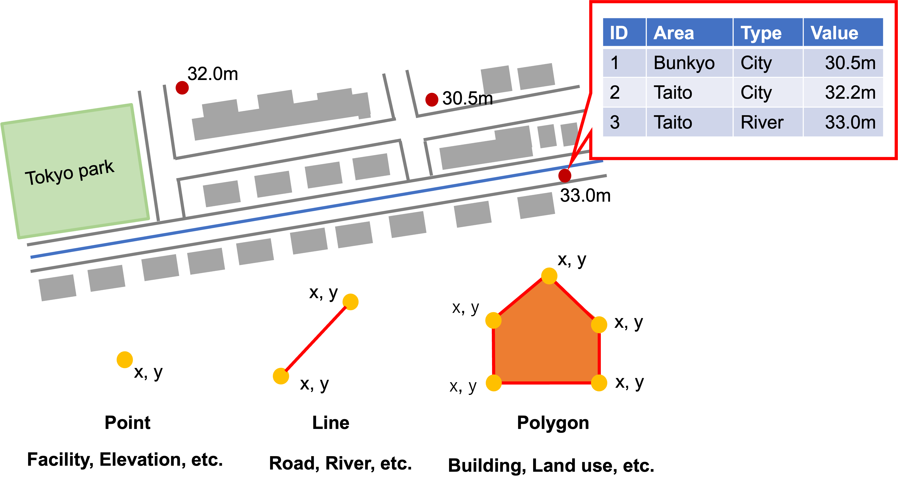
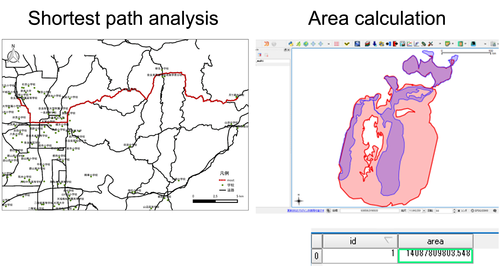
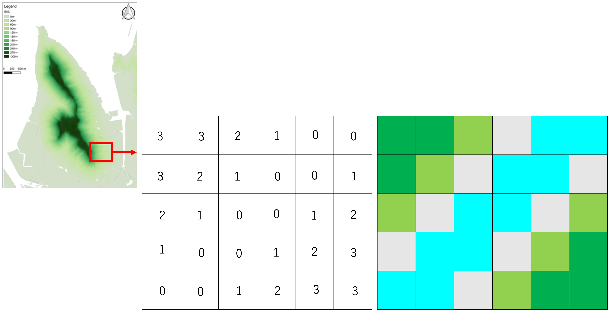
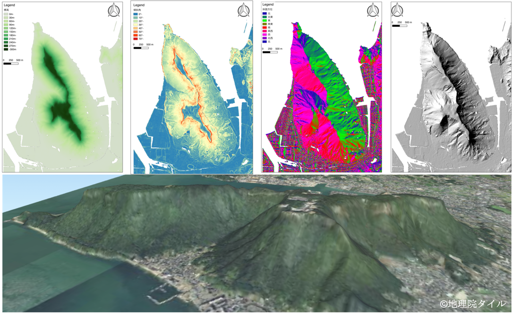
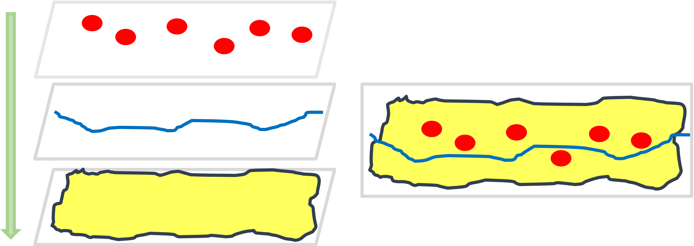
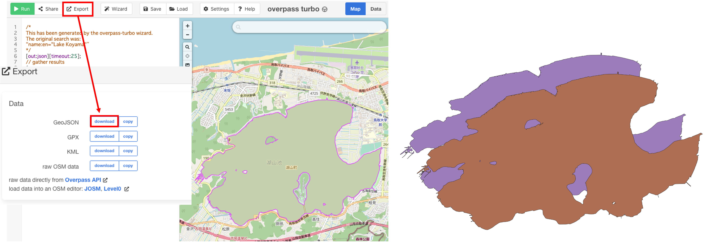
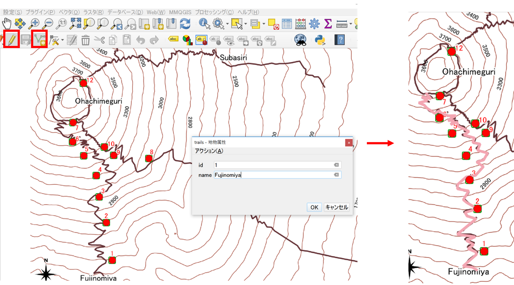

# Introduction of GIS and educational topics in the course
This page explains briefly GIS fundamental concept.The learnners will practice operating GIS software with a self learning while leading the online materials. 

## Summary and Goals 
In this section, the students learn following five knowledge and skills. The first is a visualization of spatial data and creation of the maps. The second is collecting spatial dataset from websites. The third is basic spatial data analysis. The fourth is development of a simple online map. The fifth is skill for interpreting GIS analyzed results. Whole of the section, students learn how to process spatial data using Japan's data. 

- Visualization and creation of maps using GIS
- Collecting spatial datasets
- Basic spatial data analysis
- Development of a simple online map
- Interpretation of analyzed result

## GIS (Geographic Information Systems)
GIS means Geographic Information Systems, it is used to visualize, create, edit, and analyze geospatial data using computers. The geospatial data is included vary earth surface information related to human activities such as city land use economic cultural and so on. As well as GIS data is also included the natural environment information such as topography, climate, vegetation, and so on. Most important of point of geospatial data is not only contained an attribute information but also location information.

For example, below left image shows a population density in Tokyo central area. This data has boundary information and population value information. The GIS user can display a map as close to red color means high populated density area. On the other side, the below right map shows distribution of a vegetation in Tokyo and around area. In this figure, the closing to red color means powerful vegetation area. As shown two images, GIS can process geographic phenomenon related to human and physical geographical topics.

## Software
Now days, there are wide range of GS software, services, and applications have been providing as commercial product or free tools. Especially, open source software is very useful for GIS beginners. In this session, we use QGIS, which is a one of famous free and open source software.  Such products are called the FOSS4G. The advantage of QGIS is not only utilizing enrich data process functions similarly commercial software, but also available to use functions implemented in other FOSS4G software such as GRASS GIS, Post GIS, and SAGA GIS.

## Vector data
The GIS data are mainly used two types data set; vector data and raster data.  Firstly, we explain vector data.

The vector data can represent real features by point, line, and polygon. Vector data defined by coordinate information which have each node. Because the visibility of vector data when the user zoom to features on the map, does not change. The data contains location information and attribute information such as names, types, and boundary. As widely recognized vector data formats are ESRI Shapefile, GeoJSON, and KML.

Following image shows concepts of vector data. The data can be divided to three type features; points, lines, and polygons. The location of vector data is identified with XY information which is contain each node. In this figure, point data is used to represent facility, and elevation. Line is used to display river and road. Polygon is used to show buildings, and land use. A characteristic of vector data is to contain multiple attribute information. For example, this point data have some information such as ID, Area name, Data type, and Elevation value even shown as one data in a map.

Vector data can be used to a lot of analysis. For example, left figure shows shortest distance analysis using line data. By using GIS, the users can calculate a distance just setting two point on a map. The right figure is example of calculating area values. The GIS users easy to compare, area of two different polygons to analyze environmental changes of the place in different ages.

## Raster data
Next, we explain about the raster data. This data is appropriate for representing the distributed spatial features such as terrain, temperature, water area, and so on. This data is consisted of same size pixels as a digital photographs. Each pixel contains a value such as elevation. The size of cell is important due to depend on representing real world features. If cell size is small such as 50 cm × 50 cm (50 cm resolution), it is high reproducibility to real world, but data size is heavy. On the other hand, cell size is big such as 1 km ×  1 km (1 km resolution), it is low reproducibility to real world but data size is small. When you use a raster data, it is important to consider feature scale which you want to deal in GIS. Raster data visibility is changed the zooming level on the map due to raster data consist of same size cell.  Geotiff is known as one of typical data format of raster data.

This figure shows concepts of raster data. Raster data is consisted of multiple pixel. If zooming area on the map, the users can confirm each pixel. The data can visualize and analysis due to each cell contains one value as this figure. For example, in case of the users can colorize raster data, the users can allocate a color corresponded to each pixel as this figure.  The quality and data size of raster data are depend on each cell size that means resolution. The small cell size means high resolution data but, it is high data size.

By using the raster implemented elevation values, the GIS users can analyze and visualize topography. Such data is called DEM, it means digital elevation models. The DEM is used terrain 2D or 3D visualization using elevation values, as well as the data can be available to analyze topography calculation such as exporting slope degree, slope direction, and hill-shade as shown these figure. For example, the professional GIS users explore indications of land slide using calculated DEM data and other GIS data.

##Layer structure
The GIS software shows a map by overlying multiple layers.  If you want to create a map like a right image, you need to stack layers a procedures; polygon, line and points.  You put a point data first, you can not see the point data due to overlay the polygon data on points data. The layer stacking procedure is crucial in GIS visualization.

## Spatial coordinate
There are two main types of coordinate systems:

- Geographic coordinate systems
- Projected coordinate systems

## Educational topics in 6 weeks
From this chapter, we explain summary of each week learning topic. 

### Week 1 : Introduction to QGIS
On the first week, the students learn a creation of maps throughout practicing basic operation of QGIS. After this week, the students will obtain a skill to layout maps using QGIS.

### Week 2 : Downloading spatial data and converting spatial data coordinate
The second week has two objectives; the students try to download spatial data from online site, and convert spatial coordinate of GIS data. Understanding coordinate conversion process is very important to apply GIS analysis using your country data for your future work.

### Week 3 : Integrating and Modifying Spatial Data
On the third week, the students experience to create GIS data such as point, line, and polygon. Additionally, conduct meagre of raster data. Throughout this topic, students obtain a skill to compose original GIS dataset.

### Week 4 : Point Distribution Density
On the fourth week, the students learn spatial data analysis using vector data related to human activities. In this part the student practice  buffering analysis and creating grids for counting number of point data corresponded to polygon boundaries.

### Week 5 : Raster Data Analysis
On the fifth week, the students practice topography data analysis using raster data. They process the data for visualizing terrain as well as calculating slope degree, slope direction, terrain profile, and basic statistic information using DEM data.

### Week 6 : Introduction of Leaflet
On the final week, the students learn how to develop an online map with simple JavaScript programming, using open source map library named leaflet. They will create an online map implemented some layers.

