# Introduction to QGIS

This is a hands-on training material for QGIS beginners. Through this section, the users can learn the characteristics of spatial data, displaying GIS data on the software, changing layer symbols, map layout, etc., while actually operating QGIS.

Menu
-------

- [What is QGIS?](#WhatisQGIS)
- [Installation](#Installation)
- [Launch](#Launch)
- [Window](#Window)
- [Buttons](#Buttons)
- [Loading Data](#LoadingData)
- [Function Description](#FunctionDescription)
- [Attribute Table](#AttributeTable)
- [Properties](#Properties)
- [Import Map Tiles](#ImportMapTiles)
- [Map Layout](#MapLayout)
- [Save Working File](#SaveWorkingFile)
- [Plugins](#Plugins)
- [Introduction to Python](#IntroductiontoPython)
- [Data Saving Formats](#DataSavingFormats)
- [Reference Pages etc.](#ReferencePagesetc.)

### Data for practice.

Please download [tokyo.zip] before proceeding with this training.

[tokyo.zip]:https://github.com/gis-oer/datasets/raw/master/tokyo.zip

----

## What is QGIS?
QGIS is a free and open source (provided under GNU General Public License v2) Geographic Information Systems (GIS) that runs on Windows, Mac, Linux, Unix, Android, and many other environments. It can be used with various plug-ins and in conjunction with other open source GIS such as GRASS and PostGIS to enable various types of spatial analysis. The software is sutable for learning GIS easily and systematically.  

> Referring to http://qgis.org/ja/site/about/index.html

[▲ Back to Menu]

## Installation
There are two versions of QGIS: the latest version and the LTR (Long-Term Release) version, which has one year of bug fix support; this material mainly uses the LTR version, QGIS3.28. Follow the instructions below to install QGIS (downloading the LTR version is recommended).
Install the latest LTR version

Move to the web page of [QGIS](https://qgis.org/ja/site/index.html) and click ‘Download QGIS 3.28’. Materials correspond to the LTR version of QGIS 3.28.11 (LTR) 

Select 32-bit or 64-bit version according to your PC environment to start downloading.

After the download is complete, run the .exe file to install QGIS.

[▲ Back to Menu]

## Installing the Mac version
For the Mac version, download the installer (`qgis-macos-ltr.dmg`) from the QGIS homepage, just like the Windows version. After executing the .dmg, the following window will appear, click Agree.

[▲ Back to Menu].

## Run a program
Double-click the QGIS icon on the desktop. After a while, QGIS will start up.

[▲ Back to Menu]

## Application Window
When you start QGIS, a window shown in the figure below will appear. You can freely change the placement of the icons on the window. 

You can access different function panels by right-clicking on the area (gray area) and selecting the panel from the Panel Menu that appears. The number of icons depends on the number of plug-ins installed. Therefore, please make sure that the images of QGIS below and the educational material are different.

[▲ Back to Menu]

## Buttons
The following describes buttons that are mainly used in QGIS.

![Button A]
(./pic/Qpic7.png) 

1. save the QGIS file
2. save QGIS file with name
3. move map
4. zoom in and out of map
5. zoom in on selected area
6. move the movement back and forth
7. display geographic information
8. selection and deselection
9. length and area measurement (manual) 
10. layer editing
11. layer loading

At the bottom of the window, there is a toolbar where you can use the cursor coordinates, scale, magnification, rotation, coordinate system, etc.

![Button B]
(./pic/Qpic8.png)

[▲ Back to Menu].

## Loading data
GIS can perform spatial analysis, map creation, and data management using data that holds location information. In the following, it explains typical data formats and how to import them into QGIS. Please prepare the data used ([tokyo.zip]) described in the course material. (And please unzip the tokyo.zip file after downloading it.)
　
It is necessary to unzip the zip file to avoid processing errors in GIS. Especially, Windows users 

## Vector data loading
In the following, it explains how to read vector data format shapefiles, which are typical vector data formats used in GIS. The characteristics of a shapefile are described in [Basic Concepts of GIS_Shapefile]. 

Click on the `Open Data Source Manager` icon and switch to the `Vectors` tab. Set the encoding to UTF-8 and specify cvs_jgd2011_9.shp from the source. Click `Add` and the data will appear.

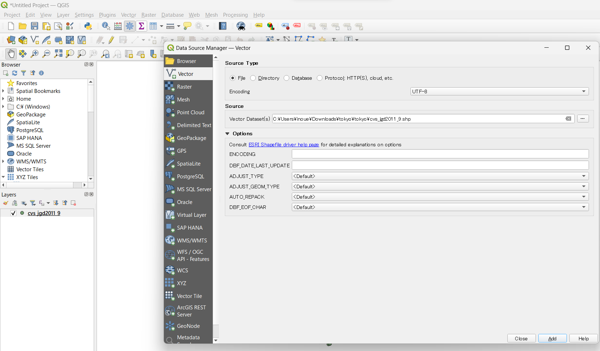

When cvs_jgd2011_9.shp is loaded as shown above, convenience stores in the 23 wards of Tokyo are displayed (point data). Vector data includes point, line, and polygon data formats. Lines and polygons can be loaded using the same method.

### Lines
Displays rivers around Tokyo (river_9kei.shp).

## polygons
Show area of Tokyo 23 wards(tokyo_23ku_jgd2011_9.shp).
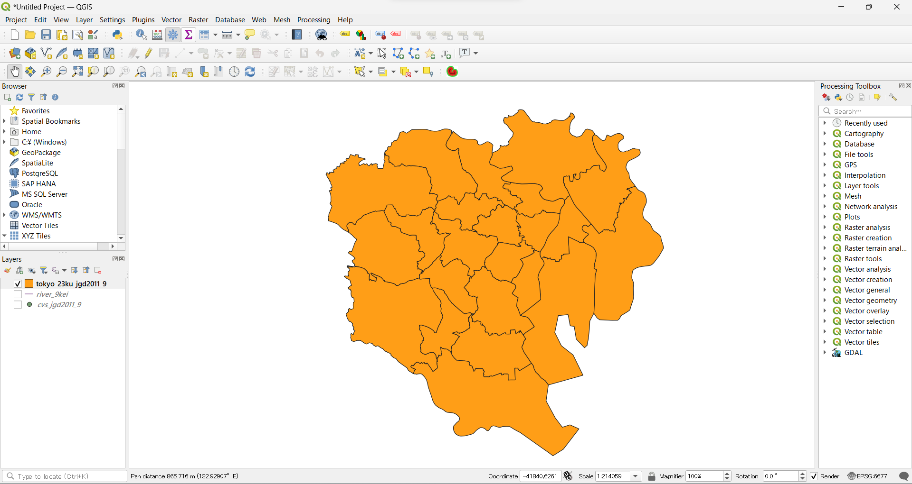

[Note] If vector data are loaded in continuously up to this point, lines will be displayed over the points, and then polygon data will be displayed over them. This is because the data loaded later in the layer is displayed on top; to make the three pieces of data appear properly, change the layer order by dragging the layer name in the Layers panel. The details are explained in `Layer Structure` below.

## Loading Raster Data
The following section describes the method of loading Geotiff, a typical raster data format handled in GIS. Click on the `Open Data Source Manager` icon and switch to the `Raster` tab. Select `tokyo_srtm.tif` from the source and click on `Add`.
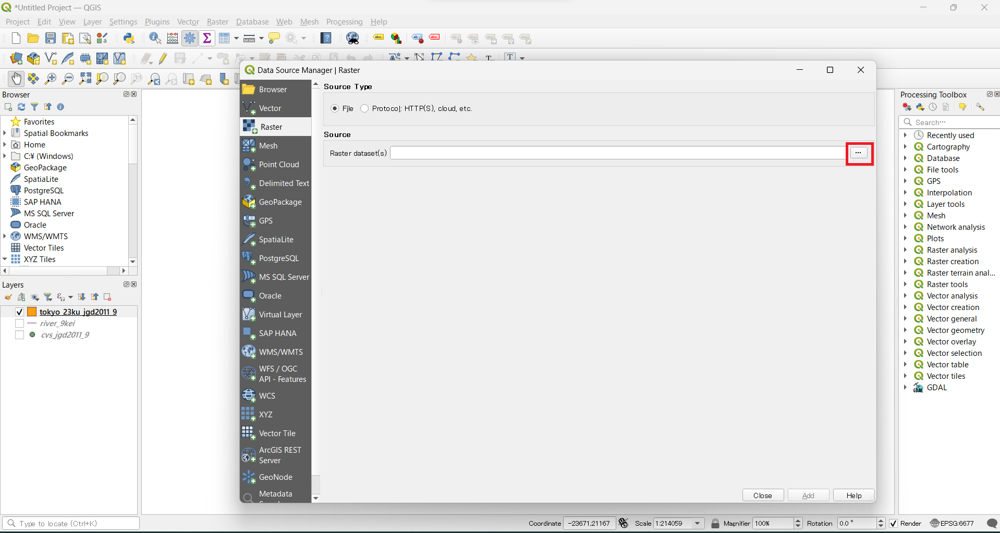

## Text data loading
The following describes a method for loading data in CSV format, a typical text file handled in GIS. Click on the `Open Data Source Manager` icon and switch to the `Delimited Text` tab. select post_office.csv from the file name, and specify the latitude and longitude corresponding to the X and Y fields, if needed, or check `No geometry` if there is no latitude and longitude (In this section, since we only practice reading CSV, check `Geometry definition>No geometry`. 

The CSV file in this exercise is based on UTF-8 encoding, which is the default encoding in GGIS3 (which can be specified next to the layer name) is UTF-8. 
However, the language settings on your PC may affect the file format, in which case, please check the file format and change the encoding format accordingly. 

[▲ Back to Menu].

## Layer Structure
In GIS, data can be switched and superimposed according to the layer structure. The following explains the methods for switching, overlapping, and deleting layers.

### Switch Layer Display
Check the checkbox next to each layer to display the layer on the map display screen.

### Overlap layers
When a layer is shifted up or down in the layer window, the map displayed on the screen switches in tandem.

### Delete a layer
Right-click on a layer in the Layer window and click Delete Layer. Note that this process only deletes the layer from the Layer window, but does not delete the data itself.
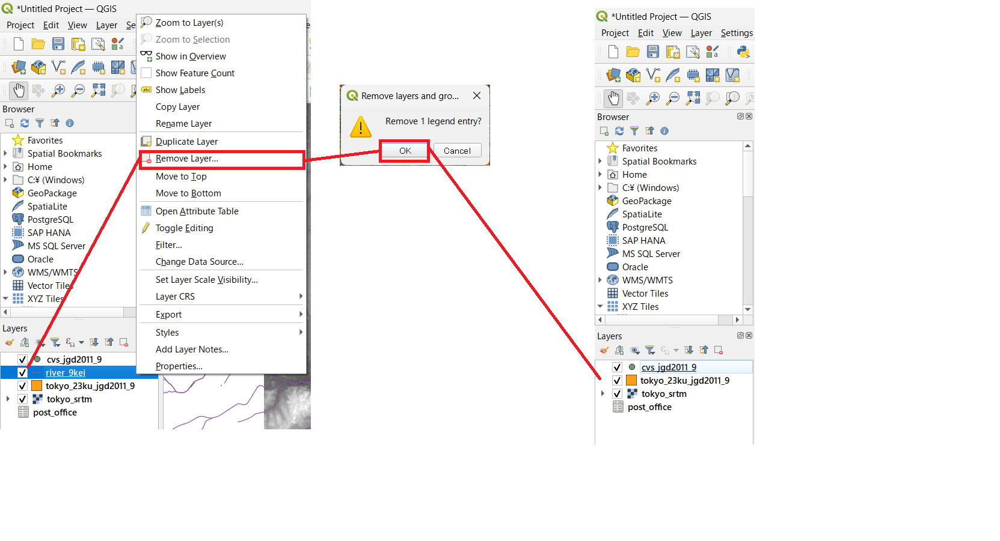

[▲ Back to Menu].

## Functional Description
QGIS has various functions for instance, map layout, data creation, analysis etc. The following describes the functions of QGIS.

![Function Description a]
(./pic/Qpic19.png)

Project: QGIS (.qgs) files can be saved and loaded, maps layout and exported.

Edit: Vector layers can be edited. When editing, it becomes active.

![Function Description b]
(./pic/Qpic20.png)
View: Allows manipulation of the map screen, such as moving, zooming in and out.

Layer: Layers, for instance, vectors, rasters, etc can be added.

Point: New layers of points, lines, and polygons can be created.

![Function description c]
(./pic/Qpic21.png)
Settings: Project settings and snap options can be set from Options.

Plug-ins: Manage and install plug-ins, open Python input window.

![Feature Description d]
(./pic/Qpic22.png)
Vectors: Processes vector-related operations such as buffers and clipping.

Raster: Processes rasters, such as creating slope aspect map and shaded relief map.

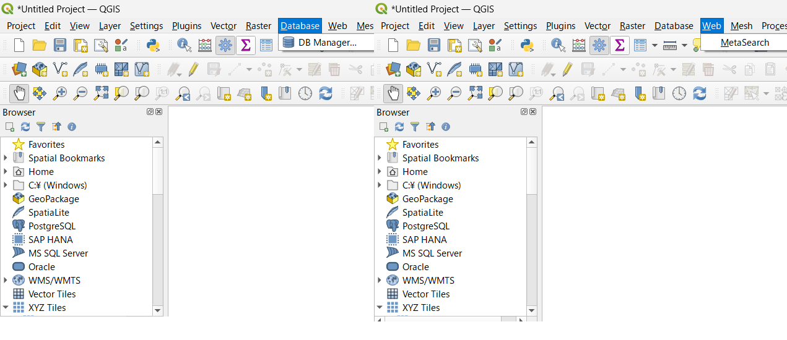
Database: Connect to PostGIS and other databases, and link to external files through the eVis plug-in.

Web: Can set background maps and export web maps (via plug-ins).

Processing: Can be operated in conjunction with other GIS software (R, GRASS, SAGA, etc. can be processed within QGIS).

Help: Help window of the QGIS is here.

[▲ Back to Menu].

## Attribute Tables
Vector data can hold multiple attribute information. The following describes the method of referencing attribute information in QGIS.

Only cvs_jgd2011_9.shp is used below. Please delete unnecessary layers. 

After loading data, right-click on a layer in the layer window to open the attribute table.

Selected objects in the attribute table are displayed in yellow on the map. If a geographic feature on the map is selected with the selection icon, the attribute table corresponding to that feature is selected.When you select a geographic feature on the map, all data is displayed in the attribute table as it is, and it is sometimes difficult to see what you have selected. In such cases, select `Show selected geographic features` from the pop-up menu at the bottom of the attribute table, and only the attributes related to the selected geographic feature will be displayed for easier viewing.

Note that selection by polygon (pressing the small triangle to the right of the selection button displays a pop-up menu and you can select polygon, freehand, etc.) is terminated by right-clicking, and selection by freehand is terminated by left-clicking. This inconsistency makes it difficult to understand its operability.

[▲ Back to Menu]

## Properties
In QGIS, you can change the display information and style of data from layer properties for each layer. You can change the shape and size for points, the line shape and thickness for lines, and the fill color, etc for polygon.Styles can also be differentiated according to attribute information. This process only changes the display of the layer, but does not change the shape of the data itself.

In the following, it explains layer properties and how the style of point data can be changed.

Select the layer whose properties you want to display from the Layer window by right-click,  properties.

### Source
You can check the coordinate reference system and change the character code and display name.

### Symbolology
This function allows you to style data. The color scheme and style can be changed according to the value of the data. Classification methods include `single symbol`, `classified`,`tiered`, etc.

Here, you can change the size and color of the point data. Select Single Symbol and specify the color and size. When you are ready to specify, click OK and the changes will be applied.
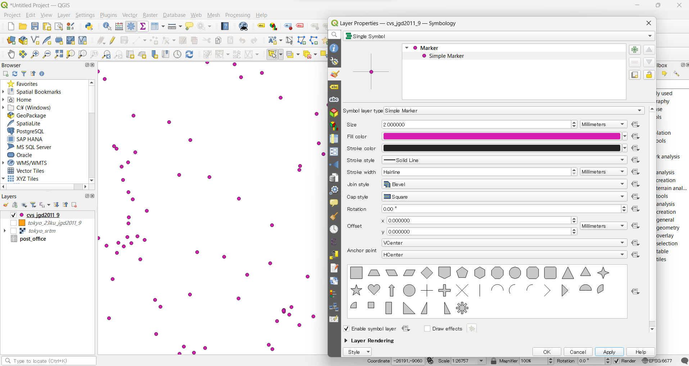

You can also change the shape as follows.

To change the size and color according to the values in the attribute table, select `classified` in the pop-up menu at the top of the symbology screen, then select the field you want to classify.

For practice, let’s change the color for each convenience store. Select `name_en` from the pop-up menu for the `columns` field, then, click on the `Classify` button in the lower left corner, and a color classification by the value of `name_en` is automatically generated. Each color can be adjusted by double-clicking on the symbol, and the legend can also be changed.
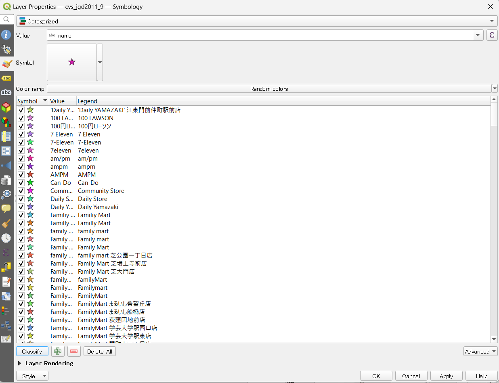

Finally, select and delete the unnecessary classifications, then click `OK` to apply the changes.
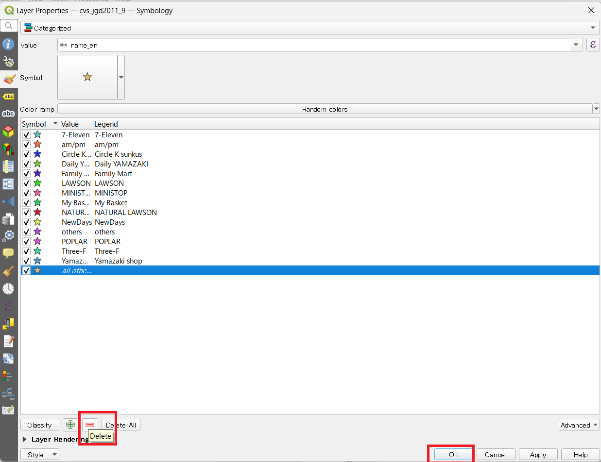

### Label
This function creates labels based on attribute information when displaying data. The following describes the method of displaying labels using attribute values.

The default setting is `no label` To set a label based on a specific attribute, you should select the `label` pop-up menu, then choose `single label` and specify the attribute you want. In this practice, let’s select `name_en`. Afterward, click `OK` to apply the changes, and the label will be displayed on the map.

[▲ Back to Menu]

### Loading map tiles
The following describes a technique for loading background maps in XYZ tile format into QGIS. (For Instance, GeoSpatial Information Authority (GSI) of Japan has shared the Background maps)

Right-click in the area where the icons are lined up (gray area) and click `Panel>Browser Panel`. Find `Browser Panel>XYZ Tiles`, right click and click `New Connection`.

From the GSI's [GSI Tiles] page, select `2. Available only with a description of the source other than basic survey results>Tile List>Basemap>Picture`, then click on the URL (`https://cyberjapandata.gsi.go.jp/xyz/seamlessphoto/{z }/{x}/{y}.jpg`) and copy the URL (`{z}/{x}/{y}.jpg`). Set the copied URL, name, and zoom level as follows. Click `OK` to add the tile to the browser panel. Click on the added tile to add it as a layer in the layer window, and the map will also be displayed.

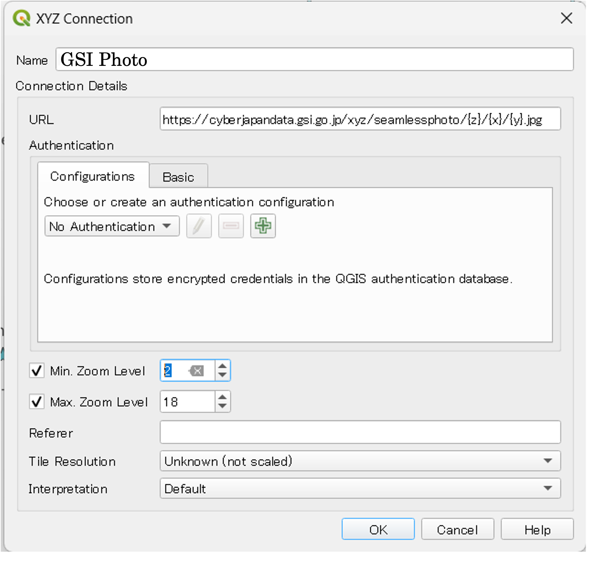

* Please follow the Terms of Use when using the Geographic Tiles from GSI.

[Note] If you superimpose labels of geographic features on an image, the labels may be difficult to read because they are blended into the image. In such cases, click `Draw text buffer` in Layer Properties > Label > Buffer to display the text with borders to make it easier to read.

## Batch loading of XYZ tiles
It is possible to load multiple tiles in a batch from `load connections` using an xml file that describes tile information in advance. Here we use `gisoer_tiles.xml` in the file of data used.

> gisoer_tiles is created based on [GitHub(MIERUNE/mierune-qgis)](https://github.com/MIERUNE/mierune-qgis) by MIERUNE Inc.

[▲ Back to Menu].

## Map Layout
In the following, we will explain the method of laying out a map and outputting it as an image using the styled data and tiles by GSI. Before starting this exercise, please zoom in the map screen to the desired area (in the following, the area around the Hongo campus of the University of Tokyo is shown).

Select `Project>New Print Layout` and enter a title (map name or any other name). If the data does not overlap, restart QGIS, as the on-the-fly CRS projection may not be working properly. Then load the sample data, followed by the XYZ tiles.

Print Composer
In the print layout, the following functions can be used to create a map.

1. selecting and moving items
2. move map
3. add map
4. add image 
5. add text 
6. add a legend 
7. add scale bar 
8. output map

[Note] Deleting an item is done from Edit.

## Layout

To create the following map, add a map, scale bar, legend, title, etc.

### Adding a map
Click the Add Map button, drag it on the map layout screen to specify its size, and then add a map. The map to be added will be the area displayed in QGIS.

### Adding a scale bar
Add a scale bar by clicking (or dragging) on the arrow position as shown below. With the scale bar selected, switch to the Item property tab and change the size values of the line segment columns, etc.
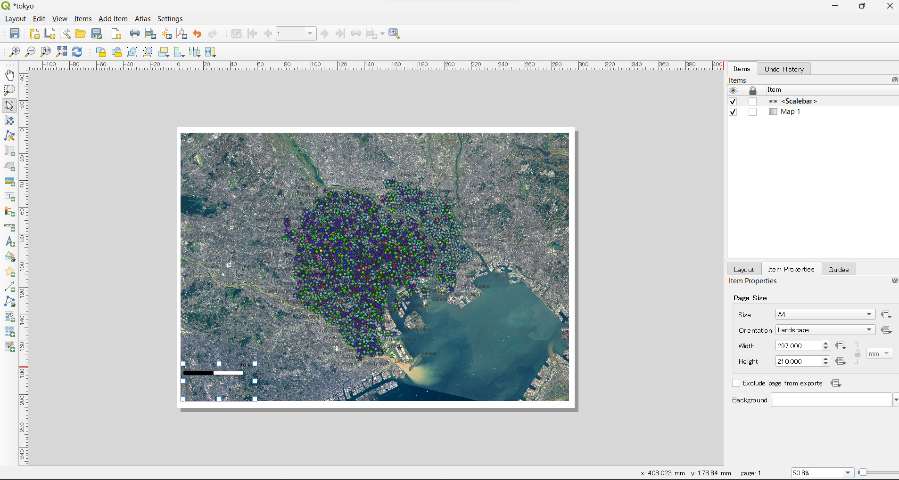

### Adding a legend
Add a legend in the same way as for the scale. Select the legend and adjust it in the item property tab. The legend can be edited by unchecking the `automatic update` checkbox. Then, you can change the name, add and delete legend items.

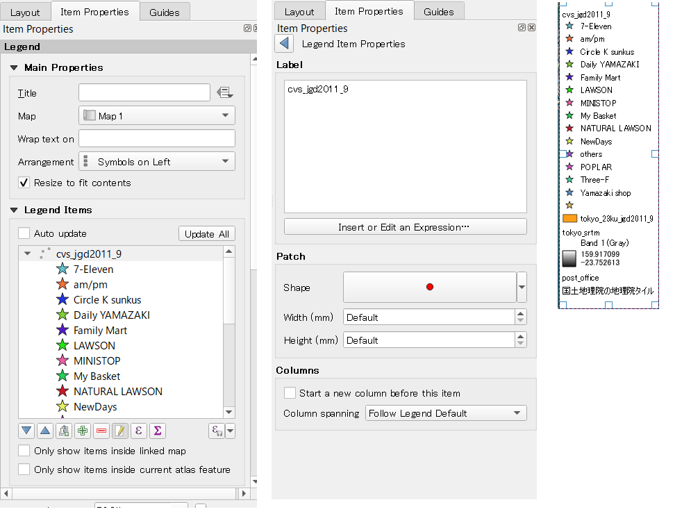

If the legend has margins, place the GIS’s 3D tile at the bottom in the `legend item` of the `item properties` and uncheck the `size to fit content` checkbox in the `main properties`. Then resize it manually.

### Adding an azimuth symbol
Add the azimuth symbol from the `Add Image. Click on `Item Properties>Search Directory` and select the azimuth symbol.

 Note that by default, the search directory will not open unless you click on the red boxed area in the figure. Adjust the image in the item properties as follows.
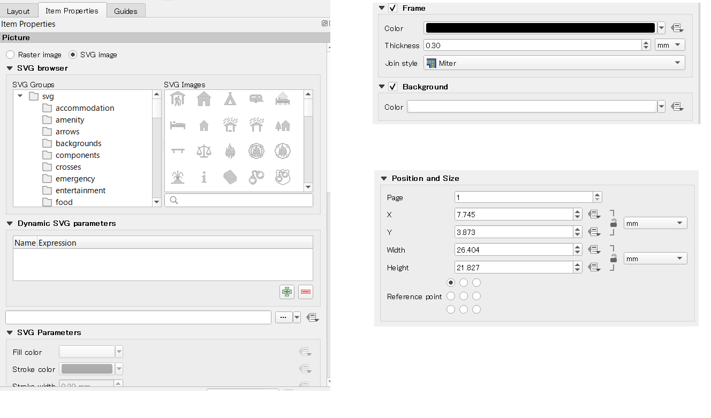

### Adding Text
Add text from Add Text Icon. Then, describe the text you want to enter in the main property.

Like below, adjust the font size, alignment, etc. as follows.

Using the same method, add the necessary information such as background map and data license in text at the desired location.

### Outputting images
After preparing the layout of the map, export it as an image. Select `Layout>Export as Image`.

Double-click the exported image file to display the map as shown below. After exporting the image, close the print layout.

### Display legend and azimuth symbols on the QGIS view
Select `View>Map Decorations`. Add a scale bar and azimuth symbol from the map decorations. Check the check boxes for each, adjust the format and placement, and click `OK`.
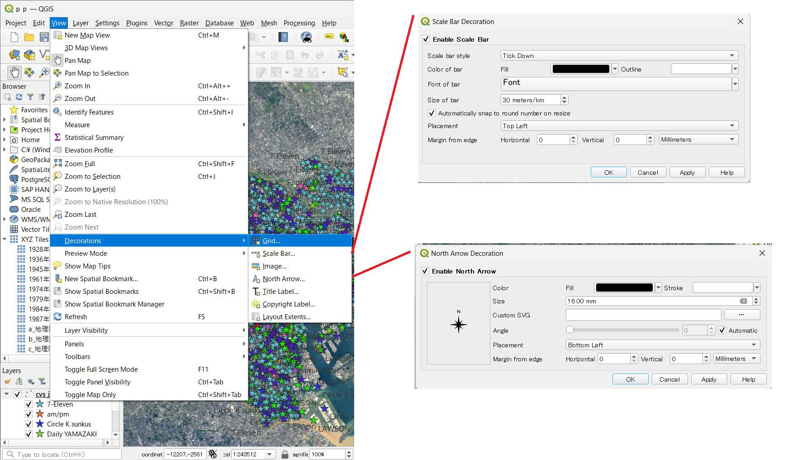

The scale and azimuth symbol will appear on the QGIS view as follows.

### Saving a working file
QGIS has the ability to save a working file. This allows you to resume your work from the previous state, even after you have closed QGIS.

Click `Project>Save As` and output the file with any name. The next time you open the file, double-click the output .qgz file and QGIS will resume from the previous state

[Note] Since the .qgz file is not associated with QGIS3 on the Mac after installation, you will be asked to select an application when you click on the file, so please specify QGIS3 as the `Open Application` there.

[▲ Back to Menu]

### Data Storage Format
GIS often uses vector data in Shapefile format. However, depending on the software or application used, another format of file may be used. This section describes the export of KML and CSV data with QGIS. The method of exporting Shapefile (Shapefile) will be introduced in the next study content.

Right-click on the layer and click Save As... QGIS can output data in various formats such as KML and CSV in addition to Shapefile.

KML is a format that can be used in Google Earth, and is data that can be easily expressed on the Web by using Cesium, etc.

The figure above shows the route from Tokyo Station to Tokyo Tower.

CSV is a comma-separated data format. If you have the coordinate values, you can easily express them as a Web GIS using Carto, etc.

The above figure was created using processed data from Susono City Open Data: Wide-area evacuation areas and city-designated evacuation shelters.

[▲ Back to Menu]

## Assignment for week 1
The map shows the locations surveyed regarding the extent of damage caused by the flood in August 2014. Please create a map similar to the below example using the practice data. Layout the surveyed points, legend, compass, scale bar, and title on the map.

### Practice data
[fkuchiyama_sample.zip]

[fkuchiyama_sample.zip]:https://raw.githubusercontent.com/gis-oer/datasets/master/vector/fkuchiyama_sample.zip

### Completed example

[▲ Back to Menu]:. /a.md#Menu

