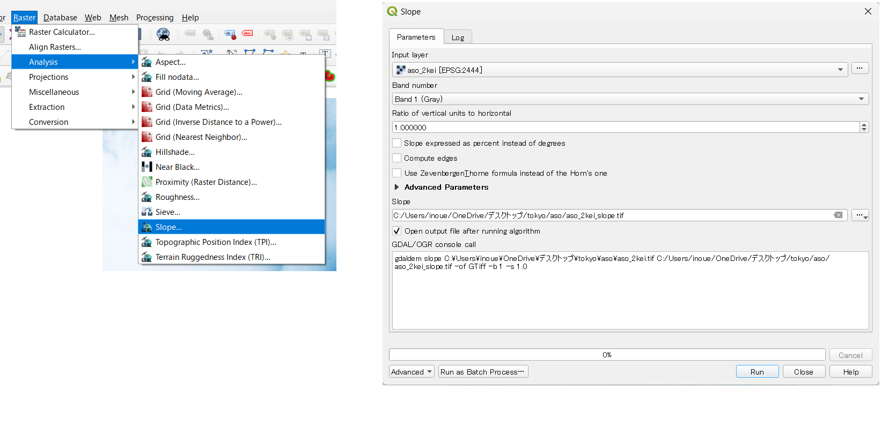
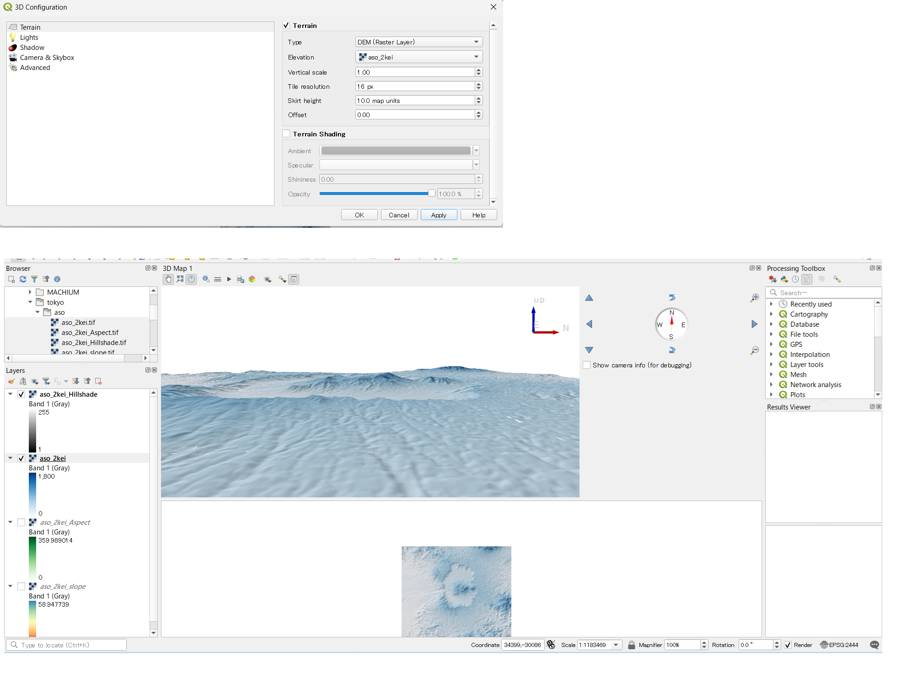

# Raster data analysis
This explains the techniques for terrain analysis using raster data, where each cell contains elevation values. 

Menu
------
・Visual Analysis of Digital Elevation Models
・Checking Basic Statistical Measures

------

### Exercise Data
Before you begin the exercises, please download aso.
[aso]:https://github.com/gis-oer/datasets/raw/master/aso.zip

## Visualization of terrain using DEMs(Digital Elevation Models)
By using DEMs, the GIS users can create slope classification maps, slope direction maps, shaded relief maps, 3D maps, and terrain profiles. The following explanation provides methods for creating these visualizations. Start by launching QGIS and displaying the raster data from the `Data Source Manager > Raster`.

To create an elevation color map, go to Properties > Symbology. Set the rendering type to Singleband pseudocolor, and click OK to access the color settings.

You can change the color scheme of the raster as shown in the image below. above. 

In the Symbology section, you can specify the minimum, maximum values, classification mode, number of classes, and more. After setting each parameter, click on "Classify" to see the changes. You can also double-click on each value or label to customize them.

In the example below, the elevation values are color-coded with 200-meter intervals:

## Creating Slope Classification Maps
To create a slope classification map, select Raster > Analysis > Slope and click "Run" to calculate the slope classes. 
※ Note that if you have multiple QGIS instances running, the "Analysis" feature may not be visible.

Once the slope is calculated, adjust the color scheme as shown on the left in the image below to create a slope classification map:

## Creating Aspect Maps
You can calculate aspect maps by selecting Raster > Terrain Analysis > Aspect.

The output will look like the image below, where aspect values are calculated in degrees ranging in 360° (from 0° to 359.999°). You can classify the values based on their angles.
!Aspect Map](pic/15pic_9.png)

## Creating Shaded Relief Maps
You can calculate shaded relief maps by selecting Raster > Terrain Analysis > Shaded Relief Maps.

The output will be a shaded relief map, as shown in the image below. To create a 3D-like representation of the terrain, overlay the elevation raster on the shaded relief map. Changeits transparency using Properties > Transparency to make the relief more readable and visually informative. Ensure that you are careful not to change the transparency or color scheme of the shaded relief map itself.

## Creating Bird's Eye View Maps
You can calculate bird's eye view maps by selecting Raster > Terrain Analysis > Bird's eye view.

The output will be a bird's eye view map, as shown in the image below. 
Select the altitde raster data as the height, and click OK. Move the map inside the window to see the 3-D visualization. Given that the vertical scale is 1 or more, you can emphasize the terrain as shown below: 

## Creating Terrain Cross-Section Profiles
To create terrain cross-section profiles, you'll need to install the "VoGIS Profile tool" plugin. Here's how to do it: Go to Plugins > Manage and Install Plugins. Search for "VoGIS Profile tool" and install it.

Once you've installed the plugin, you can create terrain cross-section profiles:
Select Raster > VoGIS ProfileTool > VoGIS Profile Tool to launch the plugin.

Check the raster for which you want to create a cross-section profile.
Click on “Digitize (new) profile line”.
Create a line by clicking on the QGIS map while holding down the mouse button (right-click to finish).
After drawing the line, click on Create Profile, and the cross-section shape will be displayed in a separate window.

[▲ Back to Menu]

## Checking Basic Statistical Measures
Here, we explain how to examine the information retained in raster data and view its basic statistical measures using QGIS.

Open Raster > Miscellaneous > Raster Information. Choose the raster for which you want to view statistics, check "Load image statistics and display," and click "Execute."

The results can be viewed in HTML format by clicking on the "File path" in the result viewer. This information includes details like the coordinate system, cell size, minimum elevation, maximum elevation, mean elevation, elevation standard deviation, and more.

To display a histogram, select Properties > Histogram and click on "Calculate Histogram." You can zoom in on the histogram by left-clicking and return to the original view by right-clicking.

※ Note that you can deal with outliers by going to Properties > Symbology and using the "Min/Max Value Settings" with options like "Cumulative cut." This allows you to exclude outliers for a more appropriate map representation.

#### [Assignment E](../tasks/task_e.md)

[▲ Back to Menu]:./15.md#Menu

# Week 5 Assignment
In this assignment, you need to create terrain-visualized maps and terrain profile graph using raster data (Digital Elevation Models).

### Practice Data

Before you start following exercise, please download [Fuji_task]. 

[Fuji_task]:https://github.com/gis-oer/datasets/raw/master/tasks/fuji_task.zip

## Assignment A Calculating and visualizing Mt. Fuji using DEM.
Using DEM data around Mount Fuji, create elevation map, slope map, slope aspect map, hill shade map, and 3D view map as shown in the figures below. When submitting this assignment, please consolidate these figures into a single PDF file (if possible).
　
### Example of completion

## Assignment B Surveying terrain profile
Please create a terrain profile graph that traverses the top of Mt. Fuji from west to east using the values of each cell.

### Example of completion

