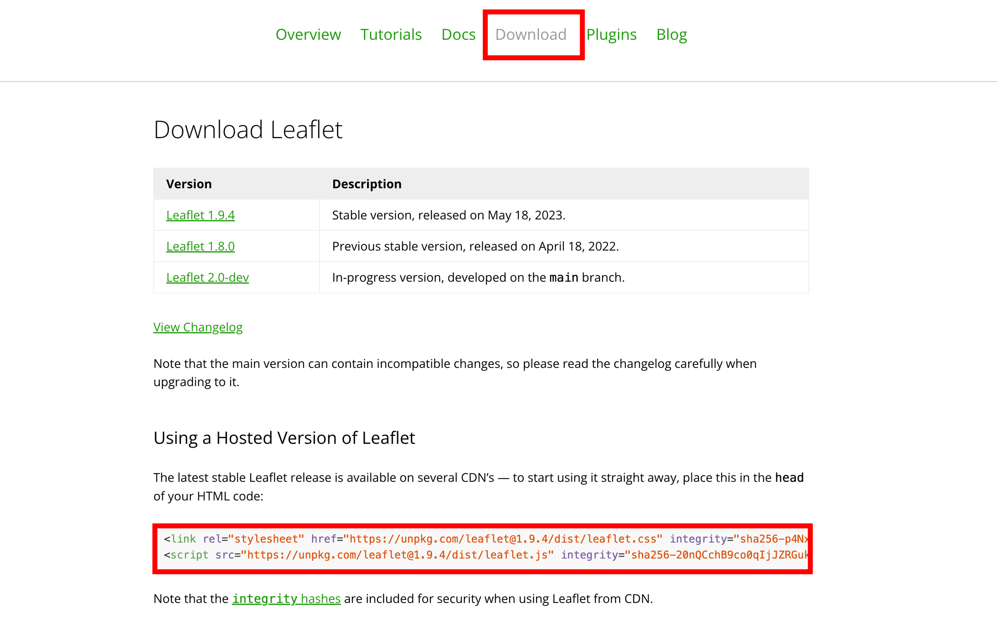

# Introduction to Leaflet

In this part, the material is explained web map creating methods using Leaflet. This exercise requires a text editor such as Visual Studio Code. The explanations of this material were made refer to Tutorials and Documentation page in [Leaflet web site](https://leafletjs.com/).


**Menu**
------
* About the Leaflet
* Outcomes of this practice
* Introduction
* Obtaining APIs information
* Save and display a web map
* Setting multiple layers
* Creating point, line, and polygon data
* Implementing a scale
---

## About the Leaflet
Leaflet is an open-source JavaScript library for creating web maps. With simple coding, you can easily develop web maps that are available for use on both mobile and PC. For detailed information about Leaflet, please refer to the following link.

> - [Leaflet](http://Leafletjs.com/) 
> - [Wikipedia](https://ja.wikipedia.org/wiki/Leaflet)


[▲ Back to Menu]


## Outcomes of this practice
Before learning how to create a web map using Leaflet, this material displays the entire code as [the finished example](https://yamauchi-inochu.github.io/webmap/leaflet-practice.html). Please refer to the code if you encounter any difficulties during practice.


```html

<html>
<head>
	<title>webmap</title>
    <link rel="stylesheet" href="https://unpkg.com/leaflet@1.9.4/dist/leaflet.css" integrity="sha256-p4NxAoJBhIIN+hmNHrzRCf9tD/miZyoHS5obTRR9BMY=" crossorigin="" />
	<script src="https://unpkg.com/leaflet@1.9.4/dist/leaflet.js" integrity="sha256-20nQCchB9co0qIjJZRGuk2/Z9VM+kNiyxNV1lvTlZBo=" crossorigin=""></script>
</head>
<body>
	<div id="map" style="height: 100%; width: 100%;"></div>
	<script>
	
		const basemap = L.tileLayer('https://tile.openstreetmap.org/{z}/{x}/{y}.png', {
			maxZoom: 19,
			attribution: '&copy; <a href="http://www.openstreetmap.org/copyright">OpenStreetMap</a>'
		})
	
		const addmap1 = L.tileLayer('https://cyberjapandata.gsi.go.jp/xyz/ort/{z}/{x}/{y}.jpg', {
		maxZoom: 18,
		attribution: "<a href='https://maps.gsi.go.jp/development/ichiran.html' target='_blank'>GSI maps</a>"
		});
	
		var markers = L.layerGroup();
	
		L.marker([34.9849,135.7586]).bindPopup('Kyoto station').addTo(markers),
		L.marker([35.0138,135.7516]).bindPopup('Nijoujo').addTo(markers),
		L.marker([35.03949,135.72955]).bindPopup('Kinkakuji').addTo(markers),
		L.marker([35.0303,135.7349]).bindPopup('Kitanotenmangu').addTo(markers);
	
	
	const webmap = L.map('map',{
			center:[34.9849,135.7586],
			zoom:12,
			layers:[basemap,markers]
		});
	
	const maps = {
	"OSM":basemap,
	"Aerial photo（2007～）":addmap1
	};
	
	const spots = {
		"Sightseeing spots": markers,
	};
	
	
	L.control.layers(maps,spots).addTo(webmap);
	
	L.control.scale({imperial: false}).addTo(webmap);

	</script>
</body>

</html>

```

[▲ Back to Menu]

## Introduction
In the following, the material explains the method for creating a web map using the Hosted Version of Leaflet. Before implementing the web map, create a folder named `webmap`. Then, open a text editor, copy and paste the following code, and save it as `webmap.html` inside that folder.


```html
<!DOCTYPE html>
<html>
<head>
	<title>webmap</title>
</head>
<body>
	<script>
	</script>
</body>

</html>
```

[▲ Back to Menu]

## Obtaining the Hosted Version of Leaflet

Access to [Leaflet](https://leafletjs.com/download.html)，and copy the code in `Using a Hosted Version of Leaflet` 



Open `webmap.html` in text editor, and paste the code within the `<head>` tag as shown below.

```html
<head>
	<title>webmap</title>
	<link rel="stylesheet" href="https://unpkg.com/leaflet@1.9.4/dist/leaflet.css" integrity="sha256-p4NxAoJBhIIN+hmNHrzRCf9tD/miZyoHS5obTRR9BMY=" crossorigin="" />
	<script src="https://unpkg.com/leaflet@1.9.4/dist/leaflet.js" integrity="sha256-20nQCchB9co0qIjJZRGuk2/Z9VM+kNiyxNV1lvTlZBo=" crossorigin=""></script>
</head>
```

Paste `<div id="map" style="height: 100%; width: 100%;"></div>` in `<body>` tag. Create `<script>` tag in `<body>` tag as shown below.

```html
<body>
	<div id="map0" style="width: 500px; height: 500px;"></div>
	<script>
	</script>
</body>


```

[▲ Back to Menu]

## Setting background maps
In the `<script>` within the `<body> `, add the code as shown below. In `setView([51.505, -0.09], 13)`, enter the latitude, longitude, and map's zoom level to specify the initial display position. To load tiles, set the URL for the tile layer and credit information in `L.tileLayer`. The learners use the standard map provided by OpenStreetMap (OSM), which offers multiple tile layers. After created the code in text editor, it is need to save its file.

```JavaScript
	const webmap = L.map('map').setView([34.9849,135.7586], 14);

	const basemap = L.tileLayer('https://tile.openstreetmap.org/{z}/{x}/{y}.png', {
		maxZoom: 19,
		attribution: '&copy; <a href="http://www.openstreetmap.org/copyright">OpenStreetMap</a>'
	}).addTo(webmap);
	
```

[▲ Back to Menu]

## Save and display a web map
Open the `web map.html` in web browser. The map is appeared as shown below.


[▲ Back to Menu]

## Setting multiple layers
Delete the code in the `<script>` that was written in the previous step, and then proceed with the following procedure. Here, the material explains a method for loading multiple tile layers and switching between them in the map window. In this section, learners can attempt to import an aerial photographs tile provided by the Geospatial Information Authority of Japan.


```JavaScript
const basemap = L.tileLayer('https://tile.openstreetmap.org/{z}/{x}/{y}.png', {
		maxZoom: 19,
		attribution: '&copy; <a href="http://www.openstreetmap.org/copyright">OpenStreetMap</a>'
	})

const addmap1 = L.tileLayer('https://cyberjapandata.gsi.go.jp/xyz/ort/{z}/{x}/{y}.jpg', {
maxZoom: 18,
attribution: "<a href='https://maps.gsi.go.jp/development/ichiran.html' target='_blank'>GSI maps</a>"
});

const webmap = L.map('map',{
	center:[34.9849,135.7586],
	zoom:14,
	layers:[basemap] //A layer is displayed when the map is opened.
});

//Grouping tile layers
const maps = {
"OSM":basemap,
"Aerial photo（2007～）":addmap1
};

// Setting layer selecting box
L.control.layers(maps).addTo(webmap);
```

[▲ Back to Menu]

## Creating point, line, and polygon
In this section, the material explains the creating method for points, lines, and polygons layers using coordinate information.

### Obtain coordinate information using OSM
Before demonstrating data creation methods using Leaflet, introduce how to obtain coordinate information using an online map. [OpenStreetMap (OSM) ](https://www.openstreetmap.org/)has a function that allows users to display coordinate information. Open the OSM and select `Show address` by right-clicking on the map.


### Point layer

The learners only need to read the following sections: `Point Layer`, `Line Layer`, and `Polygon Layer`. Trying these sections requires knowledge of JavaScript. The learners are encouraged to start from the `Grouping and Implementing Layers in the Web Map` section. If you wish to practice creating each type of layer, the procedures: Following `L.control.layers(maps).addTo(webmap);`, `const point = 〇〇.addTo(webmap);`.

To create a point (marker) layer, use the code shown below. `L.marker([34.9850, 135.7588])` defines the location of the point. The `bindPopup` function refers to a popup that is displayed when a user clicks on the point.

```JavaScript
L.marker([34.9850,135.7588]).bindPopup('Kyoto station').addTo(webmap);
```

### Line layer
To create a line (polyline) layer, follow the code as shown below. Describing the line layer requires setting the line color and width (weight).

```JavaScript
L.polyline([
    [34.9849,135.7586],
    [34.9853,135.7533],
    [35.0138,135.7516]
], {color: 'yellow',weight: 3.0}).bindPopup('Kyoto station to Nijojo').addTo(webmap);
```

### Polygon layer
To create a polygon layer, follow the code as shown below. Describing the polygon layer requires setting the polygon color and opacity.


```JavaScript
L.polygon([
    [34.9871,135.7531],
    [34.9871,135.7626],
	[34.9844,135.7627],
	[34.9841,135.7537]
], {color:'pink',fillOpacity:0.5}).bindPopup('Area').addTo(webmap);

```

### Grouping and implementing layers to web map
This section explains a method for grouping markers using `L.layerGroup()` and adding them to the map.

```JavaScript
var markers = L.layerGroup();

L.marker([34.9849,135.7586]).bindPopup('Kyoto station').addTo(markers),
L.marker([35.0138,135.7516]).bindPopup('Nijoujo').addTo(markers),
L.marker([35.03949,135.72955]).bindPopup('Kinkakuji').addTo(markers),
L.marker([35.0303,135.7349]).bindPopup('Kitanotenmangu').addTo(markers);

const webmap = L.map('map',{
		center:[34.9849,135.7586],
		zoom:12,
		layers:[basemap,markers] // Layers are displayed when the map is opened.
	});

// Listing tile layers for displaying in the layer selection box.
const maps = {
"OSM":basemap,
"Aerial photo（2007～）":addmap1
};


// Listing vector layers for displaying in the layer selection box.
const spots = {
	"Sightseeing spots": markers,
};

// Adding features to the layer selecting box.
L.control.layers(maps,spots).addTo(webmap);
```

[▲ Back to Menu]

## Implementing a scale
Learners can add a scale bar by including the following code at the end of the `<script>`.

```Javascript
L.control.scale({imperial: false}).addTo(webmap);

```

Finally, open the map in a web browser and confirm that the online map is created just like the finished example.

[▲ Back to Menu]

## Week 6 Assignment
Create an online map using Leaflet.js that showcases tourist attractions in Japan. The map should feature at least five tourist spots. After developing the map, take a screenshot such as below image.


[▲ Back to Menu]:./Leaflet.md#Menu
