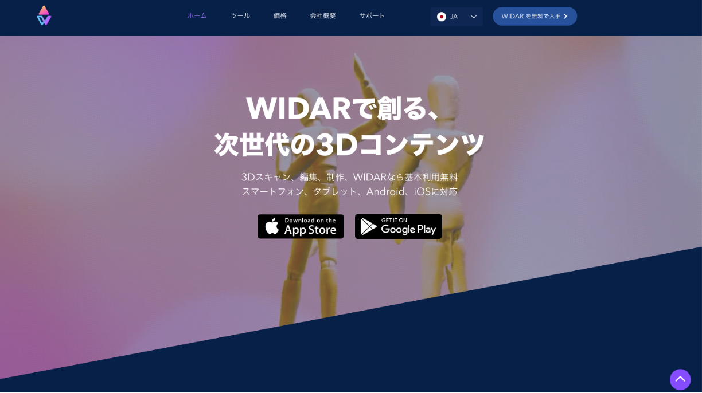
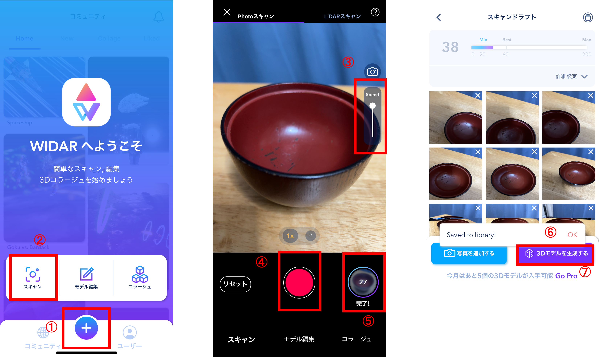
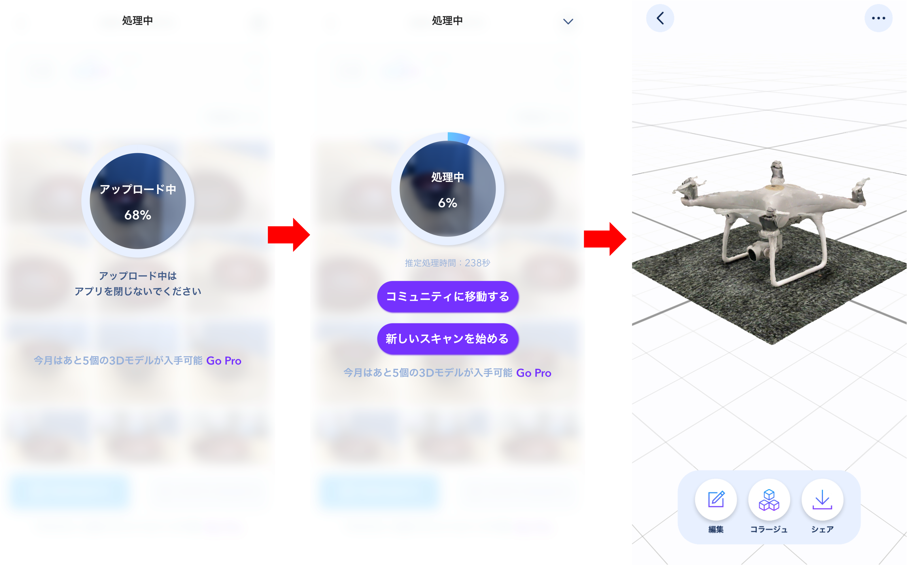
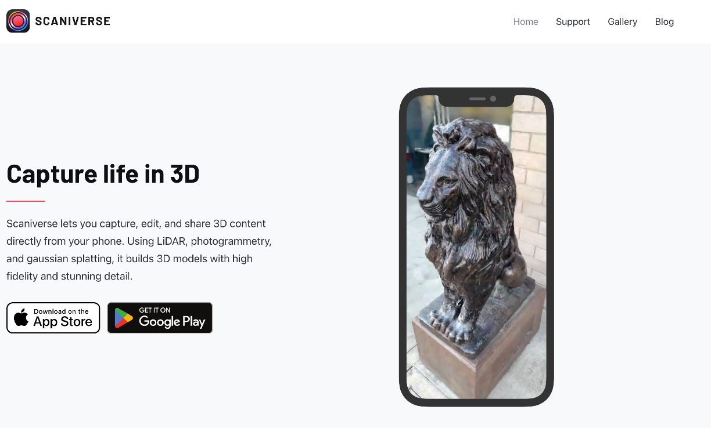
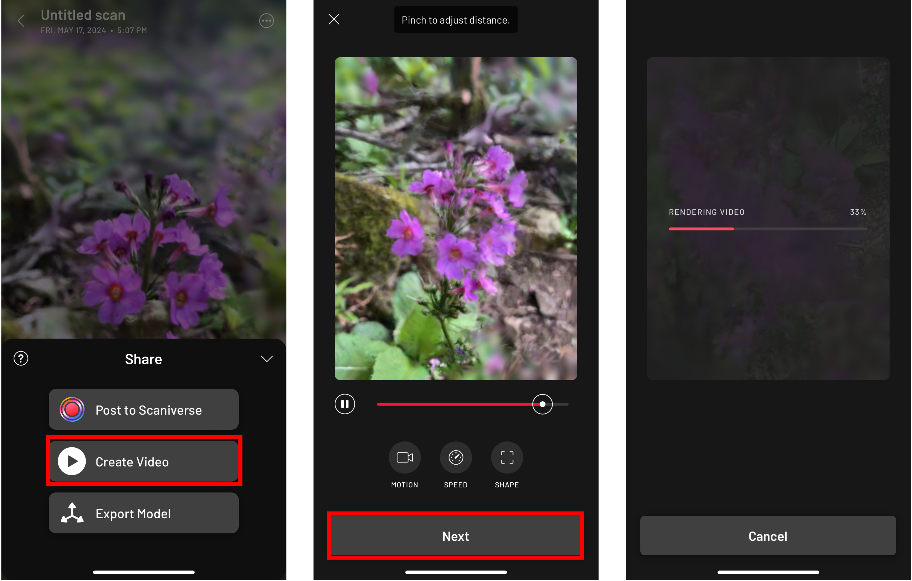

# スマホアプリを用いた3Dスキャニング
本教材は、スマートフォンアプリを用いて、3Dモデルを作成する手法を実習形式で解説します。

**Menu**
-----
- WIDAR
- Scaniverse

-----

## WIDAR
[公式サイト](https://www.widar.io/ja)にアクセスし、スマートフォンのOSに応じて、アプリをインストールする。

スマートフォンでWIDARを起動し、以下の手順で3Dモデルを作成する。※ 2024年6月現在、WIDARは月５つのモデルを無料で構築できる。

1. `＋`ボタンをタップする
2. `スキャン`アイコンをタップする
3. `Speed`を調整する（最初はデフォルト）
4. 撮影ボタンをタップして、対象物が60%~80%ほど重なるように撮影していく
5. 全体が撮影できたら、完了させる
6. `Save to library`を`OK`とする
7. `3Dモデル`を生成する

モデルをアップロードすると処理が開始され、少しまつと3Dモデルが作成される。

## Scaniverse
[公式サイト](https://scaniverse.com/)にアクセスし、スマートフォンのOSに応じて、アプリをインストールする。

スマートフォンでアプリを起動し、以下の手順で3Dモデルを作成する。まず、被写体をみつけ、`New Scan`をタップする。次に、`Splat`を選択する。IPhone Pro 12以上のユーザーは、LiDARモジュールを用いる`Mesh`を利用できる。

撮影ボタンをタップして、被写体を中心にぐるっと回るようにデータを計測する。撮影が完了したら、撮影ボタンを再度タップする。最後に、`Process Splat`を実行するとモデルが作成される。

`Share > Create Video`を選択すると、ビデオが作成できる。
