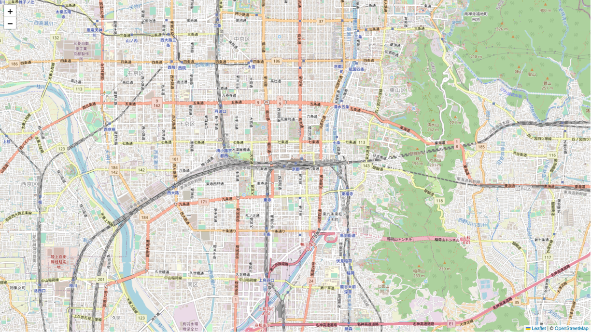

# Leaflet入門

ここでは、WEB地図の作成入門として、Leafletの利用方法について演習形式で解説します。内容は、[Leaflet web site](https://leafletjs.com/)を参考に作成しています。


**Menu**
------
* Leafletについて
* 今日の学習成果について
* イントロ
* APIの利用
* WEB地図の保存
* レイヤの実装
* ポイントデータの作成
* スケールの追加
* 課題

---

## Leafletについて
Leafletは、WEB地図の作成のためのオープンソースJavaScriptライブラリです。シンプルなコーディングで容易に、モバイルやデスクトップの表示に対応したWEB地図が作成できます。全体のファイルサイズが軽いことや様々な地図表現（マーカやタイル読み込み）ができることが特徴です。Leafletに関する詳しい解説は、以下のリンクを参照してください。

> - [Leaflet](http://Leafletjs.com/) 
> - [Wikipedia](https://ja.wikipedia.org/wiki/Leaflet)


[▲ Back to Menu]


## 学習の完成例
学習をはじめる前に [この実習で作成する地図の全体像](https://yamauchi-inochu.github.io/webmap/leaflet-practice.html). をみてみましょう。


```html

<html>
<head>
	<title>webmap</title>
    <link rel="stylesheet" href="https://unpkg.com/leaflet@1.9.4/dist/leaflet.css" integrity="sha256-p4NxAoJBhIIN+hmNHrzRCf9tD/miZyoHS5obTRR9BMY=" crossorigin="" />
	<script src="https://unpkg.com/leaflet@1.9.4/dist/leaflet.js" integrity="sha256-20nQCchB9co0qIjJZRGuk2/Z9VM+kNiyxNV1lvTlZBo=" crossorigin=""></script>
</head>
<body>
	<div id="map" style="height: 100%; width: 100%;"></div>
	<script>
	
		const basemap = L.tileLayer('https://tile.openstreetmap.org/{z}/{x}/{y}.png', {
			maxZoom: 19,
			attribution: '&copy; <a href="http://www.openstreetmap.org/copyright">OpenStreetMap</a>'
		})
	
		const addmap1 = L.tileLayer('https://cyberjapandata.gsi.go.jp/xyz/ort/{z}/{x}/{y}.jpg', {
		maxZoom: 18,
		attribution: "<a href='https://maps.gsi.go.jp/development/ichiran.html' target='_blank'>GSI maps</a>"
		});
	
		var markers = L.layerGroup();
	
		L.marker([34.9849,135.7586]).bindPopup('Kyoto station').addTo(markers),
		L.marker([35.0138,135.7516]).bindPopup('Nijoujo').addTo(markers),
		L.marker([35.03949,135.72955]).bindPopup('Kinkakuji').addTo(markers),
		L.marker([35.0303,135.7349]).bindPopup('Kitanotenmangu').addTo(markers);
	
	
	const webmap = L.map('map',{
			center:[34.9849,135.7586],
			zoom:12,
			layers:[basemap,markers]
		});
	
	const maps = {
	"OSM":basemap,
	"Aerial photo（2007～）":addmap1
	};
	
	const spots = {
		"Sightseeing spots": markers,
	};
	
	
	L.control.layers(maps,spots).addTo(webmap);
	
	L.control.scale({imperial: false}).addTo(webmap);

	</script>
</body>

</html>

```

[▲ Back to Menu]

## イントロ
ここでは、Hosted VersionのLeafletを使用していきます。 まずは、デスクトップに`webmap`というフォルダを作ります。次に、メモ帳などのテキストエディタに以下のコードをコピペします。最後にテキストファイルを`webmap.html`という名前で`webmap`のフォルダに保存します。


```html
<!DOCTYPE html>
<html>
<head>
	<title>webmap</title>
</head>
<body>
	<script>
	</script>
</body>

</html>
```

[▲ Back to Menu]

## Leaflet APIの利用

[Leaflet](https://leafletjs.com/download.html)にアクセスし、`Using a Hosted Version of Leaflet`にあるコードをコピーします。


次に`webmap.html`をテキストエディタでひらき、`<head>` タグ内に先ほどのコードをコピペします。

```html
<head>
	<title>webmap</title>
	<link rel="stylesheet" href="https://unpkg.com/leaflet@1.9.4/dist/leaflet.css" integrity="sha256-p4NxAoJBhIIN+hmNHrzRCf9tD/miZyoHS5obTRR9BMY=" crossorigin="" />
	<script src="https://unpkg.com/leaflet@1.9.4/dist/leaflet.js" integrity="sha256-20nQCchB9co0qIjJZRGuk2/Z9VM+kNiyxNV1lvTlZBo=" crossorigin=""></script>
</head>
```

`<body>`にタグ内に `<div id="map" style="height: 100%; width: 100%;"></div>` を追加します。 その下に`<script>`タグを追加します。

```html
<body>
	<div id="map" style="height: 100%; width: 100%;"></div>
	<script>
	</script>
</body>


```

[▲ Back to Menu]

## 背景地図の設定
`<body> `の`<script>` を以下のように記述します。`setView([xxxx,xxxxx], 13)`の箇所には、中央に表示したい場所の座標、初期表示のズームレベルを記載します。ここでは、デフォルトの地図画像として`L.tileLayer`を使って、OpenStreetMap (OSM)を読み込みます。

```JavaScript

const basemap = L.tileLayer('https://tile.openstreetmap.org/{z}/{x}/{y}.png', {
            maxZoom: 19,
            attribution: '&copy; <a href="http://www.openstreetmap.org/copyright">OpenStreetMap</a>'
        })

const webmap = L.map('map',{
            center:[34.9849,135.7586],
            zoom:12,
            layers:[basemap]
        });
	
```

[▲ Back to Menu]

## 保存と地図表示
テキストの追加が完了したら、まずはここで上書き保存します。Webブラウザで、htmlファイルを開いてみると以下のような地図が表示されます。以下の`//Grouping tile layers`と`// Setting layer selecting box`では、チェックをつけた地図を切り替えて表示できるようにします。


[▲ Back to Menu]

## 複数の背景地図の設定
ここからは、複数の背景地図を追加して、地図上で切り替えられるようにします。まずは、[地理院タイル](https://maps.gsi.go.jp/development/ichiran.html)の写真のタイルを読み込んでみましょう。


```JavaScript
const basemap = L.tileLayer('https://tile.openstreetmap.org/{z}/{x}/{y}.png', {
		maxZoom: 19,
		attribution: '&copy; <a href="http://www.openstreetmap.org/copyright">OpenStreetMap</a>'
	})

const addmap1 = L.tileLayer('https://cyberjapandata.gsi.go.jp/xyz/ort/{z}/{x}/{y}.jpg', {
maxZoom: 18,
attribution: "<a href='https://maps.gsi.go.jp/development/ichiran.html' target='_blank'>GSI maps</a>"
});

const webmap = L.map('map',{
	center:[34.9849,135.7586],
	zoom:14,
	layers:[basemap] //A layer is displayed when the map is opened.
});

//Grouping tile layers
const maps = {
"OSM":basemap,
"Aerial photo（2007～）":addmap1
};

// Setting layer selecting box
L.control.layers(maps).addTo(webmap);
```

[▲ Back to Menu]

## ポイントデータの作成
ここでは、Point,データを作成していきます。

### OSMから緯度経度を取得する
[OpenStreetMap (OSM) ](https://www.openstreetmap.org/)を開いて、任意の場所で右クリックすると`Show address`からその場所の緯度経度を知ることができます。


下記のように記載すると、ポイントデータが記載できます。

`L.marker([34.9850, 135.7588])` は、ポイントデータの座標を記載します. The `bindPopup` では、ポップアップを指定できます。

```JavaScript
L.marker([34.9850,135.7588]).bindPopup('Kyoto station').addTo(webmap);
```

### レイヤのグループ化と実装
ここでは作成したポイントデータをグルーピングして、レイヤとして表示していきます。京都駅に加え、二条城、金閣寺、北野天満宮の位置を加え、観光スポットとして地図で閲覧できるようにします。ポイントをクリックすると記載したポップアップが表示されます。

```JavaScript
var markers = L.layerGroup();

L.marker([34.9849,135.7586]).bindPopup('Kyoto station').addTo(markers),
L.marker([35.0138,135.7516]).bindPopup('Nijoujo').addTo(markers),
L.marker([35.03949,135.72955]).bindPopup('Kinkakuji').addTo(markers),
L.marker([35.0303,135.7349]).bindPopup('Kitanotenmangu').addTo(markers);

const webmap = L.map('map',{
		center:[34.9849,135.7586],
		zoom:12,
		layers:[basemap,markers] // Layers are displayed when the map is opened.
	});

// Listing tile layers for displaying in the layer selection box.
const maps = {
"OSM":basemap,
"Aerial photo（2007～）":addmap1
};


// Listing vector layers for displaying in the layer selection box.
const spots = {
	"Sightseeing spots": markers,
};

// Adding features to the layer selecting box.
L.control.layers(maps,spots).addTo(webmap);
```

[▲ Back to Menu]

## スケールの追加
`<script>`の最後に、以下を記述することで、スケールが追加できる。

```Javascript
L.control.scale({imperial: false}).addTo(webmap);

```

最終的に作成したものを上書き保存して、ブラウザで開くと、完成例と同じものが表示される。

[▲ Back to Menu]

## 課題
京都市内をテーマに何かのおすすめマップを作成してください。地図は、2枚以上のWeb地図が切り替えられ、５地点以上のポイントが含まれていること。

### 完成例（奈良）


[▲ Back to Menu]:./Leaflet.md#Menu
